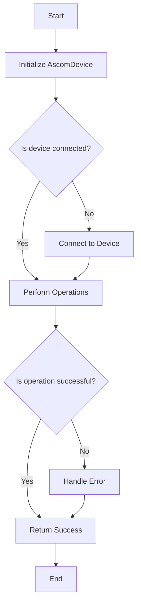
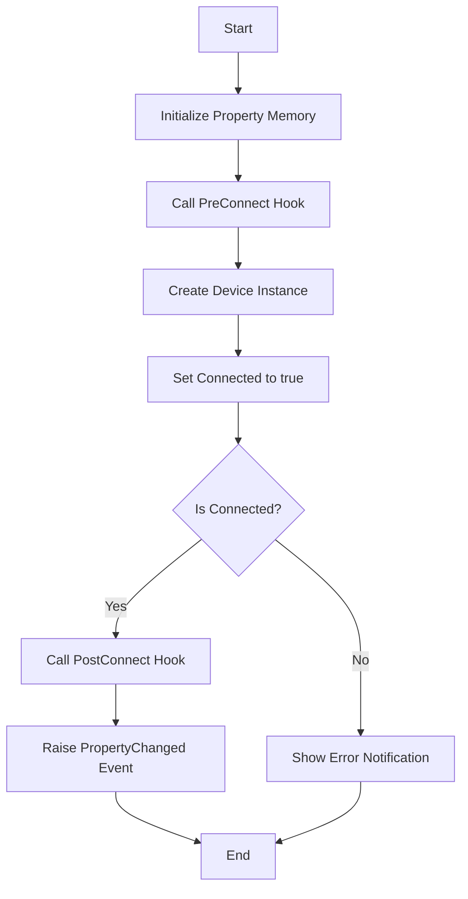
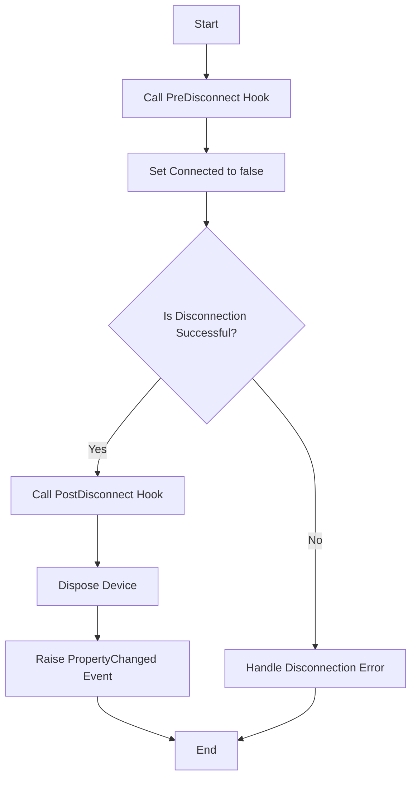
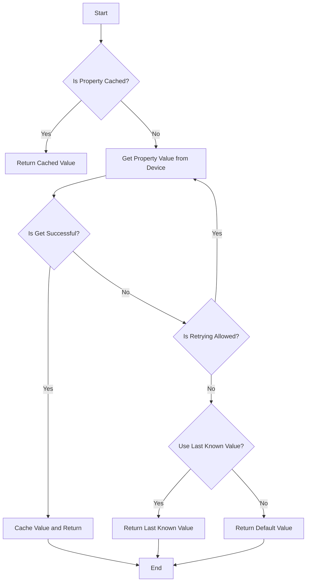
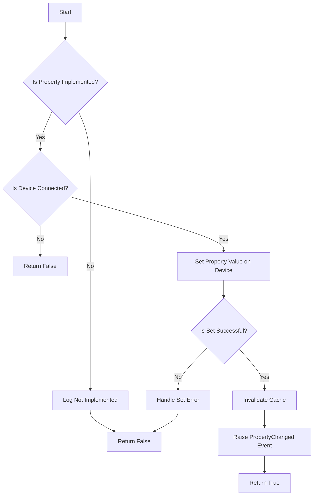

# ASCOM Device Handler Class Overview

The provided C# code defines an abstract class `AscomDevice<DeviceT>`, which is responsible for managing the connection and interaction with ASCOM devices. The class handles common operations such as connecting, disconnecting, setting up, and communicating with ASCOM devices in a unified manner.

## Overall Structure

The class has the following structure:

1. **Initialization**: The constructor initializes the ASCOM device with an ID and name.
2. **Properties and Methods**:
   - **Properties**: Various properties provide access to device information, such as `Name`, `Description`, `DriverVersion`, `Connected`, etc.
   - **Methods**:
     - `Connect`: Connects to the device.
     - `Disconnect`: Disconnects from the device.
     - `SetupDialog`: Displays a setup dialog for configuring the device.
     - `Action`, `SendCommandString`, `SendCommandBool`, `SendCommandBlind`: Methods for sending commands to the device.
     - `GetProperty`, `SetProperty`: Methods to get and set device properties, with caching and error handling.

### Overall Flowchart

---

## Step-by-Step Flowcharts

### 1. `Connect` Method

The `Connect` method is responsible for establishing a connection with the ASCOM device. It first initializes the device, then attempts to connect and run any post-connection tasks.

#### Flowchart

### 2. `Disconnect` Method

The `Disconnect` method handles the disconnection process from the ASCOM device. It ensures that all necessary pre-disconnection tasks are performed before safely disconnecting and disposing of the device.

#### Flowchart

### 3. `GetProperty` Method

The `GetProperty` method retrieves a property value from the ASCOM device, with caching and error handling to ensure reliability.

#### Flowchart

### 4. `SetProperty` Method

The `SetProperty` method sets a property value on the ASCOM device, with error handling for potential issues during the setting process.

#### Flowchart

