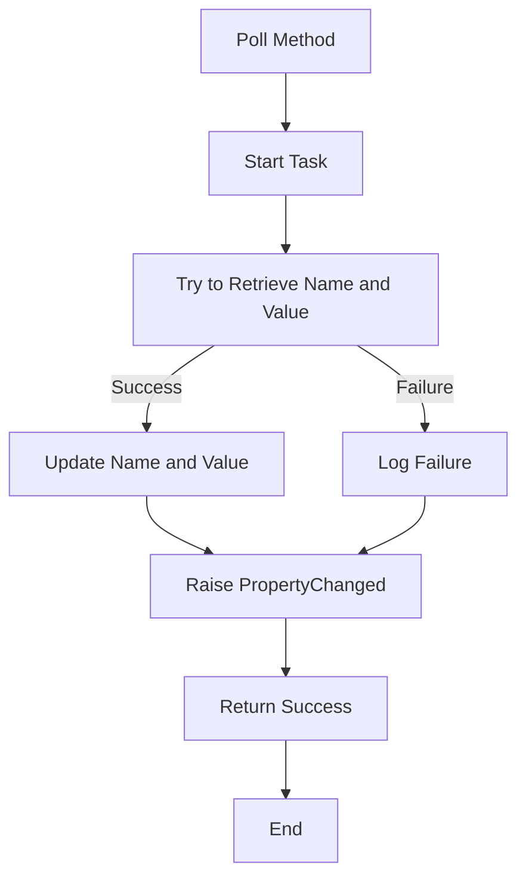

# AscomSwitch

The `AscomSwitch` class is part of the `NINA.Equipment.Equipment.MySwitch.Ascom` namespace and is used to interact with ASCOM switch devices.

## Namespace

```csharp
namespace NINA.Equipment.Equipment.MySwitch.Ascom
```

## Class Declaration

```csharp
internal class AscomSwitch : BaseINPC, ISwitch
```

## Properties

### `Id`

- **Type:** `short`
- **Description:** The unique identifier for the switch.

### `Name`

- **Type:** `string`
- **Description:** The name of the switch.
- **Property Change Notification:** Uses `RaisePropertyChanged` when updated.

### `Description`

- **Type:** `string`
- **Description:** A description of the switch.

### `Value`

- **Type:** `double`
- **Description:** The current value of the switch.
- **Property Change Notification:** Uses `RaisePropertyChanged` when updated.

## Constructors

### `AscomSwitch`

```csharp
public AscomSwitch(ISwitchV2 s, short id)
```

- **Parameters:**
  - `s`: An instance of `ISwitchV2` representing the ASCOM switch hub.
  - `id`: The unique identifier for the switch.
- **Description:** Initializes the `AscomSwitch` instance with the provided switch hub and identifier. Retrieves initial values for `Name`, `Description`, and `Value`.

## Methods

### `Poll`

```csharp
public async Task<bool> Poll()
```

- **Description:** Polls the switch for updated values.
- **Flowchart:**



**Detailed Steps:**

1. **Start Task:** Begins an asynchronous task to retrieve the switch values.
2. **Try to Retrieve Name and Value:** Attempts to get the `Name` and `Value` from the switch hub.
   - **Success:** Updates the `Name` and `Value` properties and logs the retrieved values.
   - **Failure:** Logs a failure message.
3. **Raise PropertyChanged:** Notifies that the properties have changed if retrieval was successful.
4. **Return Success:** Returns a boolean indicating whether the operation was successful.
