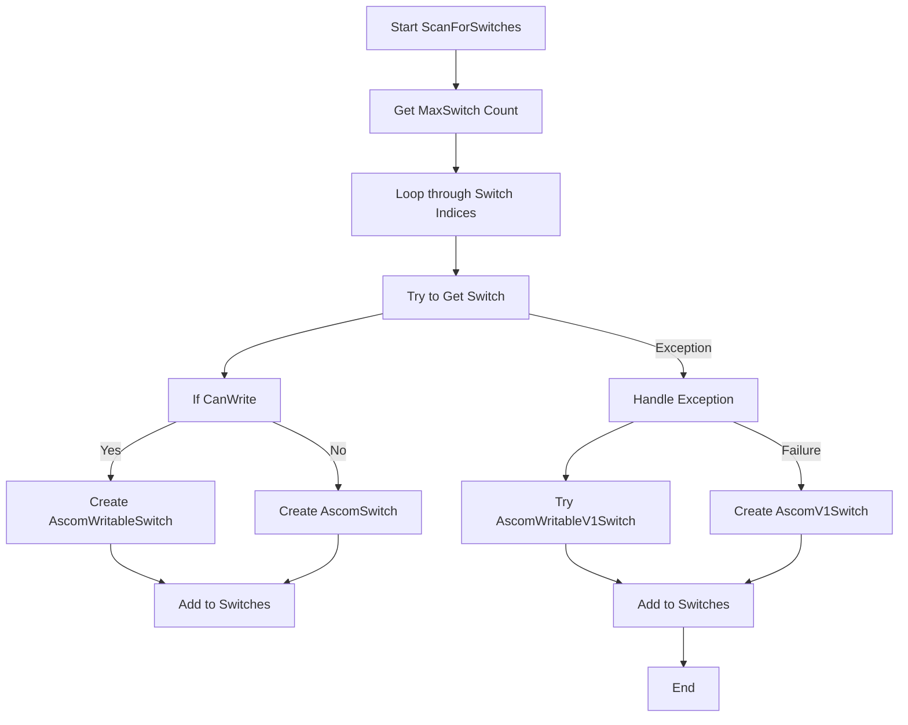
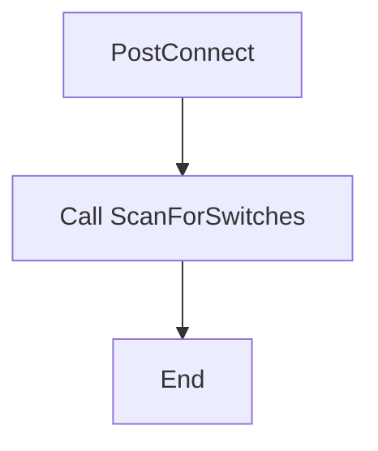
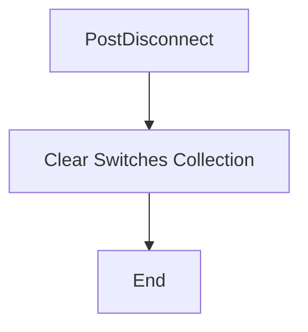
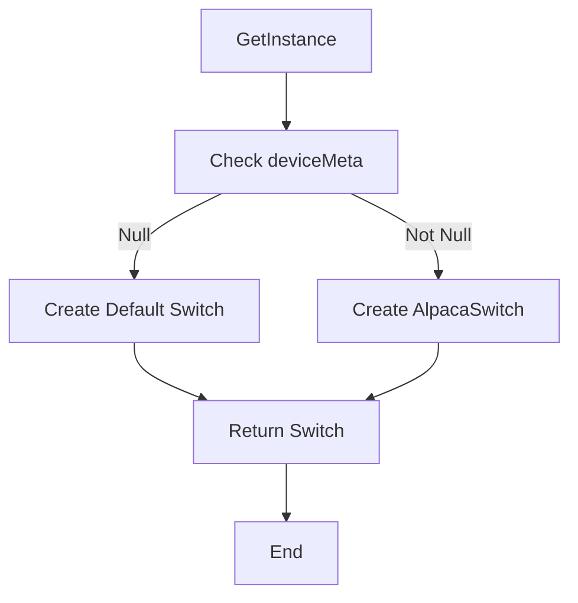

# AscomSwitchHub

The `AscomSwitchHub` class is part of the `NINA.Equipment.Equipment.MySwitch.Ascom` namespace and manages a collection of ASCOM switches. It extends `AscomDevice<ISwitchV2>` and implements `ISwitchHub`, providing functionality to discover and interact with ASCOM switch devices.

## Namespace

```csharp
namespace NINA.Equipment.Equipment.MySwitch.Ascom
```

## Class Declaration

```csharp
public partial class AscomSwitchHub : AscomDevice<ISwitchV2>, ISwitchHub, IDisposable
```

## Properties

### `Switches`

- **Type:** `ICollection<ISwitch>`
- **Description:** A collection of switches managed by the hub.
- **Property Change Notification:** Uses `ObservableProperty` for automatic property change notification.

## Constructors

### `AscomSwitchHub(string id, string name)`

```csharp
public AscomSwitchHub(string id, string name) : base(id, name)
```

- **Parameters:**
  - `id`: The identifier for the switch hub.
  - `name`: The name of the switch hub.
- **Description:** Initializes a new instance of the `AscomSwitchHub` class with the specified ID and name. Initializes an empty collection of switches.

### `AscomSwitchHub(AscomDevice deviceMeta)`

```csharp
public AscomSwitchHub(AscomDevice deviceMeta) : base(deviceMeta)
```

- **Parameters:**
  - `deviceMeta`: Metadata for the ASCOM device.
- **Description:** Initializes a new instance using the metadata from an `AscomDevice`. Initializes an empty collection of switches.

## Methods

### `ScanForSwitches`

```csharp
private async Task ScanForSwitches()
```

- **Description:** Scans for switches connected to the ASCOM switch hub and adds them to the `Switches` collection.
- **Flowchart:**



**Detailed Steps:**

1. **Start ScanForSwitches:** Begins scanning for connected switches.
2. **Get MaxSwitch Count:** Retrieves the maximum number of switches from the device.
3. **Loop through Switch Indices:** Iterates through each switch index.
4. **Try to Get Switch:** Attempts to create a switch object for the given index.
   - **If CanWrite:**
     - **Yes:** Creates an `AscomWritableSwitch` and adds it to the `Switches` collection.
     - **No:** Creates an `AscomSwitch` and adds it to the `Switches` collection.
   - **Exception Handling:**
     - **Handle Exception:** Catches `MethodNotImplementedException` and tries to create an `AscomWritableV1Switch`. If this fails, creates an `AscomV1Switch`.

### `PostConnect`

```csharp
protected override async Task PostConnect()
```

- **Description:** Performs actions after establishing a connection, such as scanning for switches.

- **Flowchart:**



**Detailed Steps:**

1. **Call ScanForSwitches:** Initiates the scanning process to discover switches.
2. **End:** Completes the connection post-setup.

### `PostDisconnect`

```csharp
protected override void PostDisconnect()
```

- **Description:** Performs actions after disconnecting, such as clearing the collection of switches.

- **Flowchart:**



**Detailed Steps:**

1. **Clear Switches Collection:** Resets the `Switches` collection to an empty state.
2. **End:** Completes the disconnection process.

### `GetInstance`

```csharp
protected override ISwitchV2 GetInstance()
```

- **Description:** Provides an instance of `ISwitchV2` for the switch hub.
- **Flowchart:**



**Detailed Steps:**

1. **Check deviceMeta:** Determines whether `deviceMeta` is null.
   - **Null:** Creates a default `Switch` instance.
   - **Not Null:** Creates an `AlpacaSwitch` instance based on the metadata.
2. **Return Switch:** Returns the created switch instance.
3. **End:** Completes the instance retrieval process.
