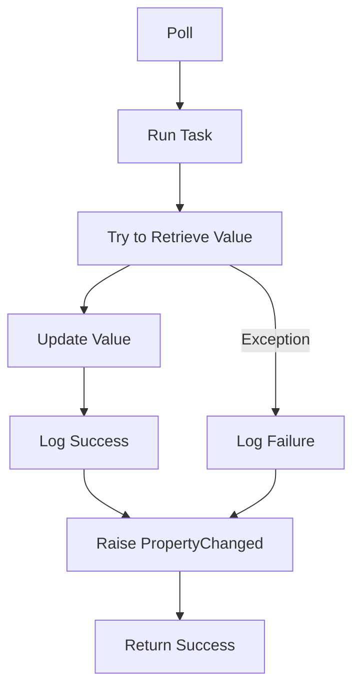

# AscomV1Switch

The `AscomV1Switch` class is part of the `NINA.Equipment.Equipment.MySwitch.Ascom` namespace and implements the `ISwitch` interface. It provides functionality for handling ASCOM V1 switches, including retrieving their values and updating the state.

## Namespace

```csharp
namespace NINA.Equipment.Equipment.MySwitch.Ascom
```

## Class Declaration

```csharp
internal class AscomV1Switch : BaseINPC, ISwitch
```

## Constructors

### `AscomV1Switch(ISwitchV2 s, short id)`

```csharp
public AscomV1Switch(ISwitchV2 s, short id)
```

- **Parameters:**
  - `s`: The ASCOM switch hub instance.
  - `id`: The identifier for the switch.
- **Description:** Initializes a new instance of the `AscomV1Switch` class with the specified switch hub and ID. Sets the initial properties of the switch.

## Properties

### `Id`

- **Type:** `short`
- **Description:** The identifier for the switch.

### `Name`

- **Type:** `string`
- **Description:** The name of the switch.

### `Description`

- **Type:** `string`
- **Description:** The description of the switch.

### `Value`

- **Type:** `double`
- **Description:** The value of the switch (0 or 1).

## Methods

### `Poll`

```csharp
public async Task<bool> Poll()
```

- **Description:** Retrieves the current value of the switch asynchronously and updates the `Value` property. Logs the operation and handles exceptions.

- **Flowchart:**



**Detailed Steps:**

1. **Run Task:** Executes the value retrieval in a separate task.
2. **Try to Retrieve Value:** Attempts to get the switch value from the ASCOM switch hub.
   - **Update Value:** Sets the `Value` property based on the retrieved switch state.
   - **Log Success:** Logs the successful retrieval of the switch value.
   - **Exception Handling:** Logs the failure if an exception occurs.
3. **Raise PropertyChanged:** Notifies any listeners that the `Value` property has changed.
4. **Return Success:** Returns whether the operation was successful.
