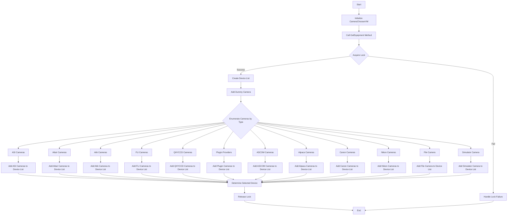
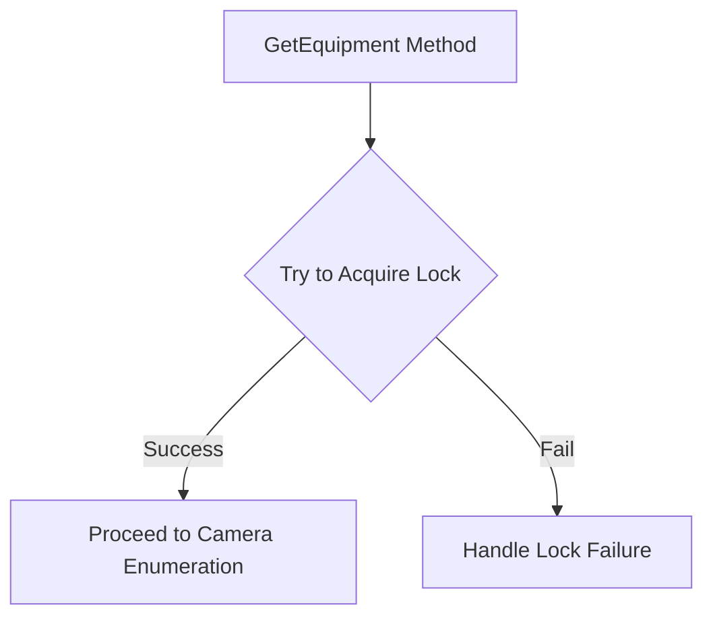
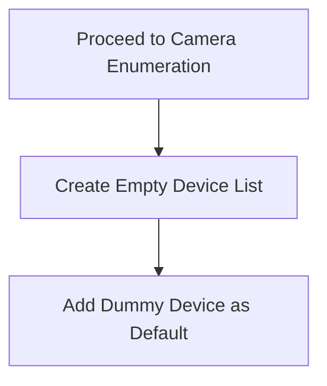
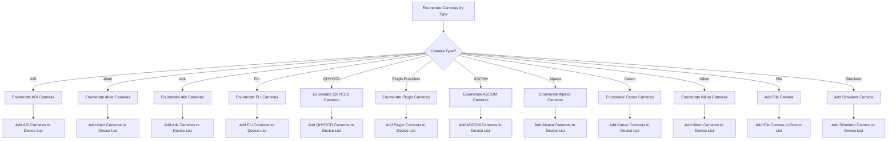
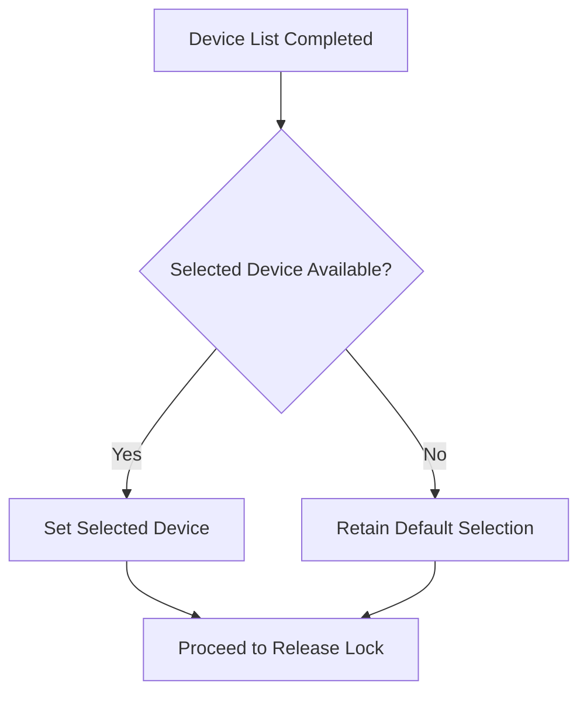
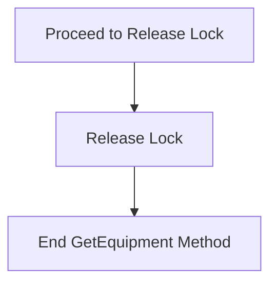

# Overview of CameraChooserVM Implementation

The `CameraChooserVM` class is a ViewModel responsible for selecting and managing camera devices within the N.I.N.A. (Nighttime Imaging 'N' Astronomy) application. It interacts with various camera SDKs, profiles, and other equipment providers to enumerate and manage the connected cameras. The implementation ensures that different types of cameras (e.g., ASI, Altair, Atik, FLI, QHYCCD, etc.) are discovered, initialized, and made available for selection within the application.

## Overall Process Flowchart

## Step-by-Step Flowchart for `GetEquipment` Method

## 1. Acquire Lock

## 2. Initialize Device List

## 3. Enumerate and Add Cameras

## 4. Determine Selected Device

## 5. Release Lock and Complete

## Detailed Markdown Explanation

The `CameraChooserVM` class is responsible for managing the list of camera devices within the N.I.N.A. application. It handles the discovery of various camera types, including those connected via different SDKs (e.g., ASI, QHYCCD, Canon, Nikon, etc.) and makes them available for user selection.

The process begins by calling the `GetEquipment` method, which acquires a lock to ensure thread safety. It then initializes a device list and adds a dummy device as a default placeholder. The method proceeds to enumerate cameras of various types, adding them to the device list if found. After all cameras have been enumerated and added, the method determines which device, if any, should be selected as the default. Finally, the lock is released, and the method completes.

This class plays a crucial role in enabling the application to work seamlessly with different camera hardware, offering flexibility and extensibility for various user configurations.
