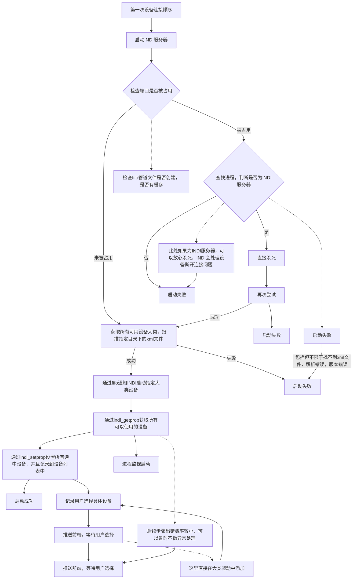
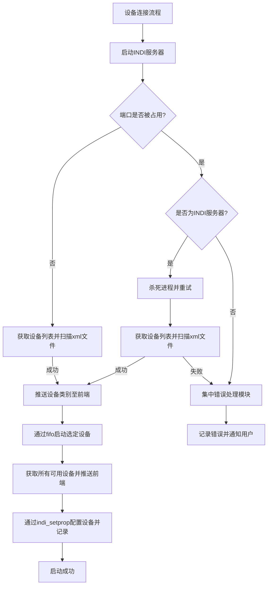

# 连接流程

```mermaid
graph TD
    A[第一次设备连接顺序] --> B[启动INDI服务器]
    B --> C{检查端口是否被占用}
    C -->|未被占用| D[获取所有可用设备大类，扫描指定目录下的xml文件]
    D -->|成功| E[通过fifo通知INDI启动指定大类设备]
    E --> F[通过indi_getprop获取所有可以使用的设备]
    F --> G[通过indi_setprop设置所有选中设备，并且记录到设备列表中]
    G --> H[启动成功]

    C -->|被占用| I{查找进程，判断是否为INDI服务器}
    I -->|是| J[直接杀死]
    J --> K[再次尝试]
    K -->|成功| D
    I -->|否| L[启动失败]

    K --> M[启动失败]
    D -->|失败| N[启动失败]
    F --> O[进程监视启动]
    G --> P[记录用户选择具体设备]
    P --> Q[推送前端，等待用户选择]
    Q --> R[推送前端，等待用户选择]

    I -.-> S[启动失败] -->|包括但不限于找不到xml文件，解析错误，版本错误| N
    C -.-> T[检查fifo管道文件是否创建，是否有缓存]
    I -.-> U[此处如果为INDI服务器，可以放心杀死，INDI会处理设备断开连接问题] --> L
    F -.-> V[后续步骤出错概率较小，可以暂时不做异常处理] --> R
    Q -.-> W[这里直接在大类驱动中添加] --> P
```

```mermaid
graph TD
    A[设备连接流程] --> B[启动INDI服务器]
    B --> C{端口是否被占用?}
    C -->|否| D[获取设备列表并扫描xml文件]
    D -->|成功| E[推送设备类别至前端]
    E --> F[通过fifo启动选定设备]
    F --> G[获取所有可用设备并推送前端]
    G --> H[通过indi_setprop配置设备并记录]
    H --> I[启动成功]

    C -->|是| J{是否为INDI服务器?}
    J -->|是| K[杀死进程并重试]
    K --> L[获取设备列表并扫描xml文件]
    L -->|失败| M[集中错误处理模块]

    J -->|否| M[集中错误处理模块]

    L -->|成功| E
    M --> N[记录错误并通知用户]
```
