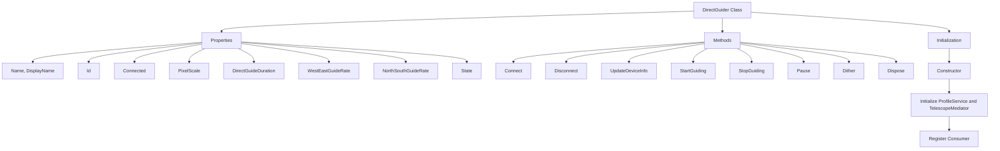
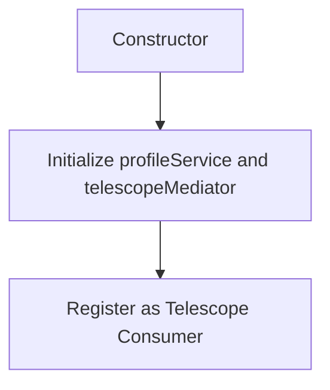
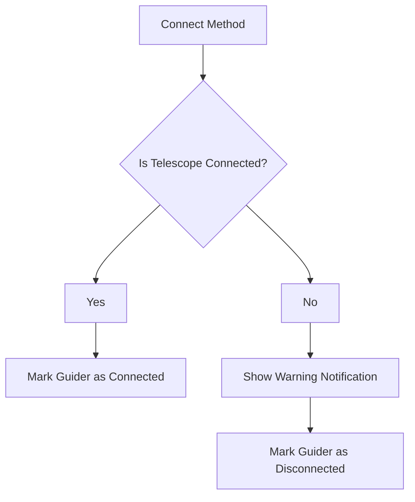
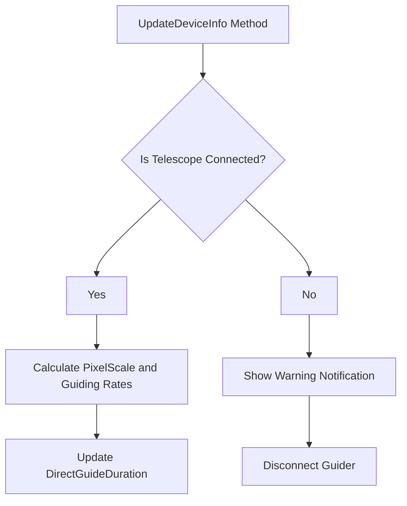
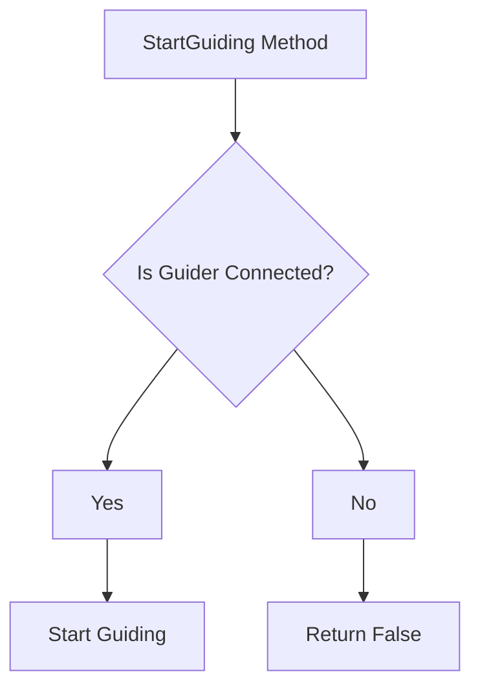
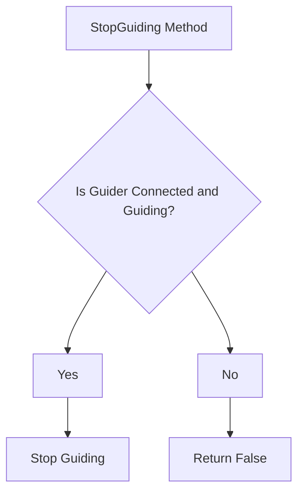
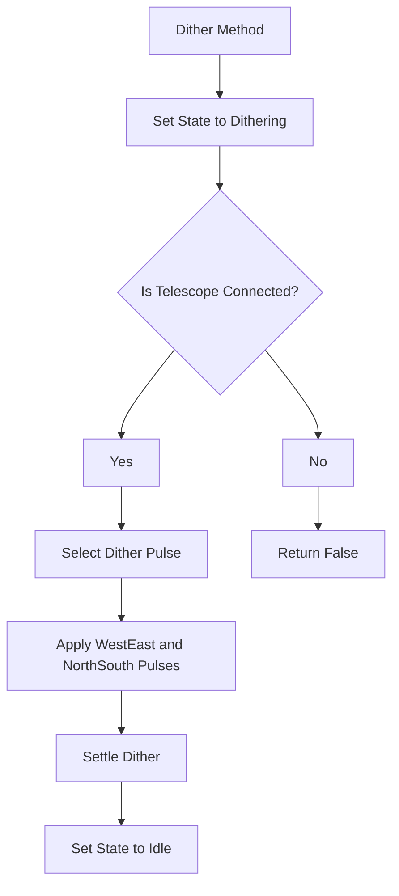

# `DirectGuider` Class Overview

The `DirectGuider` class is a guiding module for telescope mounts in astrophotography. It implements the `IGuider` and `ITelescopeConsumer` interfaces to manage guiding operations directly via a connected telescope. The class handles connection status, guiding rates, and dithering operations to maintain accurate tracking of celestial objects during long exposure imaging.

## Overall Flowchart

## Step-by-Step Flowchart

## 1. **Initialization (Constructor)**

The constructor initializes the `DirectGuider` instance with the provided `profileService` and `telescopeMediator`. It also registers the guider as a consumer of the telescope mediator.

## 2. **Connect Method**

The `Connect` method establishes a connection to the telescope. It checks if the telescope is already connected; if so, it marks the guider as connected, otherwise, it shows a warning notification.

## 3. **UpdateDeviceInfo Method**

The `UpdateDeviceInfo` method updates the guider with the latest telescope information. If the telescope is disconnected, it disconnects the guider and shows a warning notification. Otherwise, it calculates the pixel scale and guiding rates based on the telescope's specifications.

## 4. **StartGuiding Method**

The `StartGuiding` method starts the guiding process if the guider is connected.

## 5. **StopGuiding Method**

The `StopGuiding` method stops the guiding process if the guider is connected and currently guiding.

## 6. **Dither Method**

The `Dither` method applies a small random movement to the telescope to avoid guiding on the same pixel during multiple exposures, which can help reduce noise.

## Properties

1. **`Name`**: Returns the name of the guider.
2. **`DisplayName`**: Returns the display name of the guider.
3. **`Id`**: Returns the identifier of the guider.
4. **`Connected`**: Gets or sets the connection status of the guider.
5. **`PixelScale`**: Represents the scale of the pixels in arcseconds per pixel, which is calculated based on the telescope and camera specifications.
6. **`DirectGuideDuration`**: Indicates the expected duration of a guide pulse, based on the pixel scale and guiding rate.
7. **`WestEastGuideRate`**: Represents the guiding rate in the West/East direction.
8. **`NorthSouthGuideRate`**: Represents the guiding rate in the North/South direction.
9. **`State`**: Indicates the current state of the guider (e.g., "Idle", "Dithering", etc.).

## Methods

1. **`DirectGuider` Constructor**: Initializes the `DirectGuider` instance with the provided profile service and telescope mediator.
2. **`Connect`**: Attempts to connect the guider to the telescope and returns the connection status.
3. **`Disconnect`**: Disconnects the guider from the telescope.
4. **`UpdateDeviceInfo`**: Updates the guider with the latest telescope information and adjusts guiding parameters accordingly.
5. **`StartGuiding`**: Starts the guiding process.
6. **`StopGuiding`**: Stops the guiding process.
7. **`Pause`**: Pauses or resumes the guiding process.
8. **`Dither`**: Applies dithering by sending pulse guide instructions to the telescope.
9. **`Dispose`**: Unregisters the guider from the telescope mediator and performs cleanup.

## Detailed Explanation

- **Initialization**: The constructor initializes the guider with the profile service and telescope mediator. It registers the guider as a consumer of the telescope mediator, allowing it to receive updates on telescope status.
- **Connection**: The `Connect` method checks if the telescope is already connected. If connected, the guider is marked as connected; otherwise, a warning is shown.

- **Device Info Update**: The `UpdateDeviceInfo` method synchronizes the guider's parameters with the latest telescope information. It ensures that the guider's pixel scale and guiding rates are up-to-date, adjusting the guiding duration accordingly.

- **Guiding Operations**: The `StartGuiding`, `StopGuiding`, and `Pause` methods control the guiding process. The guider starts or stops guiding based on its connection status.

- **Dithering**: The `Dither` method is crucial for reducing noise during long exposure imaging. It applies small, random offsets to the telescope's position between exposures, preventing the camera from guiding on the same pixel repeatedly.
