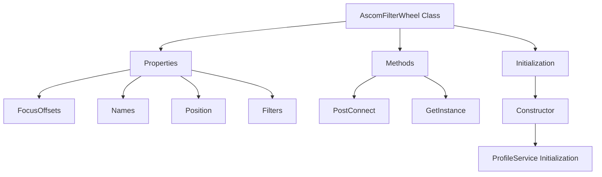
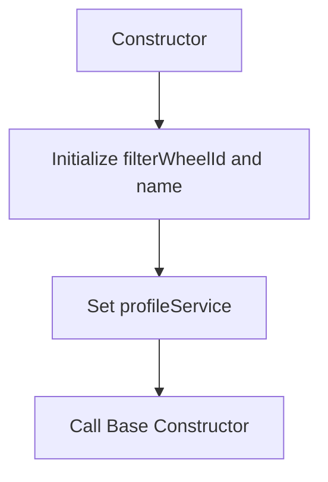
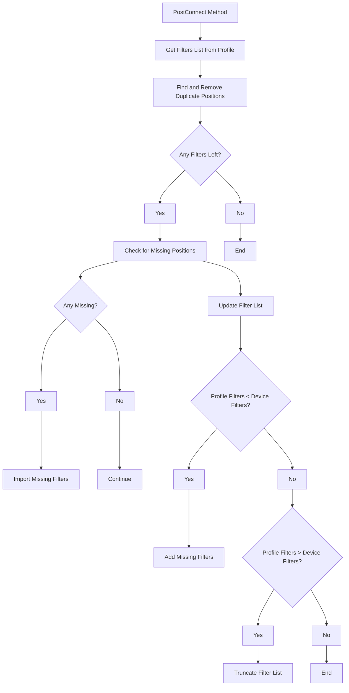
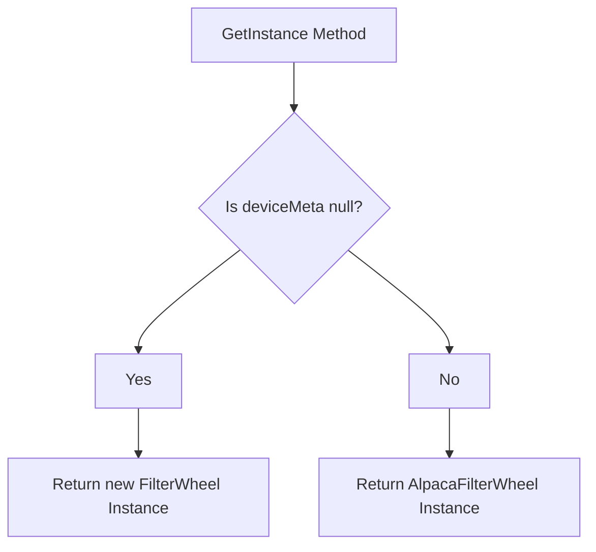

# `AscomFilterWheel` Class Overview

The `AscomFilterWheel` class is an implementation of the `AscomDevice<IFilterWheelV2>` base class. It represents a filter wheel device in astrophotography, managing the selection and synchronization of filters. The class handles the filter wheel’s properties and methods, ensures data integrity, and syncs the filter settings with the user profile.

## Overall Flowchart

## Step-by-Step Flowchart

## 1. **Initialization (Constructor)**

The constructor initializes the `AscomFilterWheel` instance with the specified filter wheel ID, name, and profile service.

## 2. **PostConnect Method**

The `PostConnect` method synchronizes the filter wheel with the profile settings, ensuring consistency and correcting any discrepancies.

## 3. **GetInstance Method**

The `GetInstance` method returns an instance of the `IFilterWheelV2` interface, either by creating a new one or using an existing device metadata.

## Properties

1. **`FocusOffsets`**: Returns an array of focus offsets corresponding to the filters.
2. **`Names`**: Returns an array of filter names.
3. **`Position`**: Gets or sets the current filter position.
4. **`Filters`**: Returns the filters collection from the active profile.

## Methods

1. **`AscomFilterWheel` Constructor**: Initializes the `AscomFilterWheel` instance with a specified filter wheel ID, name, and profile service.
2. **`PostConnect`**: Synchronizes the filter wheel with the profile settings, removing duplicates and adding missing filters.
3. **`GetInstance`**: Returns an instance of the `IFilterWheelV2` interface, either creating a new one or using an existing device metadata.

## Detailed Explanation

- **Initialization**: The constructor is responsible for setting up the `AscomFilterWheel` with the provided ID, name, and profile service. It also calls the base class constructor.

- **PostConnect**: This method ensures that the filters in the active profile are consistent with those available in the filter wheel device. It removes duplicates caused by data corruption, adds missing filters, and truncates excess filters. This process ensures that the filters are synchronized between the device and the software, preventing any operational issues.

- **GetInstance**: The method returns an appropriate instance of the filter wheel interface, depending on whether the device metadata is available.
