# `FilterWheelChooserVM` Class Overview

The `FilterWheelChooserVM` class in N.I.N.A. (Nighttime Imaging 'N' Astronomy) is responsible for managing the selection of filter wheel devices. This class extends `DeviceChooserVM<IFilterWheel>`, which provides base functionality for choosing a specific type of device, in this case, `IFilterWheel` devices. The class handles the initialization, retrieval, and selection of available filter wheel devices based on connected equipment, including FLI, Atik, QHY, ZWO, PlayerOne, SBIG, and other plugin or ASCOM-based devices.

## Key Components

- **`sbigSdk`**: SDK used for interacting with SBIG filter wheels.
- **`profileService`**: Manages the user's profile, including settings specific to the current configuration.
- **`equipmentProviders`**: A collection of providers that can supply additional filter wheel devices via plugins.
- **`lockObj`**: Semaphore ensuring thread-safe operations.
- **`ASCOMInteraction`**: Manages interactions with ASCOM-compatible filter wheel devices.
- **`AlpacaInteraction`**: Handles communication with Alpaca protocol-based filter wheel devices.

---

## Overall Flowchart

The overall flowchart below illustrates the general flow of the `GetEquipment` method in `FilterWheelChooserVM`:

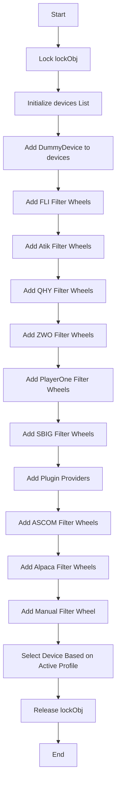

---

## Step-by-Step Explanation with Detailed Flowcharts

### 1. Initialization and Locking

When the `GetEquipment` method is invoked, it first locks the `lockObj` semaphore to ensure that the operation is thread-safe.

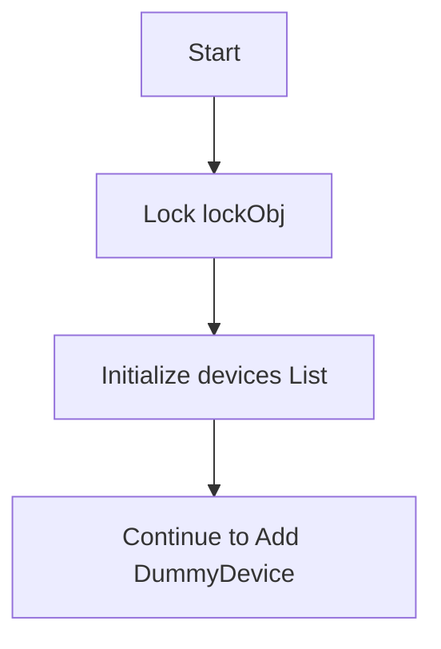

### 2. Adding a Dummy Device

The method initializes a `devices` list and adds a `DummyDevice`, which represents the absence of a physical filter wheel.

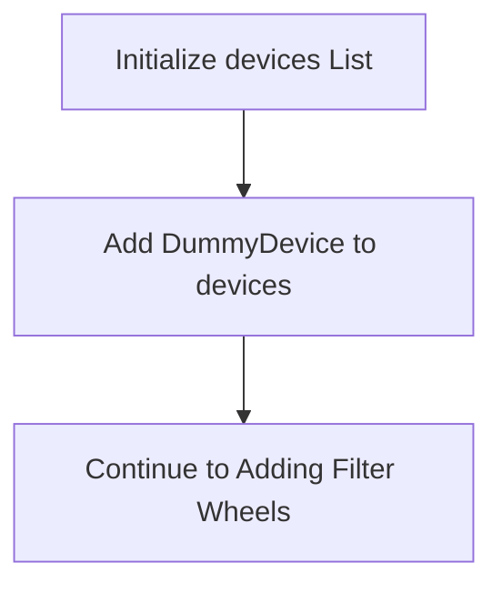

### 3. Adding FLI Filter Wheels

The method attempts to add FLI filter wheels by calling `FLIFilterWheels.GetFilterWheels()` to retrieve a list of available FLI filter wheels and adding them to the `devices` list.

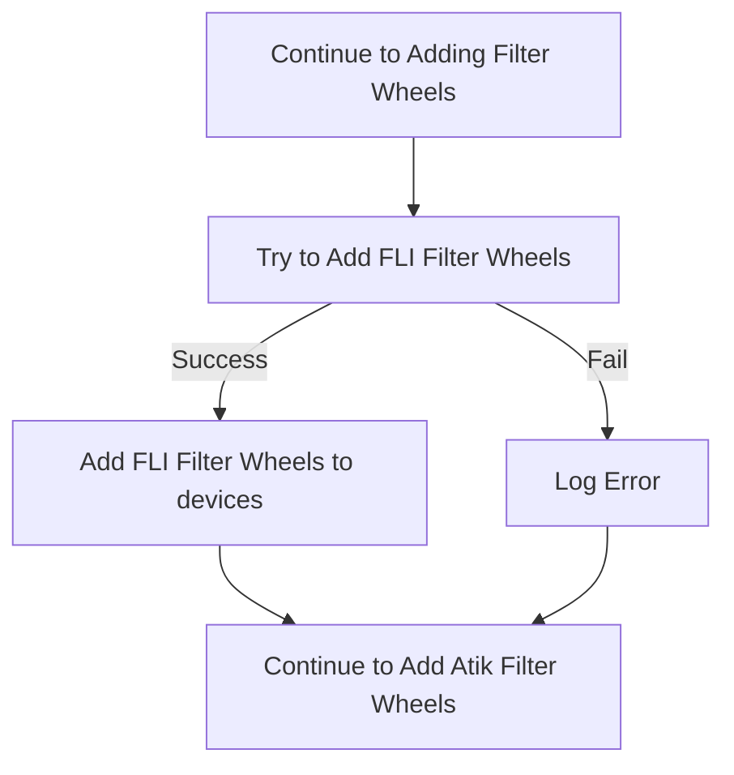

### 4. Adding Atik Filter Wheels

The method attempts to add Atik filter wheels, both external (EFW) and internal. It first checks for external filter wheels using `AtikCameraDll.ArtemisEfwIsPresent()` and then checks for internal filter wheels by iterating over detected Atik cameras.

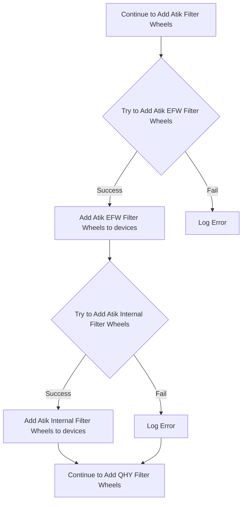

### 5. Adding QHY Filter Wheels

The method attempts to add QHY filter wheels using the `QHYFilterWheels` class to retrieve available QHY filter wheels and add them to the `devices` list.

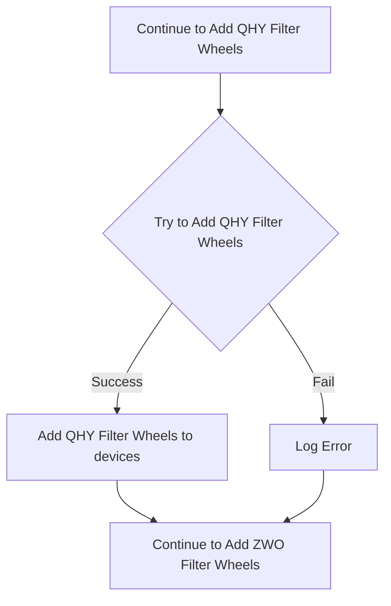

### 6. Adding ZWO Filter Wheels

The method attempts to add ZWO (ZWOptical) filter wheels using the `EFWdll.GetNum()` method to detect and add them to the `devices` list.

### 7. Adding PlayerOne Filter Wheels

The method attempts to add PlayerOne filter wheels using the `PlayerOneFilterWheelSDK.POAGetPWCount()` method to detect and add them to the `devices` list.

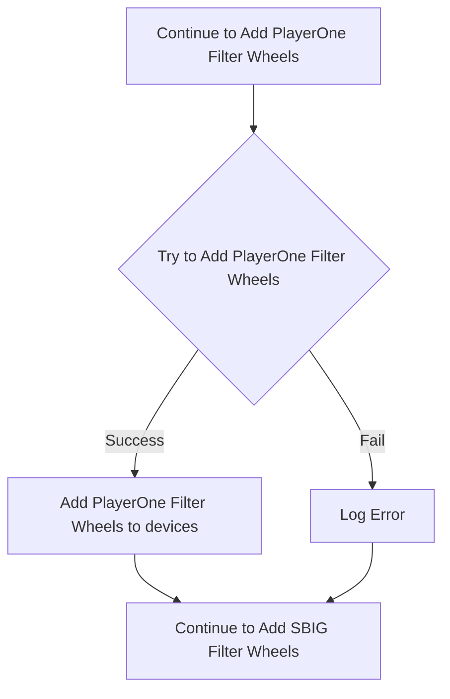

### 8. Adding SBIG Filter Wheels

The method attempts to add SBIG filter wheels using the `SBIGFilterWheelProvider` class to retrieve and add them to the `devices` list.

### 9. Adding Plugin Providers

The method then attempts to load any additional equipment from plugin providers. It loops through each provider, adding any found equipment to the `devices` list.

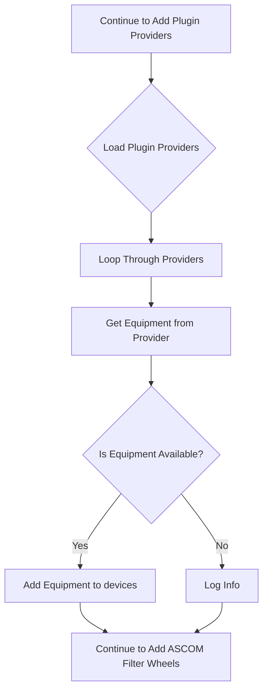

### 10. Adding ASCOM Filter Wheels

After processing plugin providers, the method attempts to add ASCOM-compatible filter wheel devices by creating an instance of `ASCOMInteraction` and calling its `GetFilterWheels` method.

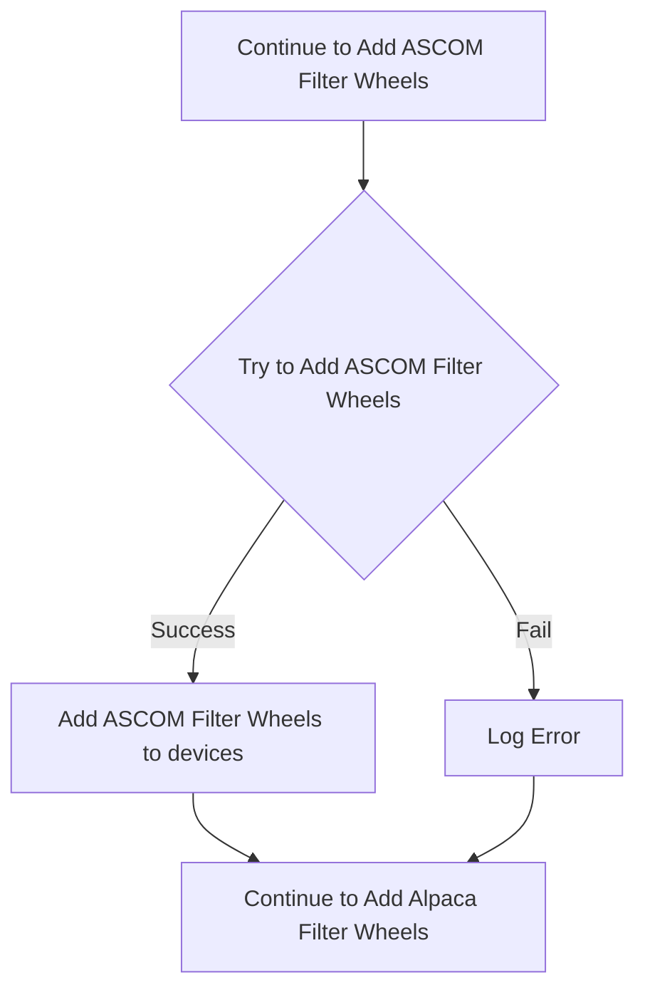

### 11. Adding Alpaca Filter Wheels

Following the ASCOM filter wheel devices, the method attempts to add any filter wheel devices available via the Alpaca protocol by creating an instance of `AlpacaInteraction` and calling its `GetFilterWheels` method.

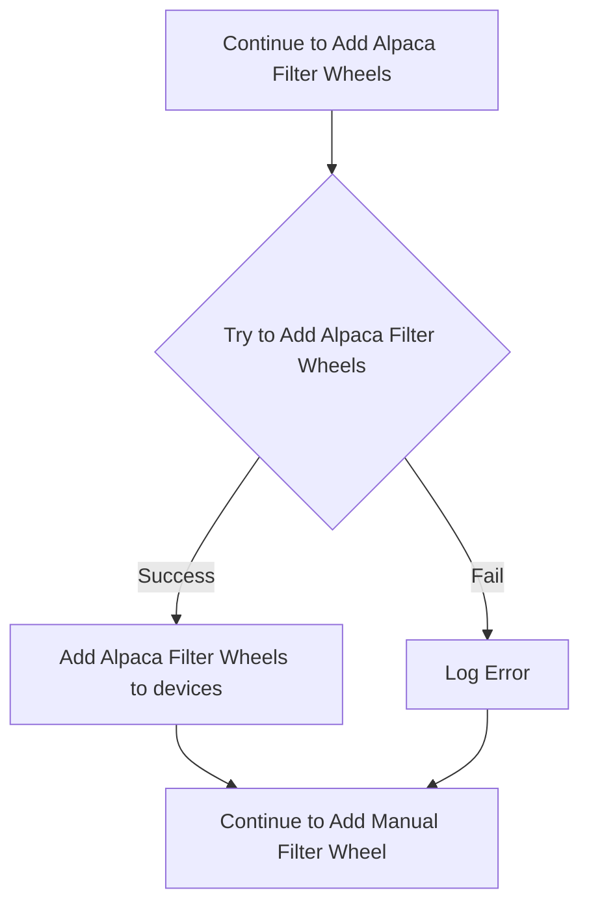

### 12. Adding Manual Filter Wheel

The method adds a `ManualFilterWheel` device to the `devices` list as a final fallback option.

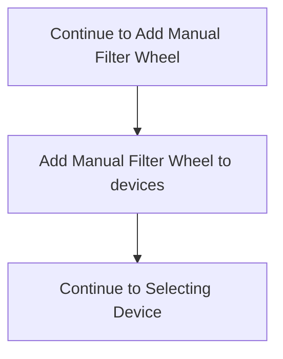

### 13. Selecting the Device Based on Active Profile

Finally, the method selects the appropriate filter wheel device based on the active profile settings and releases the `lockObj` semaphore to complete the operation.

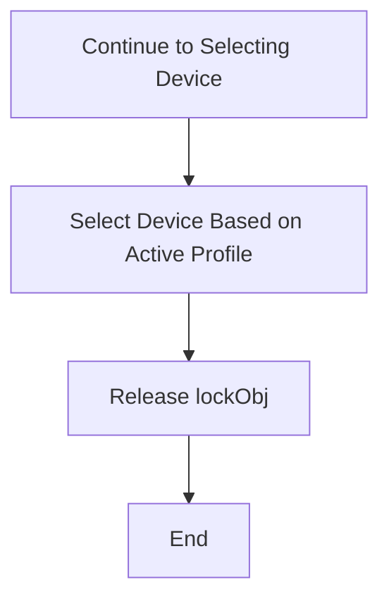
