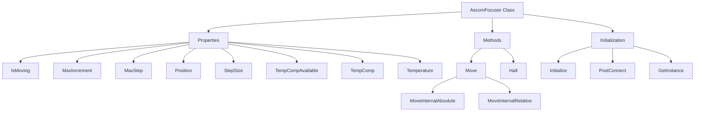
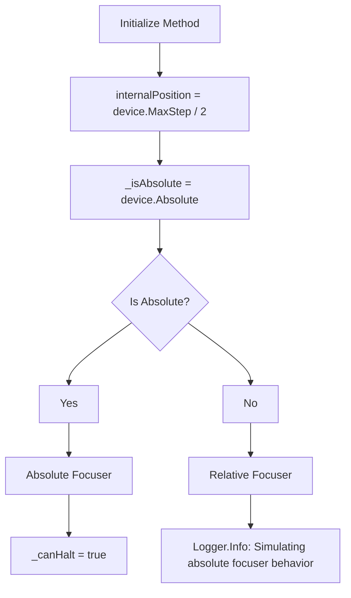
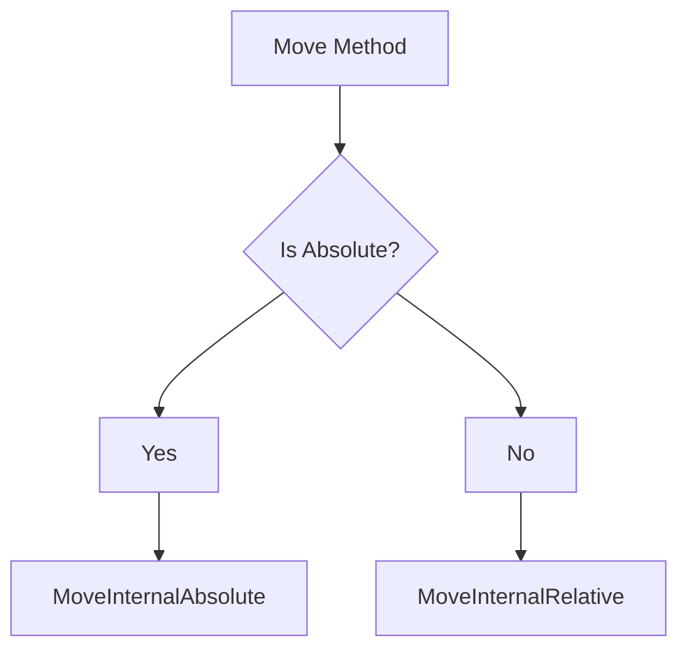
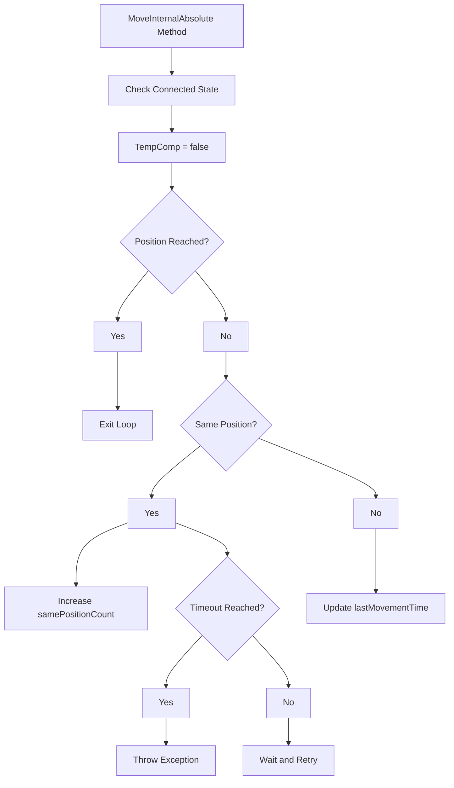
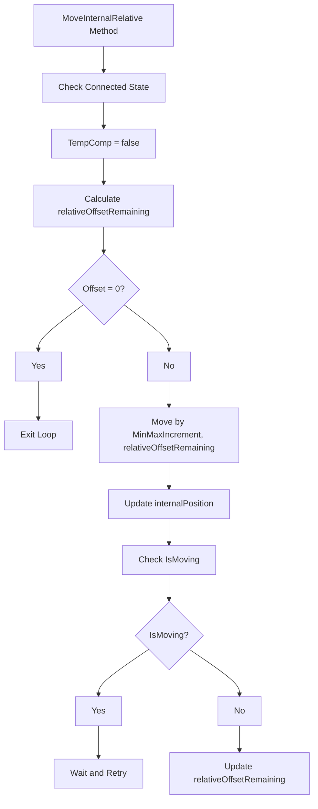

# `AscomFocuser` Class Overview

The `AscomFocuser` class is a concrete implementation of the `AscomDevice<IFocuserV3>` base class. It represents a focuser device used in astrophotography, controlling the position of the focusing mechanism. The class supports both absolute and relative focusers, provides properties for various device characteristics, and includes methods to move the focuser to a specified position.

## Overall Flowchart

## Step-by-Step Flowchart

## 1. **Initialization (`Initialize` Method)**

The `Initialize` method sets up the focuser based on its characteristics, such as whether it's an absolute or relative focuser.

## 2. **Move Method (`Move`)**

The `Move` method is responsible for moving the focuser to a specified position. It decides whether to move the focuser absolutely or relatively based on the `_isAbsolute` flag.

## 3. **MoveInternalAbsolute Method**

This method moves the focuser to a specific position for absolute focusers. It checks for timeouts and ensures that the focuser is moving as expected.

## 4. **MoveInternalRelative Method**

This method handles relative movement by moving the focuser in increments until the desired position is reached.

## Methods

1. **`AscomFocuser` Constructor**: Initializes the `AscomFocuser` instance with the given focuser and name.
2. **`IsMoving`**: Returns whether the focuser is currently moving.
3. **`MaxIncrement`**: Returns the maximum step increment the focuser can move.
4. **`MaxStep`**: Returns the maximum step position.
5. **`Position`**: Returns the current position of the focuser.
6. **`StepSize`**: Returns the size of each step in the focuser.
7. **`TempCompAvailable`**: Indicates if temperature compensation is available.
8. **`TempComp`**: Gets or sets the temperature compensation status.
9. **`Temperature`**: Returns the current temperature as reported by the focuser.
10. **`Move`**: Moves the focuser to a specified position, either absolutely or relatively.
11. **`Halt`**: Stops the focuser movement if possible.
12. **`Initialize`**: Sets up the focuser, including handling of relative focusers.
13. **`MoveInternalAbsolute`**: Moves the focuser to an absolute position with timeout handling.
14. **`MoveInternalRelative`**: Moves the focuser relatively, handling incremental movement.
15. **`PostConnect`**: Performs post-connection initialization.
16. **`GetInstance`**: Returns an instance of the `IFocuserV3` interface.
