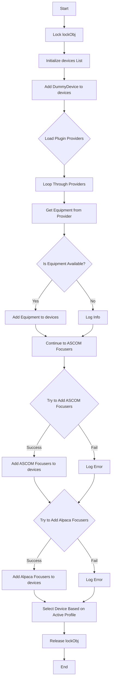
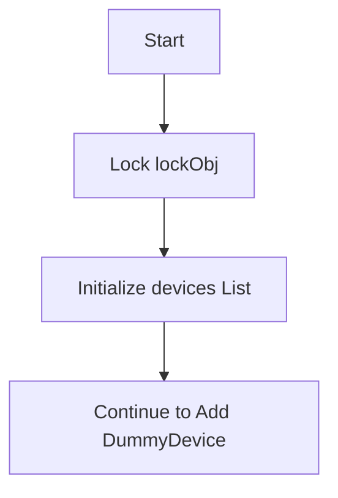
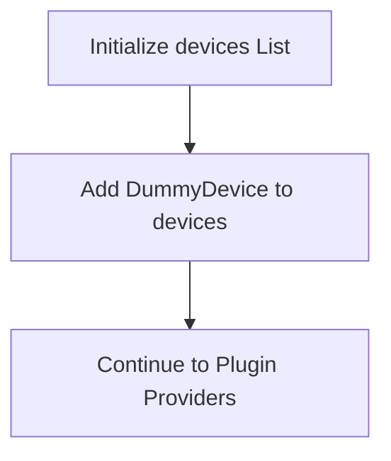
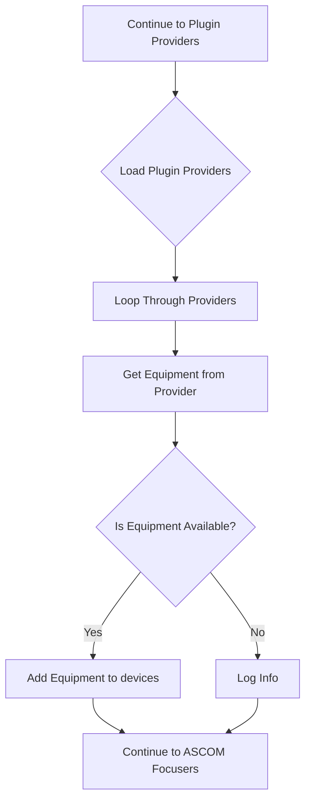
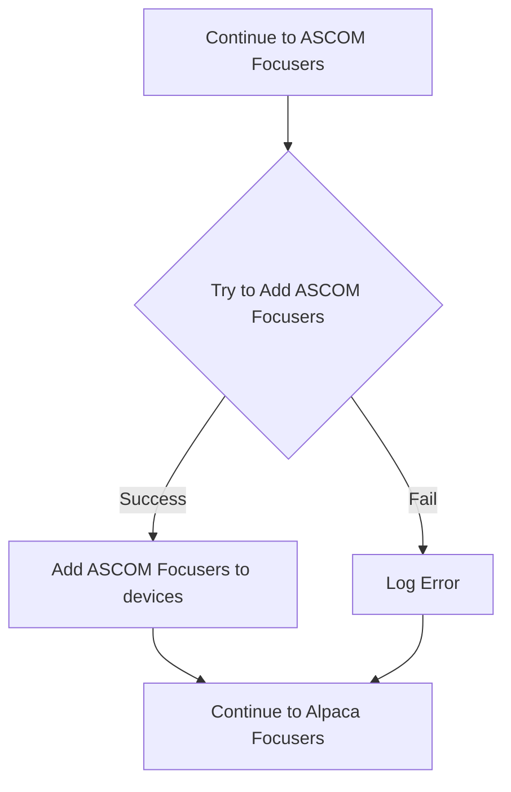
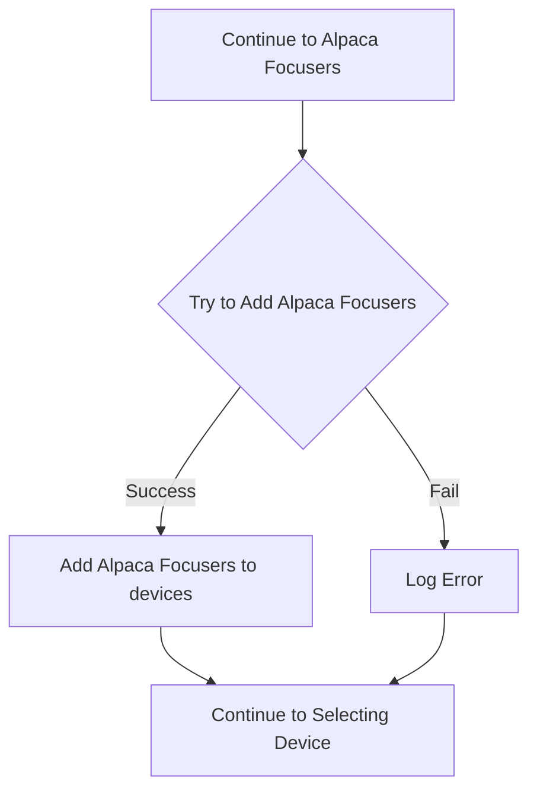
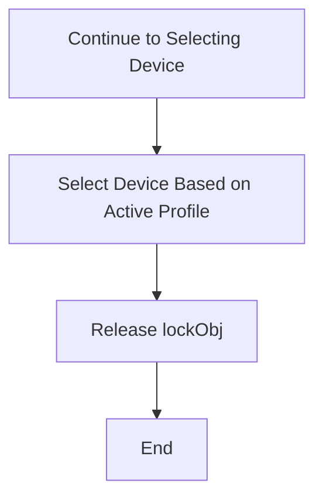

# `FocuserChooserVM` Class Overview

The `FocuserChooserVM` class in N.I.N.A. (Nighttime Imaging 'N' Astronomy) is responsible for managing the selection of focuser devices. This class extends `DeviceChooserVM<IFocuser>`, which provides base functionality for choosing a specific type of device, in this case, `IFocuser` devices. The class handles the initialization, retrieval, and selection of available focuser devices based on connected equipment, ASCOM interactions, and plugins.

## Key Components

- **`profileService`**: Manages the user's profile, including settings specific to the current configuration.
- **`equipmentProviders`**: A collection of providers that can supply additional focuser devices via plugins.
- **`lockObj`**: Semaphore ensuring thread-safe operations.
- **`ASCOMInteraction`**: Manages interactions with ASCOM-compatible focuser devices.
- **`AlpacaInteraction`**: Handles communication with Alpaca protocol-based focuser devices.

---

## Overall Flowchart

The overall flowchart below illustrates the general flow of the `GetEquipment` method in `FocuserChooserVM`:

---

## Step-by-Step Explanation with Detailed Flowcharts

### 1. Initialization and Locking

When the `GetEquipment` method is invoked, it first locks the `lockObj` semaphore to ensure that the operation is thread-safe.

### 2. Adding a Dummy Device

The method initializes a `devices` list and adds a `DummyDevice`, which represents the absence of a physical focuser.

### 3. Loading Plugin Providers

The method then attempts to load any additional equipment from plugin providers. It loops through each provider, adding any found equipment to the `devices` list.

### 4. Adding ASCOM Focusers

After processing plugin providers, the method attempts to add ASCOM-compatible focuser devices by creating an instance of `ASCOMInteraction` and calling its `GetFocusers` method.

### 5. Adding Alpaca Focusers

Following the ASCOM focuser devices, the method attempts to add any focuser devices available via the Alpaca protocol by creating an instance of `AlpacaInteraction` and calling its `GetFocusers` method.

### 6. Selecting the Device Based on Active Profile

Finally, the method selects the appropriate focuser device based on the active profile settings and releases the `lockObj` semaphore to complete the operation.

