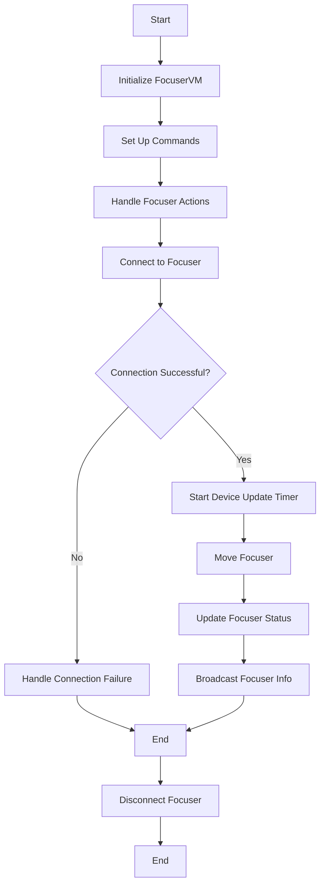
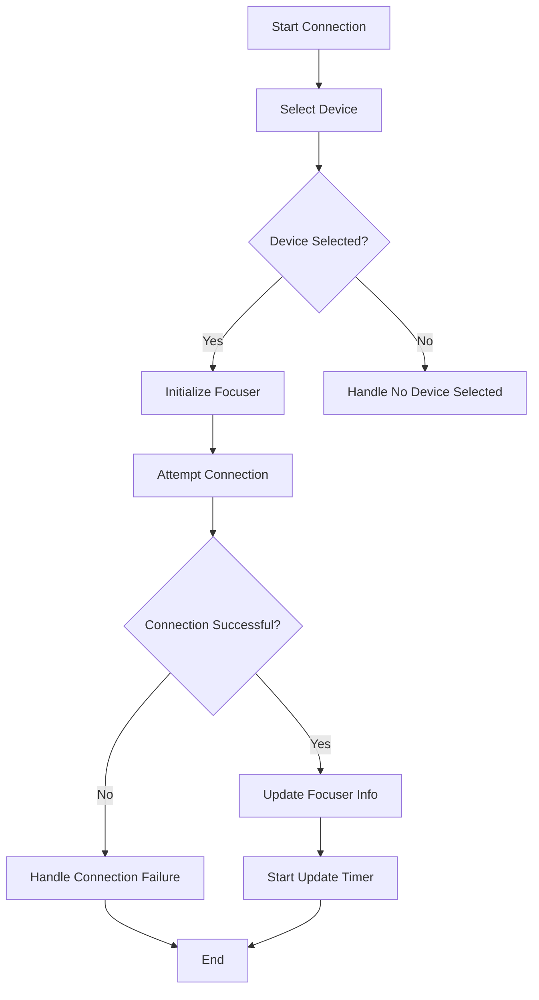
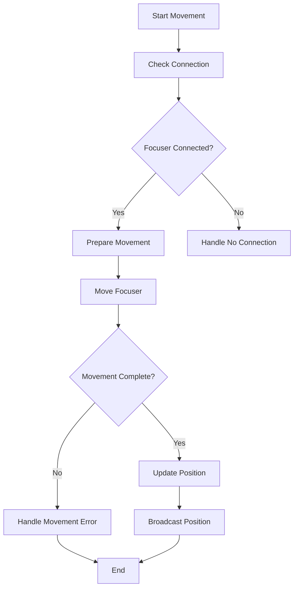
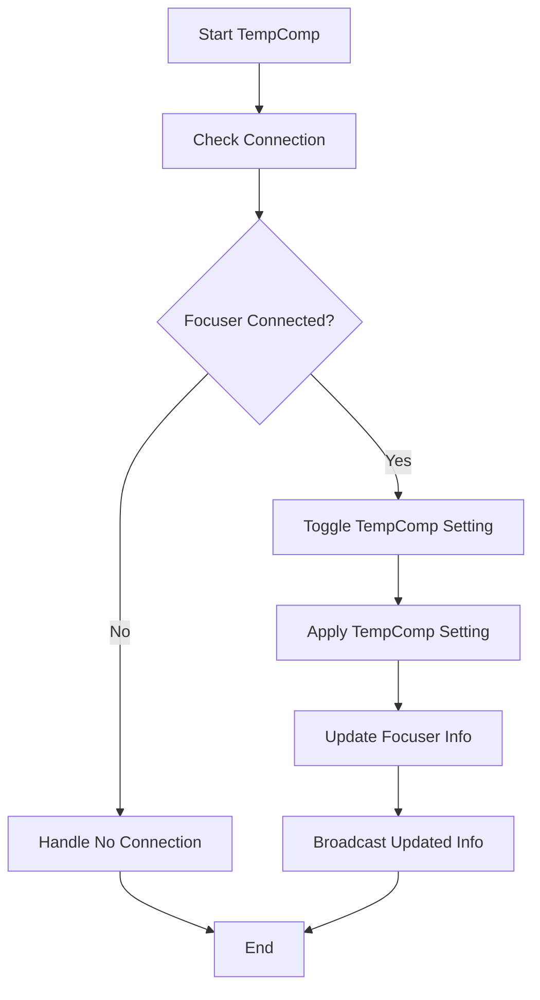

To document the `FocuserVM` class in Markdown with flowcharts, we need to break down its functionality into an overall workflow and detailed step-by-step processes. Here's how you can structure it:

---

## FocuserVM Class Documentation

### Overview

The `FocuserVM` class is part of the N.I.N.A. (Nighttime Imaging 'N' Astronomy) project and is responsible for managing the interaction with a focuser device. It handles connection, movement, and temperature compensation for the focuser. The class includes commands for various operations and manages the device's status updates.

### Class Responsibilities

- **Connect and Disconnect Focuser:** Manage connection to and disconnection from the focuser device.
- **Move Focuser:** Provide commands to move the focuser to specific or relative positions.
- **Handle Temperature Compensation:** Toggle and apply temperature compensation for the focuser.
- **Update and Broadcast Status:** Periodically update and broadcast the focuser's status and settings.

### Key Properties

- **Focuser:** Represents the current focuser device.
- **FocuserInfo:** Holds the status and information of the focuser.
- **TargetPosition:** The target position to which the focuser is moving.
- **Position:** Current position of the focuser.

### Key Commands

- **ConnectCommand:** Initiates connection to the selected focuser device.
- **DisconnectCommand:** Disconnects from the currently connected focuser device.
- **MoveFocuserCommand:** Moves the focuser to a specified position.
- **MoveFocuserInSmallCommand, MoveFocuserInLargeCommand, MoveFocuserOutSmallCommand, MoveFocuserOutLargeCommand:** Commands to move the focuser in small or large increments.
- **HaltFocuserCommand:** Halts any ongoing movement of the focuser.
- **ToggleTempCompCommand:** Toggles temperature compensation on or off.

### Flowcharts

#### 1. Overall Workflow

This flowchart shows the high-level workflow of the `FocuserVM` class:



#### 2. Handling Focuser Connection

This flowchart details the steps involved in connecting to a focuser:



#### 3. Moving Focuser

This flowchart illustrates the process for moving the focuser to a specified position:



#### 4. Handling Temperature Compensation

This flowchart shows how temperature compensation is toggled and applied:



### Class Code

Here's a concise view of the `FocuserVM` class code with comments:

```csharp
using NINA.Equipment.Equipment.MyFocuser;
using NINA.Profile.Interfaces;
using NINA.Core.Utility;
using NINA.Equipment.Interfaces.Mediator;
using NINA.Core.Utility.Notification;
using System;
using System.Collections.Generic;
using System.Threading;
using System.Threading.Tasks;
using System.Windows.Input;
using NINA.Core.Locale;
using NINA.Core.Enum;
using NINA.WPF.Base.Interfaces.Mediator;
using NINA.Core.Model;
using NINA.Core.MyMessageBox;
using NINA.Equipment.Interfaces;
using NINA.Equipment.Interfaces.ViewModel;
using NINA.Equipment.Equipment;
using Nito.AsyncEx;
using System.Linq;
using NINA.Core.Utility.Extensions;
using Newtonsoft.Json.Linq;

namespace NINA.WPF.Base.ViewModel.Equipment.Focuser {

    public class FocuserVM : DockableVM, IFocuserVM {
        private readonly DeviceUpdateTimer updateTimer;
        private readonly IFocuserMediator focuserMediator;
        private readonly IApplicationStatusMediator applicationStatusMediator;
        private readonly IProgress<ApplicationStatus> progress;
        private double lastFocusedTemperature = -1000;
        private double lastRoundoff = 0;

        public FocuserVM(IProfileService profileService,
                         IFocuserMediator focuserMediator,
                         IApplicationStatusMediator applicationStatusMediator,
                         IDeviceChooserVM focuserChooserVm,
                         IImageGeometryProvider imageGeometryProvider) : base(profileService) {
            Title = Loc.Instance["LblFocuser"];
            ImageGeometry = imageGeometryProvider.GetImageGeometry("FocusSVG");
            HasSettings = true;

            this.focuserMediator = focuserMediator;
            this.focuserMediator.RegisterHandler(this);
            this.applicationStatusMediator = applicationStatusMediator;
            DeviceChooserVM = focuserChooserVm;

            // Initialize commands
            ConnectCommand = new AsyncCommand<bool>(() => Task.Run(ChooseFocuser), (object o) => DeviceChooserVM.SelectedDevice != null);
            CancelConnectCommand = new RelayCommand(CancelChooseFocuser);
            DisconnectCommand = new AsyncCommand<bool>(() => Task.Run(DisconnectDiag));
            RescanDevicesCommand = new AsyncCommand<bool>(async o => { await Rescan(); return true; }, o => !FocuserInfo.Connected);
            _ = RescanDevicesCommand.ExecuteAsync(null);
            MoveFocuserInSmallCommand = new AsyncCommand<int>(() => Task.Run(() => MoveFocuserRelativeInternal((int)Math.Round(profileService.ActiveProfile.FocuserSettings.AutoFocusStepSize / -2d))), (p) => FocuserInfo.Connected && !FocuserInfo.IsMoving);
            MoveFocuserInLargeCommand = new AsyncCommand<int>(() => Task.Run(() => MoveFocuserRelativeInternal(profileService.ActiveProfile.FocuserSettings.AutoFocusStepSize * -5)), (p) => FocuserInfo.Connected && !FocuserInfo.IsMoving);
            MoveFocuserOutSmallCommand = new AsyncCommand<int>(() => Task.Run(() => MoveFocuserRelativeInternal((int)Math.Round(profileService.ActiveProfile.FocuserSettings.AutoFocusStepSize / 2d))), (p) => FocuserInfo.Connected && !FocuserInfo.IsMoving);
            MoveFocuserOutLargeCommand = new AsyncCommand<int>(() => Task.Run(() => MoveFocuserRelativeInternal(profileService.ActiveProfile.FocuserSettings.AutoFocusStepSize * 5)), (p) => FocuserInfo.Connected && !FocuserInfo.IsMoving);
            MoveFocuserCommand = new AsyncCommand<int>(() => Task.Run(() => MoveFocuserInternal(TargetPosition)), (p) => FocuserInfo.Connected && !FocuserInfo.IsMoving);
            HaltFocuserCommand = new RelayCommand((object o) => { try { moveCts?.Cancel(); } catch { } });
            ToggleTempCompCommand = new RelayCommand(ToggleTempComp);

            updateTimer = new DeviceUpdateTimer(
                GetFocuserValues,
                UpdateFocuserValues,
                profileService.ActiveProfile.ApplicationSettings.DevicePollingInterval
            );

            profileService.ProfileChanged += async (object sender, EventArgs e) => {
                await RescanDevicesCommand.ExecuteAsync(null);
            };

            progress = new Progress<ApplicationStatus>(p => {
                p.Source = this.Title;
                this.applicationStatusMediator.StatusUpdate(p);
            });
        }

        // Method implementations...
    }
}
```

### Summary

The `FocuserVM` class is designed to manage and interact with a focuser device in the N.I.N.A. project. The provided flowcharts illustrate the high-level operations and specific functionalities like connecting to the focuser, moving it, and handling temperature compensation. This documentation helps in understanding the class's structure and its interaction with other components in the system.
