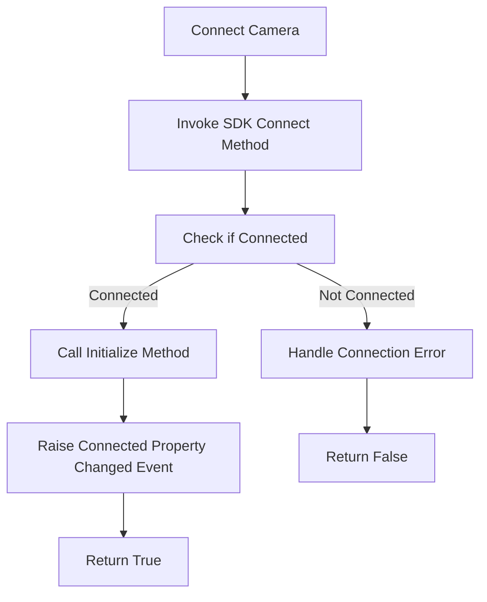
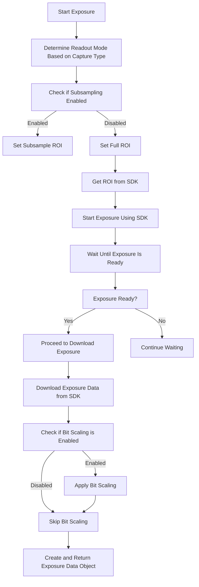
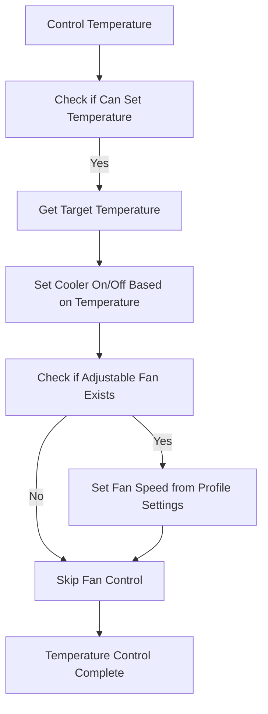

# Detailed Markdown Text with Flowcharts for the `GenericCamera` Class

The `GenericCamera` class represents a camera implementation in the NINA (Nighttime Imaging 'N' Astronomy) software. This class integrates with a camera SDK (Software Development Kit) to provide control and data acquisition functionalities for astrophotography. Below is the detailed explanation and flowcharts for the class.

## Overall Architecture of `GenericCamera` Class

The `GenericCamera` class is structured to manage all camera-related functionalities, including connection, exposure control, image data acquisition, temperature control, and subsampling. It relies on the SDK provided for specific camera models, and interfaces with NINA's profile service to adjust camera settings according to user preferences.

## Class Dependencies and Properties

### Dependencies

- **`IGenericCameraSDK`**: Interface to interact with the camera SDK.
- **`IProfileService`**: Manages user profile settings, particularly camera-related configurations.
- **`IExposureDataFactory`**: Factory class to create image data objects after an exposure.

### Key Properties

- **`Connected`**: Checks if the camera is connected.
- **`BinningModes`**: Collection of supported binning modes.
- **`BitDepth`**: The bit depth of the images, considering bit scaling settings.
- **`Temperature` and `CoolerPower`**: Properties to manage and monitor the camera's temperature and cooling system.
- **`ReadoutModes`**: Collection of supported readout modes.

## Flowcharts

### 1. **Class Initialization Flowchart**

This flowchart describes the steps that occur when a `GenericCamera` object is instantiated.

```mermaid
graph TD
    A[Instantiate GenericCamera] --> B[Initialize BinningModes]
    B --> C[Check SDK Binning Info]
    C -->|No Info Available| D[Set Default Binning (1x1)]
    C -->|Info Available| E[Sort Binning Info and Set Max Binning]
    E --> F[Add Supported Binning Modes]
    F --> G[Get Pixel Size from SDK]
    G -->|Invalid Size| H[Set Pixel SizeX to NaN]
    G -->|Valid Size| I[Set Pixel SizeX to Retrieved Value]
    I --> J[Get Sensor Dimensions and Type from SDK]
    J --> K[Initialize Temperature Control Properties]
    K --> L[Initialize Readout Modes]
    L --> M[Initialization Complete]
```

### 2. **Camera Connection Flowchart**

This flowchart details the connection process of the camera.



### 3. **Exposure Handling Flowchart**

This flowchart shows the steps involved in starting an exposure and downloading the image data.



### 4. **Temperature Control Flowchart**

This flowchart explains the logic for managing the camera's cooling system.



### Detailed Explanation of Flowcharts

1. **Class Initialization**: The initialization process starts by setting up binning modes based on the camera SDK. If no binning information is available, default values are used. The pixel size and sensor dimensions are retrieved, and readout modes are configured accordingly.

2. **Camera Connection**: The connection process involves invoking the camera SDK's connect method and checking the connection status. If successful, the camera is initialized, and connection events are raised.

3. **Exposure Handling**: During exposure, the appropriate readout mode is selected based on the capture type. The region of interest (ROI) is set, and the exposure is started. Once the exposure is ready, the image data is downloaded, potentially scaled for bit depth, and then returned as an exposure data object.

4. **Temperature Control**: The temperature control logic manages the camera's cooling system, including the cooler's on/off state and the fan speed. It ensures that the temperature is regulated according to the profile settings.
