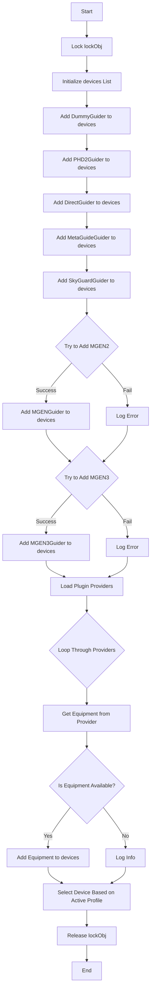
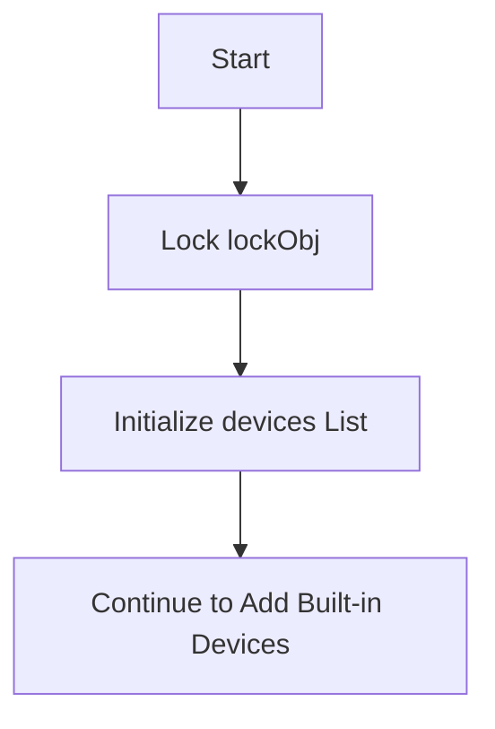
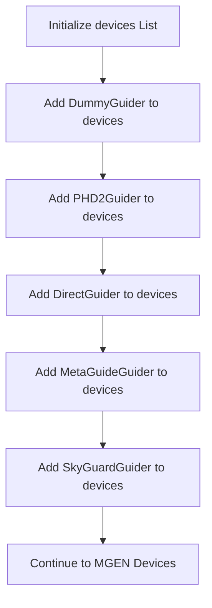
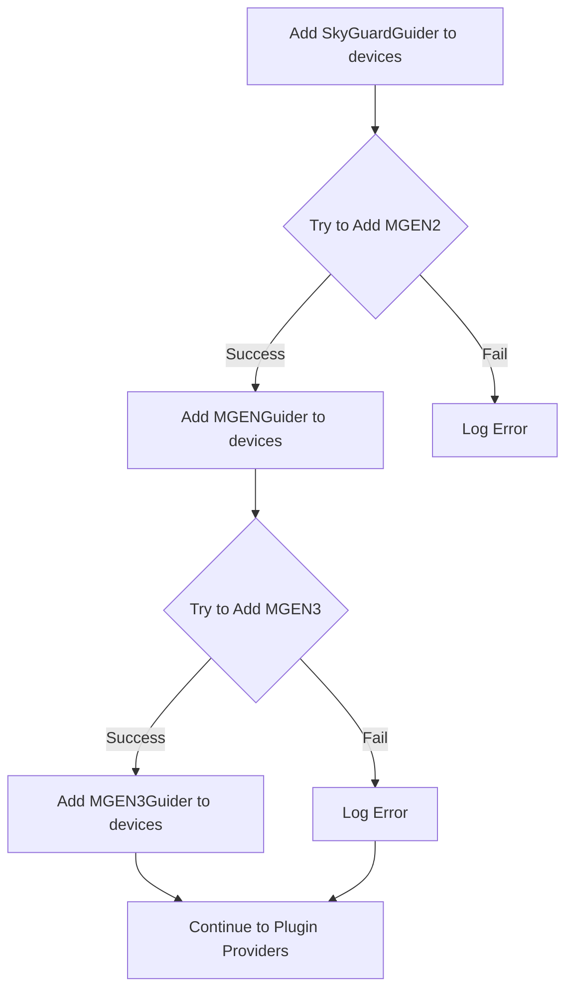
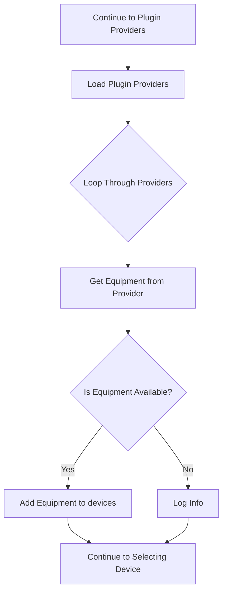
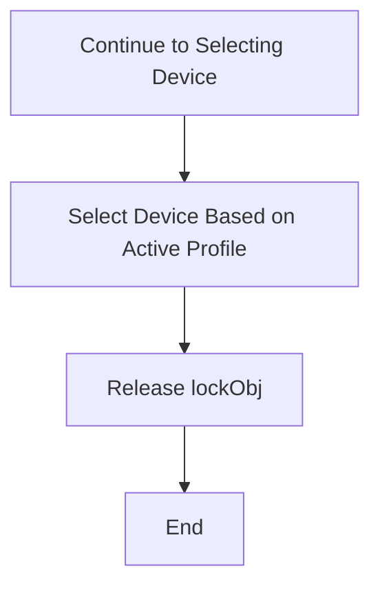

# `GuiderChooserVM` Class Overview

The `GuiderChooserVM` class is part of the N.I.N.A. (Nighttime Imaging 'N' Astronomy) software and is responsible for managing the selection of guider devices. It extends the `DeviceChooserVM` class, which provides a base implementation for selecting a specific type of device, in this case, `IGuider` devices. This class handles the initialization, retrieval, and selection of different guider devices that are available based on the connected equipment and plugins.

## Key Components

- **`cameraMediator`**: Mediates the interaction with camera devices.
- **`telescopeMediator`**: Mediates the interaction with telescope devices.
- **`windowServiceFactory`**: Manages the creation of windows and UI elements.
- **`profileService`**: Handles the current profile, which includes settings specific to the user's setup.
- **`equipmentProviders`**: A collection of providers that can supply additional guider devices via plugins.

---

## Overall Flowchart

Below is the overall flowchart representing the flow of the `GetEquipment` method in `GuiderChooserVM`:

---

## Step-by-Step Explanation with Detailed Flowcharts

### 1. Initialization and Locking

When the `GetEquipment` method is called, it first locks the `lockObj` semaphore to ensure thread safety.

### 2. Adding Built-in Guider Devices

The method initializes a `devices` list and adds several built-in guider devices (`DummyGuider`, `PHD2Guider`, `DirectGuider`, `MetaGuideGuider`, `SkyGuardGuider`).

### 3. Adding MGEN Devices

The method attempts to add MGEN2 and MGEN3 devices, handling any exceptions that might occur during this process.

### 4. Loading Plugin Providers

After adding the built-in devices, the method loads additional equipment from plugin providers.

### 5. Selecting the Device Based on Active Profile

Finally, the method selects the appropriate device based on the active profile settings and then releases the `lockObj` semaphore.

