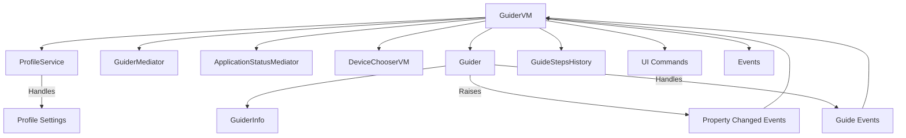
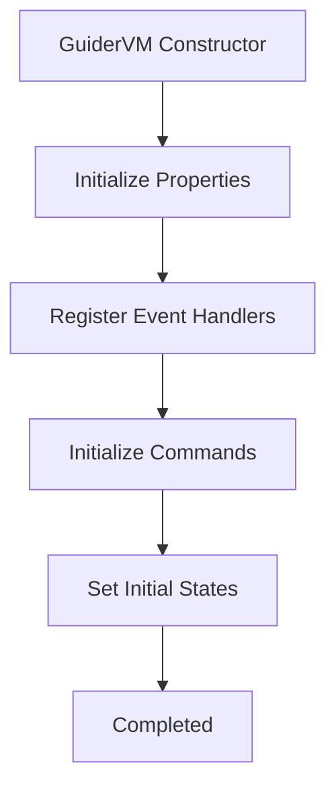
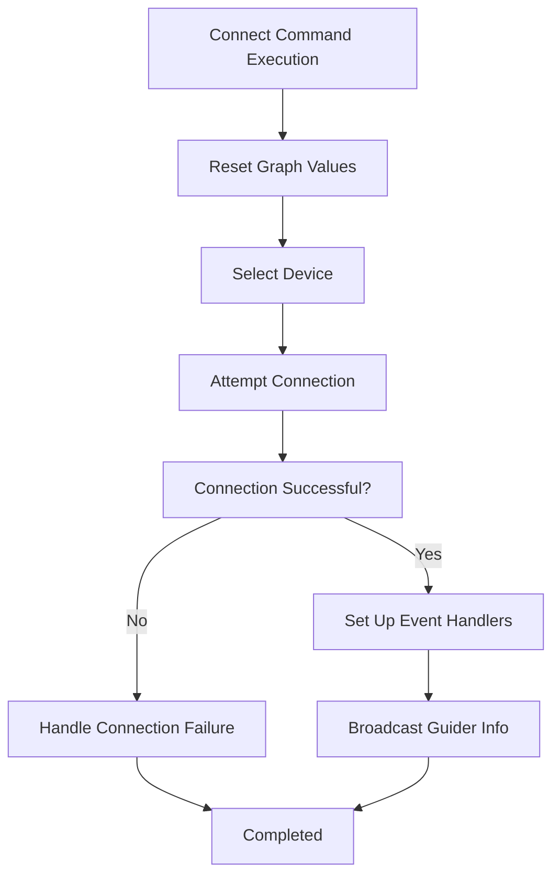
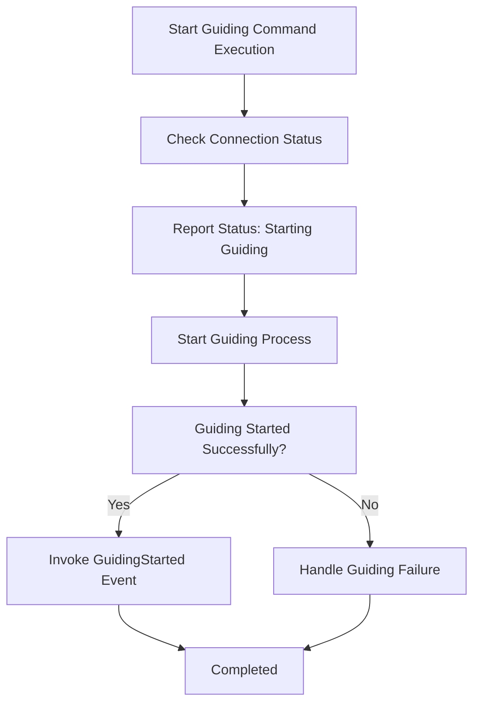
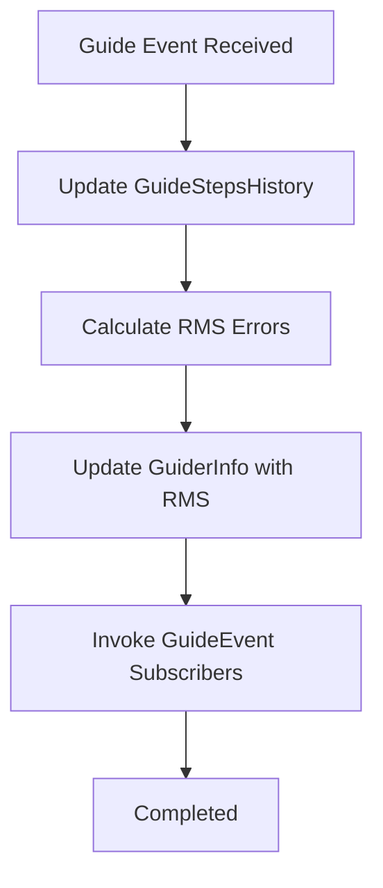
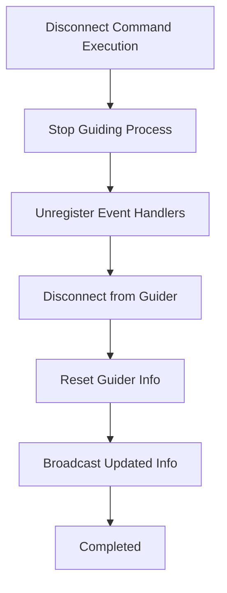

# GuiderVM Class Overview

The `GuiderVM` class is part of the N.I.N.A. software, responsible for managing the guiding operations within the application. It interacts with guider devices to establish connections, start/stop guiding sessions, handle RMS (Root Mean Square) error calculations, and more.

## Overall Structure

The overall structure of the `GuiderVM` class can be visualized in a flowchart that outlines its main components and interactions:

### Components:

- **GuiderVM**: The main ViewModel that controls the guiding functionalities.
- **ProfileService**: Manages the active profile settings.
- **GuiderMediator**: Facilitates communication between various parts of the application related to guiding.
- **ApplicationStatusMediator**: Manages and updates the application status.
- **DeviceChooserVM**: Handles device selection and management.
- **Guider**: Represents the connected guider device.
- **GuiderInfo**: Holds information about the connected guider device.
- **GuideStepsHistory**: Maintains a history of guide steps and calculates RMS errors.

## Step-by-Step Processes

### 1. Initialization

The initialization process sets up the `GuiderVM` class, registers event handlers, and prepares commands for execution.

### 2. Connecting to the Guider

The process of connecting to a guider involves selecting the device, establishing the connection, and setting up necessary event handlers.

### 3. Starting Guiding

This process details how the guiding session is started, including checking the connection status, reporting progress, and initiating guiding operations.

### 4. Handling Guide Events

The process of handling guide events involves updating the guide steps history, calculating RMS errors, and invoking any subscribed events.

### 5. Disconnecting the Guider

Disconnecting from the guider device involves stopping any ongoing processes, unregistering event handlers, and resetting the state.

## Key Methods and Commands

### Methods

- **`Connect`**: Attempts to establish a connection with the selected guider device.
- **`Disconnect`**: Disconnects the current guider and resets related states.
- **`StartGuiding`**: Initiates the guiding process.
- **`StopGuiding`**: Stops the ongoing guiding process.
- **`Rescan`**: Rescans for available guider devices.
- **`AutoSelectGuideStar`**: Automatically selects a guide star.

### Commands

- **`ConnectCommand`**: Triggers the connection process.
- **`DisconnectCommand`**: Triggers the disconnection process.
- **`RescanDevicesCommand`**: Initiates the device rescan process.
- **`ClearGraphCommand`**: Clears the guide graph.
- **`SetShiftRateCommand`**: Sets the shift rate for guiding.
- **`StopShiftCommand`**: Stops the shifting process.

## Event Handling

### Events

- **`Connected`**: Fired when the guider is successfully connected.
- **`Disconnected`**: Fired when the guider is disconnected.
- **`GuideEvent`**: Fired when a new guide step event occurs.
- **`GuidingStarted`**: Fired when guiding has successfully started.
- **`GuidingStopped`**: Fired when guiding has been stopped.
