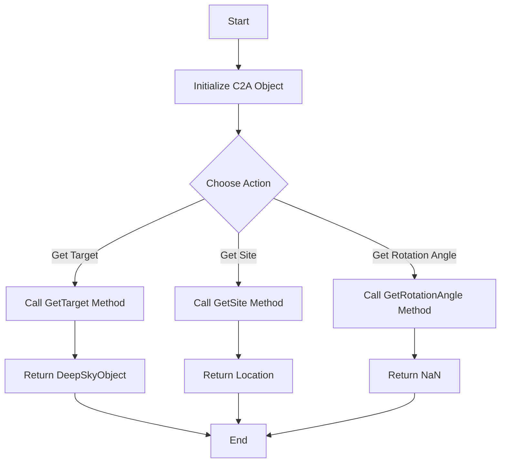
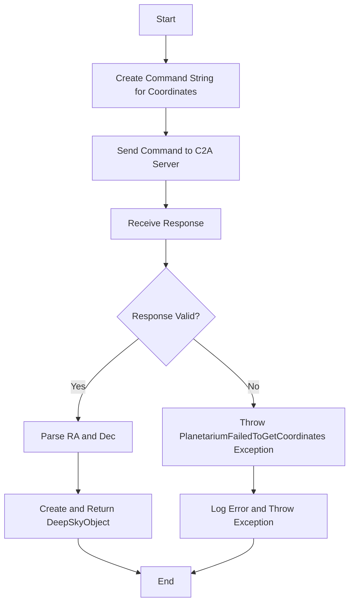
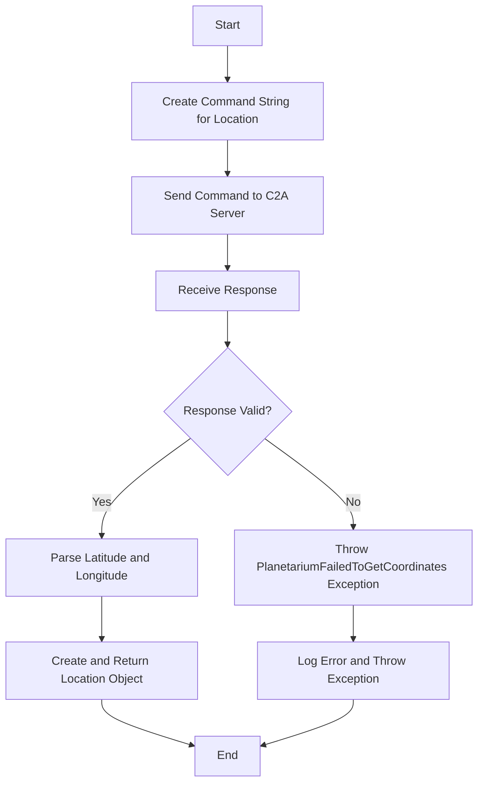
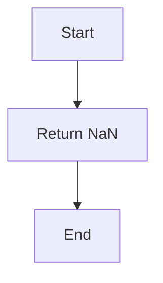

# **Overview of the C2A Class**

The `C2A` class in the `NINA.Equipment.Equipment.MyPlanetarium` namespace implements the `IPlanetarium` interface. This class is designed to interact with the C2A planetarium software via TCP/IP, allowing it to obtain the coordinates of selected objects and the user’s location.

## **Class Members**:

- **Fields**:

  - `string address`: The IP address of the C2A server.
  - `int port`: The port number used to communicate with the C2A server.

- **Constructor**:

  - `C2A(IProfileService profileService)`: Initializes the `C2A` class using the provided profile service to obtain the address and port of the C2A server.

- **Properties**:

  - `string Name`: Returns the name "C2A".
  - `bool CanGetRotationAngle`: Indicates that this implementation cannot get a rotation angle (returns `false`).

- **Methods**:
  - `Task<DeepSkyObject> GetTarget()`: Asynchronously gets the selected object’s coordinates from C2A.
  - `Task<Location> GetSite(CancellationToken token)`: Asynchronously retrieves the user’s location from C2A.
  - `Task<double> GetRotationAngle()`: Returns `NaN` since the rotation angle cannot be retrieved.

---

# 2. **Step-by-Step Flowcharts**

## **Overall Flowchart**

## **Step-by-Step Flowchart for `GetTarget` Method**

## **Step-by-Step Flowchart for `GetSite` Method**

## **Step-by-Step Flowchart for `GetRotationAngle` Method**

---

# 3. **API Extraction**

Below is a list of all public APIs extracted from the `C2A` class:

## **Constructor**:

- **`C2A(IProfileService profileService)`**:
  - **Parameters**:
    - `IProfileService profileService`: Provides access to the active profile's settings for the C2A host and port.

## **Properties**:

- **`string Name { get; }`**:
  - **Description**: Returns the name "C2A".
- **`bool CanGetRotationAngle { get; }`**:
  - **Description**: Indicates that the implementation cannot provide a rotation angle.

## **Methods**:

- **`Task<DeepSkyObject> GetTarget()`**:

  - **Description**: Asynchronously retrieves the selected object’s right ascension and declination from C2A.
  - **Returns**: `DeepSkyObject` representing the selected object.

- **`Task<Location> GetSite(CancellationToken token)`**:

  - **Description**: Asynchronously retrieves the user's geographical location (latitude and longitude) from C2A.
  - **Returns**: `Location` object containing latitude, longitude, and elevation.

- **`Task<double> GetRotationAngle()`**:
  - **Description**: Returns `NaN`, as this implementation does not support retrieving a rotation angle.
  - **Returns**: `double` (always `NaN`).

---

This detailed markdown documentation should provide clear insights into the structure, functionality, and API endpoints of the `C2A` class.
