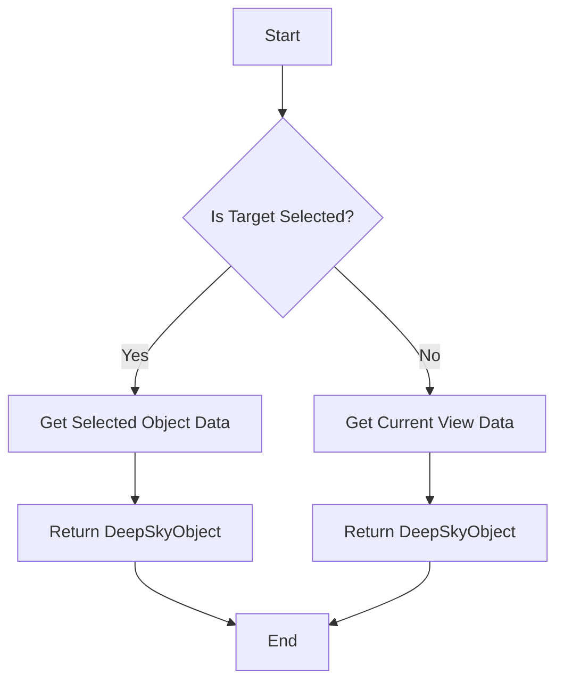
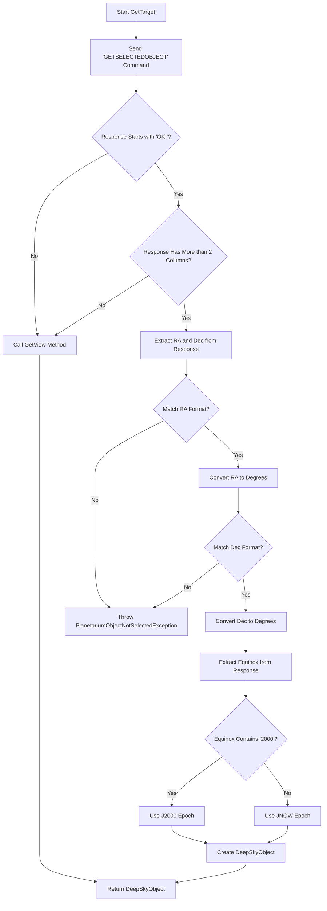
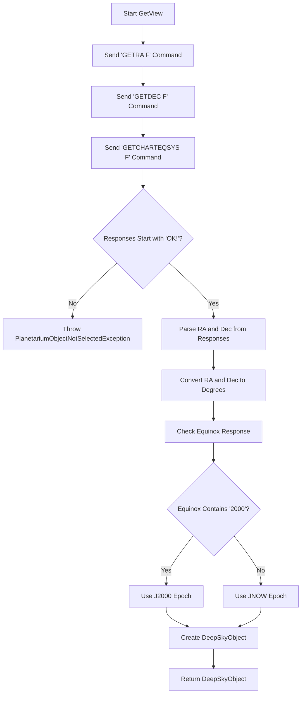
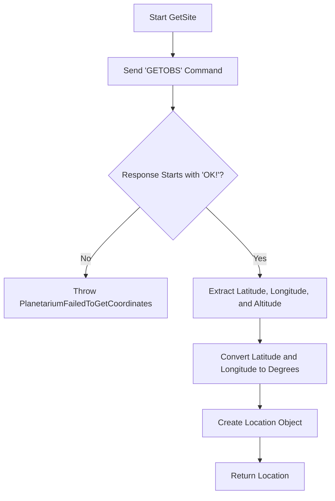

# CartesDuCiel Class

## Overview of the Code

The `CartesDuCiel` class implements the `IPlanetarium` interface and is responsible for communicating with the Cartes Du Ciel (CdC) planetarium software to retrieve astronomical data. The key methods include:

1. **`GetTarget()`**: Retrieves the selected object or the current view in CdC.
2. **`GetView()`**: Retrieves the coordinates of the current view in CdC.
3. **`GetSite()`**: Retrieves the observer's site location from CdC.
4. **`GetRotationAngle()`**: Returns a constant rotation angle, which is not implemented and always returns `NaN`.

## Overall Flowchart

Below is an overall flowchart representing the process flow in the `CartesDuCiel` class.

## Step-by-Step Flowchart for `GetTarget` Method

The `GetTarget` method is more complex, involving multiple steps to retrieve and process data from CdC.

## Step-by-Step Flowchart for `GetView` Method

This method is called when no object is selected in CdC and it retrieves the current view's RA and Dec.

## Step-by-Step Flowchart for `GetSite` Method

This method retrieves the observer's site information from CdC.

## Extracted APIs

Here is a list of all the key API calls and utility methods used in the `CartesDuCiel` class:

1. **`BasicQuery.SendQuery()`**: Sends a command to the CdC application and returns the response.
2. **`AstroUtil.HMSToDegrees()`**: Converts Right Ascension (RA) from hours/minutes/seconds to degrees.
3. **`AstroUtil.DMSToDegrees()`**: Converts Declination (Dec) from degrees/minutes/seconds to degrees.
4. **`Coordinates.Transform()`**: Transforms coordinates based on the epoch.
5. **`Logger.Error()`**: Logs errors encountered during execution.
6. **`CancellationToken`**: Manages task cancellation.

These flowcharts and API extractions provide a comprehensive view of the class's functionality and internal processes.
