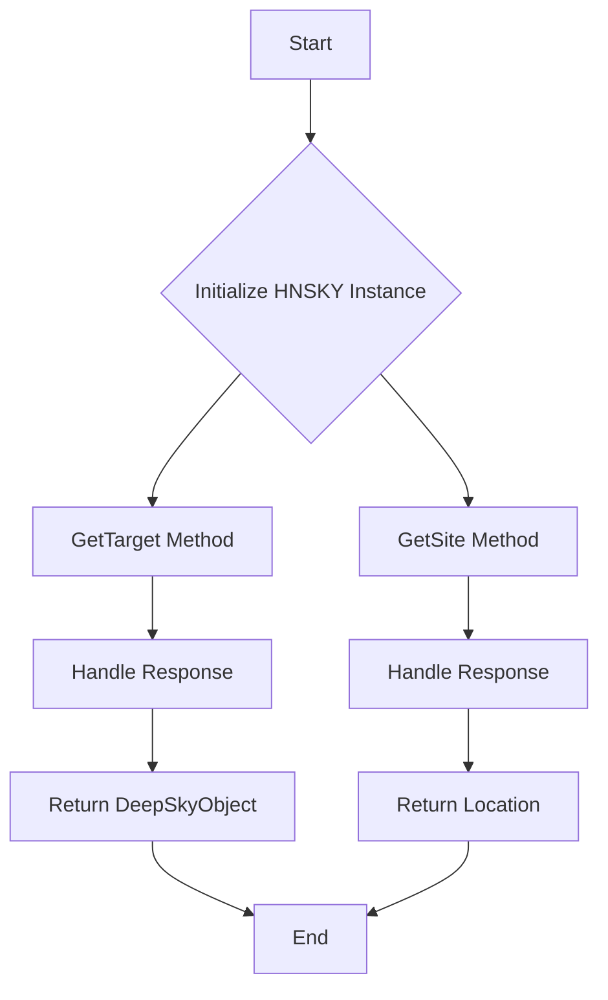
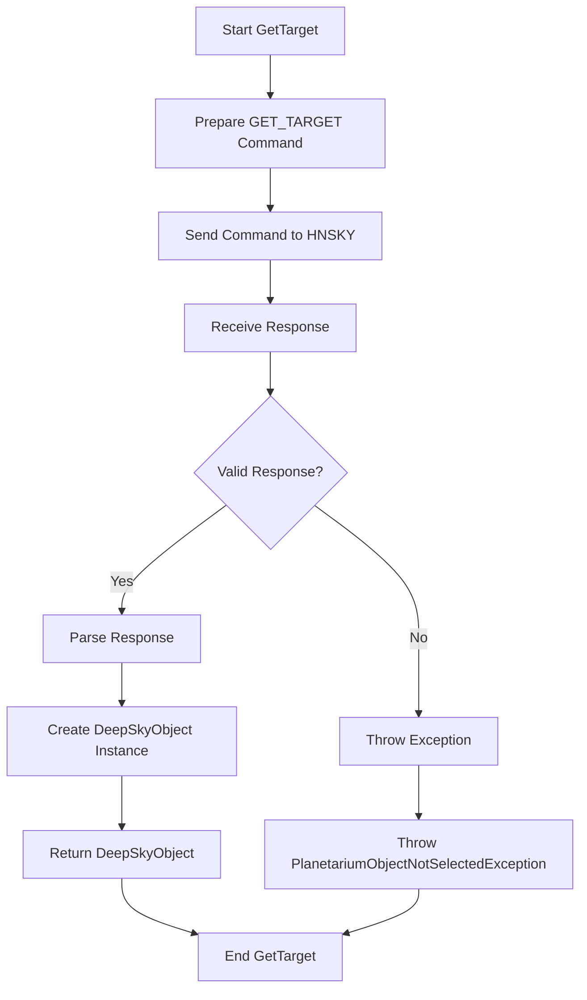
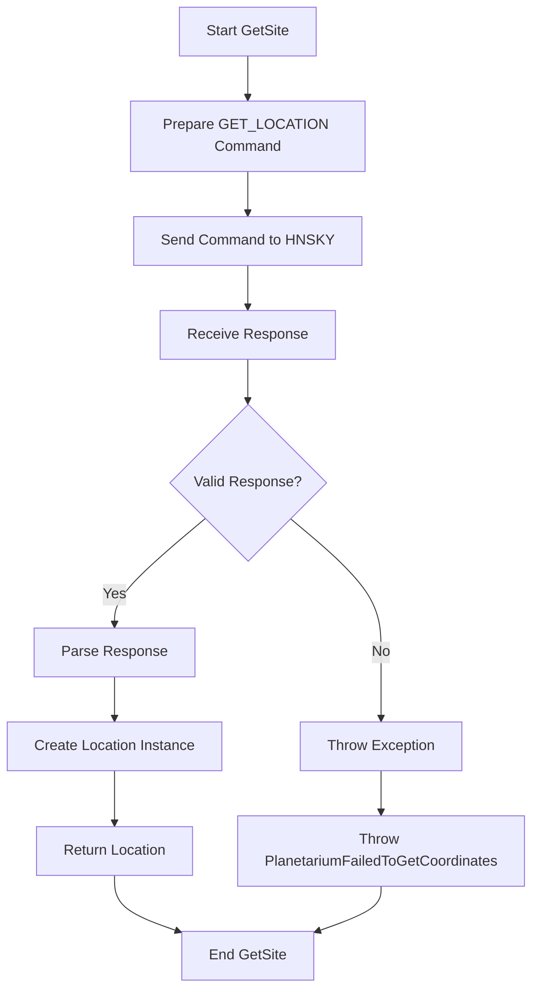
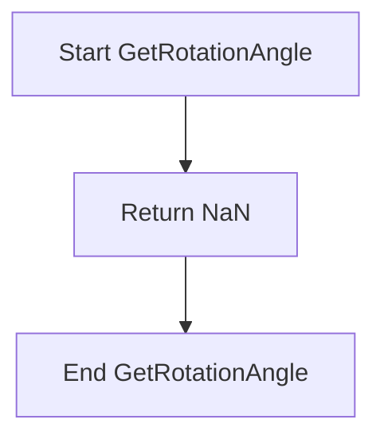

# HNSKY Class Overview

The `HNSKY` class is designed to interface with HNSKY planetarium software. It allows the user to:

1. **Retrieve the selected astronomical object** from the planetarium.
2. **Retrieve the configured user location** from the planetarium.

## Key Properties

- **address**: The IP address of the HNSKY instance.
- **port**: The port on which HNSKY is listening.

## Key Methods

- `GetTarget()`: Retrieves the currently selected deep-sky object from HNSKY.
- `GetSite(CancellationToken token)`: Retrieves the user’s configured location from HNSKY.
- `GetRotationAngle()`: Returns the rotation angle, although this method is not supported by HNSKY and will return NaN.

## Overall Flowchart

---

# Method Details and Flowcharts

## 1. GetTarget Method

## Purpose:

Fetches the currently selected deep-sky object from HNSKY.

## Step-by-Step Flowchart

## API Extraction:

- **Command Sent**: `GET_TARGET`
- **Response Format**: `RA Dec Name Position_angle`
- **Key Fields Extracted**:
  - **RA**: Right Ascension in radians
  - **Dec**: Declination in radians
  - **Name**: Name of the astronomical object

## 2. GetSite Method

## Purpose:

Retrieves the user’s configured location from HNSKY.

## Step-by-Step Flowchart

## API Extraction:

- **Command Sent**: `GET_LOCATION`
- **Response Format**: `Latitude Longitude Julian_Date`
- **Key Fields Extracted**:
  - **Latitude**: Latitude in radians
  - **Longitude**: Longitude in radians (flipped sign)
  - **Julian_Date**: The Julian date

## 3. GetRotationAngle Method

## Purpose:

This method is a placeholder and does not perform any action related to rotation angle in HNSKY. It returns NaN.

## Simple Flowchart

