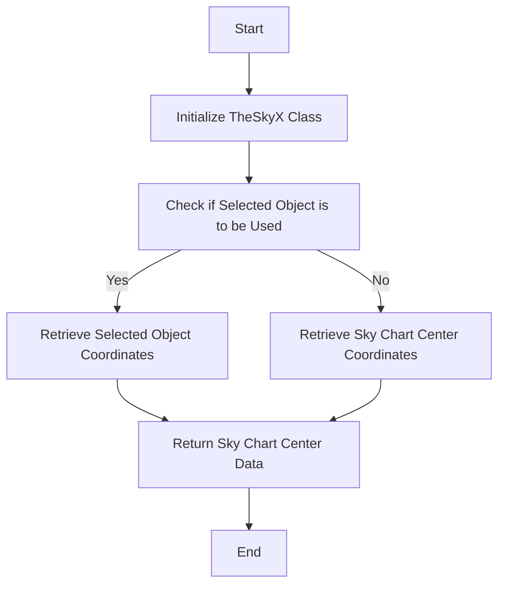
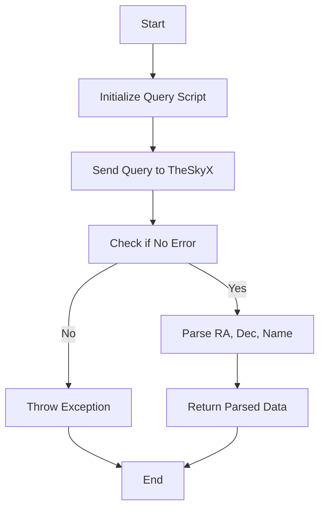
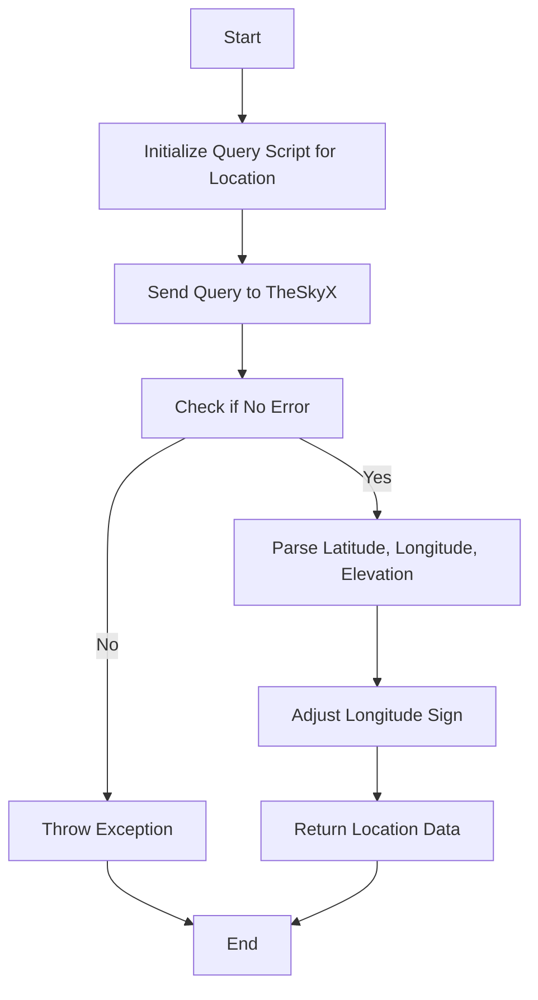
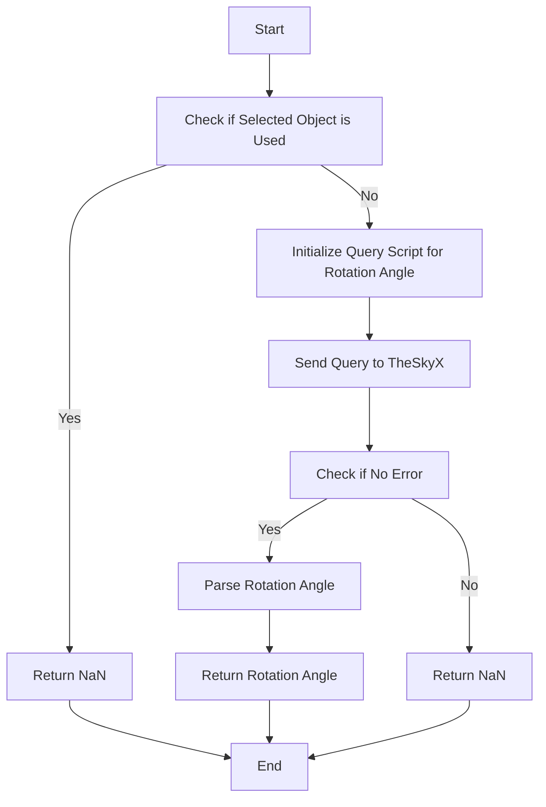

# Documentation for `TheSkyX` Class

## Overview

The `TheSkyX` class is a part of the `NINA.Equipment.Equipment.MyPlanetarium` namespace and implements the `IPlanetarium` interface. This class is used to interact with TheSkyX software, primarily to retrieve astronomical data such as the selected object, the site's location, and the rotation angle.

### Key Features:

- Retrieve the currently selected object in TheSkyX.
- Get the location coordinates (latitude, longitude, elevation) from TheSkyX.
- Determine the rotation angle of the Field of View Indicator (FOVI) in TheSkyX.

## Flowcharts

### Overall Process

### Step-by-Step Flowcharts

#### 1. Retrieving Selected Object in TheSkyX

#### 2. Getting Site Location

#### 3. Retrieving Rotation Angle

## API Extraction

The class interacts with TheSkyX through custom scripts executed via `BasicQuery`. Below are the APIs and their functions:

### 1. **`GetTarget`**

- **Description:** Retrieves the currently selected object or the sky chart center coordinates from TheSkyX.
- **Input:** None
- **Output:** `DeepSkyObject` containing RA, Dec, and object name.
- **Exceptions:** Throws `PlanetariumObjectNotSelectedException` and `PlanetariumFailedToGetCoordinates`.

### 2. **`GetSite`**

- **Description:** Retrieves the site's geographical coordinates (latitude, longitude, elevation) from TheSkyX.
- **Input:** `CancellationToken`
- **Output:** `Location` object containing latitude, longitude, and elevation.
- **Exceptions:** Throws `PlanetariumFailedToGetCoordinates`.

### 3. **`GetRotationAngle`**

- **Description:** Retrieves the rotation angle of the Field of View Indicator (FOVI) from TheSkyX.
- **Input:** None
- **Output:** `double` representing the rotation angle.
- **Exceptions:** None, but returns `NaN` if an error occurs.

### 4. **`GetSelectedObject`**

- **Description:** Helper function to retrieve the J2000 coordinates and name of the selected object in TheSkyX.
- **Input:** None
- **Output:** `string[]` containing RA, Dec, and object name.
- **Exceptions:** Throws `PlanetariumFailedToGetCoordinates`.

### 5. **`GetSkyChartCenter`**

- **Description:** Helper function to retrieve the J2000 coordinates of the center of the TSX star chart.
- **Input:** None
- **Output:** `string[]` containing RA, Dec, and an empty string for object name.
- **Exceptions:** Throws `PlanetariumFailedToGetCoordinates`.
