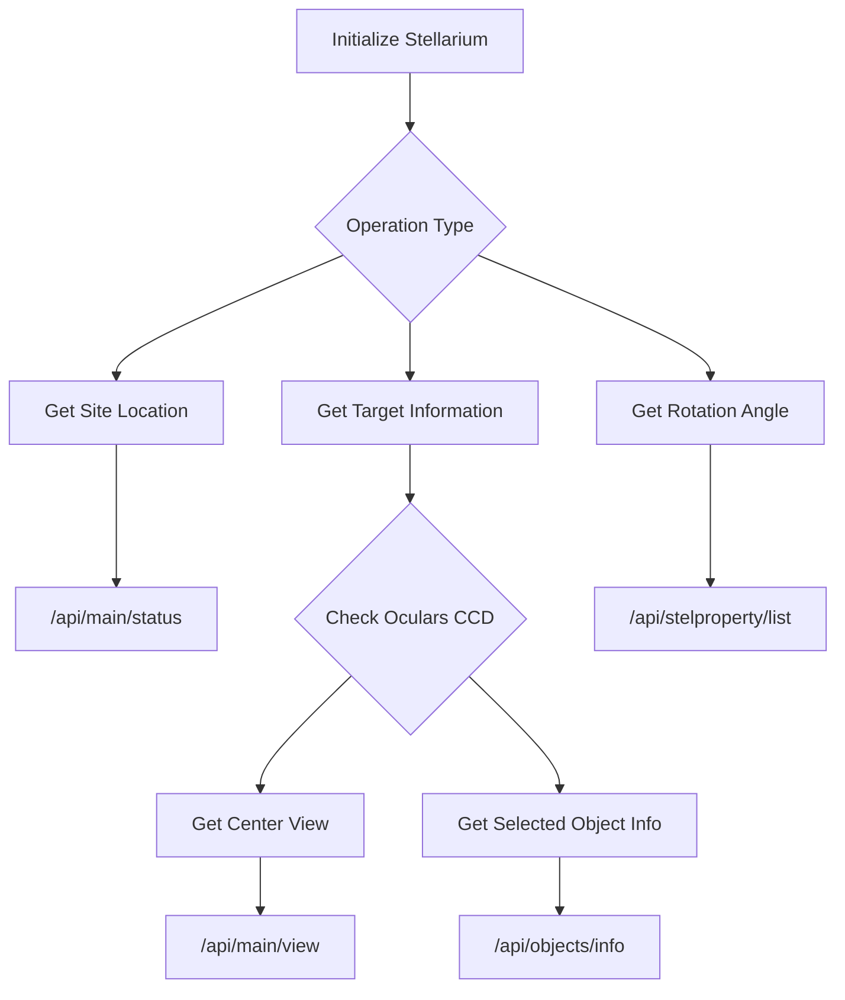
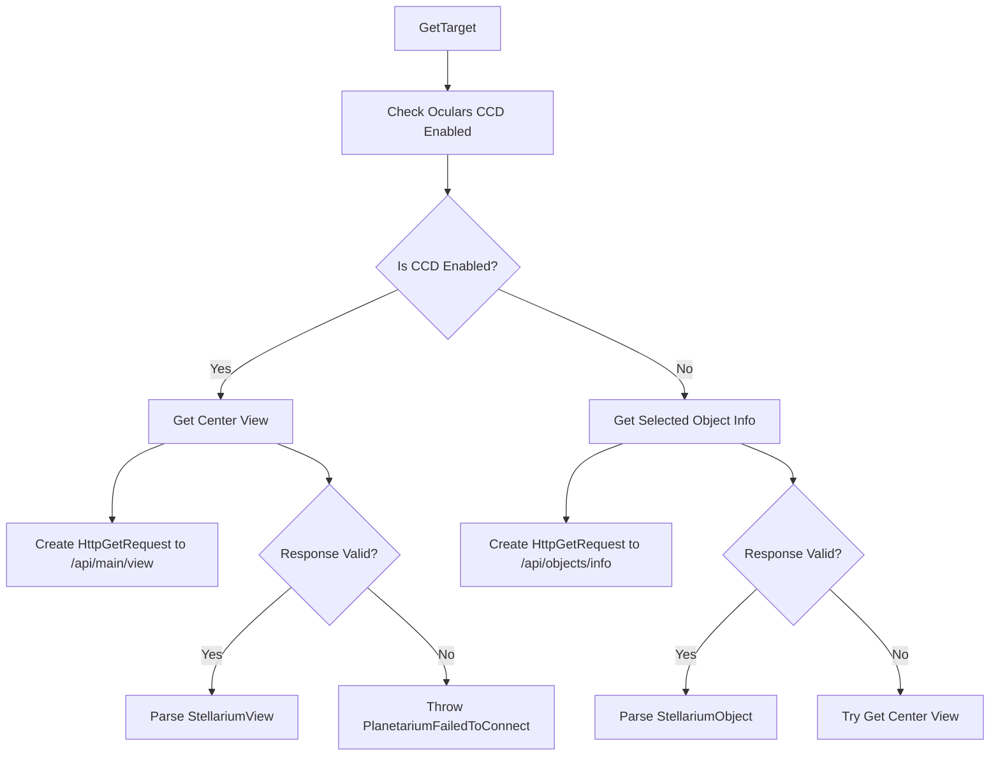
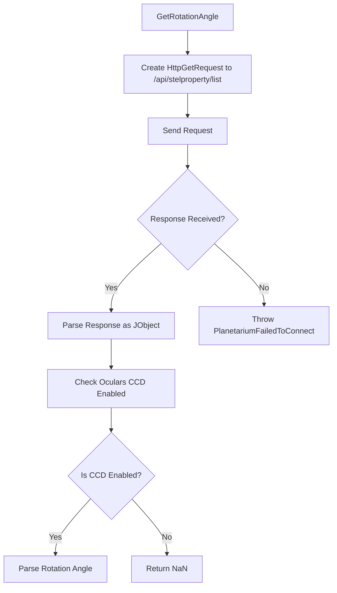

# Overview of Stellarium Class

The `Stellarium` class interacts with the Stellarium application to fetch information such as site location, target information, and the current view or rotation angle. It utilizes multiple APIs provided by Stellarium, and the operations involve HTTP requests and JSON parsing.

## Overall Flowchart



# Detailed Step-by-Step Flowcharts

## Step 1: Get Site Location

The `GetSite` method fetches the site location by querying the `/api/main/status` endpoint.

```mermaid
flowchart TD
    A[GetSite] --> B[Create HttpGetRequest]
    B --> C[Send Request to /api/main/status]
    C --> D{Response Received?}
    D -- Yes --> E[Parse Response as StellariumStatus]
    E --> F[Extract Location Data (Latitude, Longitude, Elevation)]
    D -- No --> G[Throw PlanetariumFailedToConnect]
```

## Step 2: Get Target Information

The `GetTarget` method checks whether the CCD ocular is enabled and either fetches the current view or selected object information.



## Step 3: Get Rotation Angle

The `GetRotationAngle` method fetches the rotation angle using the `/api/stelproperty/list` endpoint.



# Extracted APIs

1. **/api/main/status**: Used in `GetSite` to retrieve the current site location including latitude, longitude, and elevation.

2. **/api/main/view**: Used in `GetCenterView` to retrieve the center view's celestial coordinates in different epochs.

3. **/api/objects/info**: Used in `GetSelectedObjectInfo` to fetch information about the currently selected object, including right ascension, declination, and object name.

4. **/api/stelproperty/list**: Used in `GetRotationAngle` to obtain properties related to the telescope's ocular settings, including the rotation angle.

These flowcharts and descriptions should give a clear understanding of how the `Stellarium` class operates and interacts with Stellarium's API to retrieve the necessary astronomical data.
