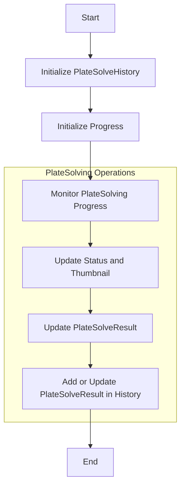
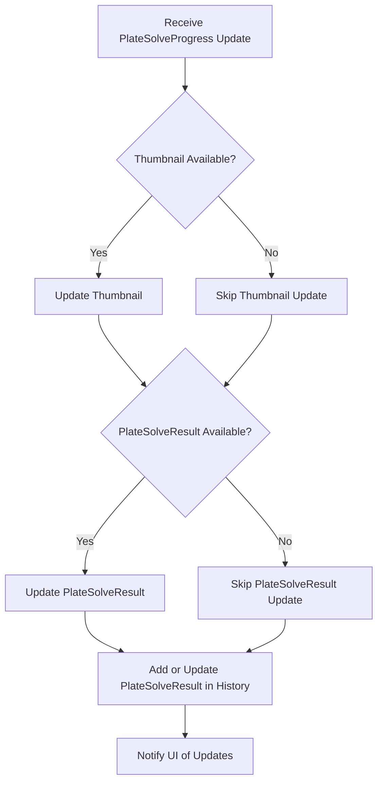
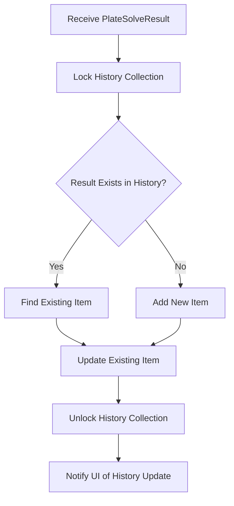

# PlateSolvingStatusVM Class Documentation

## Overview

The `PlateSolvingStatusVM` class is part of the N.I.N.A. (Nighttime Imaging 'N' Astronomy) project, specifically designed to manage and display the status and results of plate solving operations. Plate solving is a process used to determine the precise coordinates of an astronomical object in an image.

## Class Responsibilities

- **Manage Plate Solve History:** Maintains a collection of plate solving results.
- **Update and Display Plate Solve Results:** Reflects the latest plate solving result and its thumbnail.
- **Progress Tracking:** Provides real-time updates on plate solving progress.

## Key Properties

- **PlateSolveHistory:** Collection of historical plate solving results.
- **Progress:** Progress indicator for plate solving operations.
- **Status:** Current status of the plate solving operation.
- **PlateSolveResult:** Latest result of the plate solving operation.
- **Thumbnail:** Image thumbnail of the latest plate solve result.

## Flowcharts

## 1. Overall Workflow

The overall workflow of the `PlateSolvingStatusVM` class can be represented as follows:



## 2. Detailed Step-by-Step Flowcharts

### a. Handling Plate Solve Progress



### b. Adding or Updating PlateSolveResult in History



## Class Code

Here's a concise view of the `PlateSolvingStatusVM` class code with comments highlighting key areas:

```csharp
using NINA.PlateSolving;
using NINA.Core.Utility;
using System;
using System.Collections.Generic;
using System.Collections.ObjectModel;
using System.Linq;
using System.Text;
using System.Threading.Tasks;
using System.Windows.Media.Imaging;
using NINA.Core.Locale;
using NINA.Core.Model;

namespace NINA.WPF.Base.ViewModel {

    public class PlateSolvingStatusVM : BaseINPC {

        public PlateSolvingStatusVM() {
            PlateSolveHistory = new AsyncObservableCollection<PlateSolveResult>();
            Progress = new Progress<PlateSolveProgress>(x => {
                if (x.Thumbnail != null) {
                    Thumbnail = x.Thumbnail;
                }
                if (x.PlateSolveResult != null) {
                    PlateSolveResult = x.PlateSolveResult;
                }
            });
        }

        // Collection to store plate solving results
        public AsyncObservableCollection<PlateSolveResult> PlateSolveHistory { get; }

        // Title for the view model
        public string Title => Loc.Instance["LblPlateSolving"];

        // Progress reporting
        public IProgress<PlateSolveProgress> Progress { get; }

        // Method to create a progress object that links with the original progress
        public IProgress<ApplicationStatus> CreateLinkedProgress(IProgress<ApplicationStatus> original) {
            return new Progress<ApplicationStatus>(x => {
                Status = x;
                original?.Report(x);
            });
        }

        private ApplicationStatus status;
        public ApplicationStatus Status {
            get => status;
            set {
                status = value;
                RaisePropertyChanged();
            }
        }

        private object lockObj = new object();
        private PlateSolveResult plateSolveResult;
        public PlateSolveResult PlateSolveResult {
            get => plateSolveResult;
            set {
                plateSolveResult = value;
                if (value != null) {
                   lock (lockObj) {
                        var existingItem = PlateSolveHistory.FirstOrDefault(x => x.SolveTime == value.SolveTime);
                        if (existingItem != null) {
                            // Update existing item if necessary
                            var index = PlateSolveHistory.IndexOf(existingItem);
                            PlateSolveHistory[index] = existingItem;
                        } else {
                            PlateSolveHistory.Add(value);
                        }
                    }
                }
                RaisePropertyChanged();
            }
        }

        private BitmapSource thumbnail;
        public BitmapSource Thumbnail {
            get => thumbnail;
            set {
                thumbnail = value;
                RaisePropertyChanged();
            }
        }
    }
}
```
