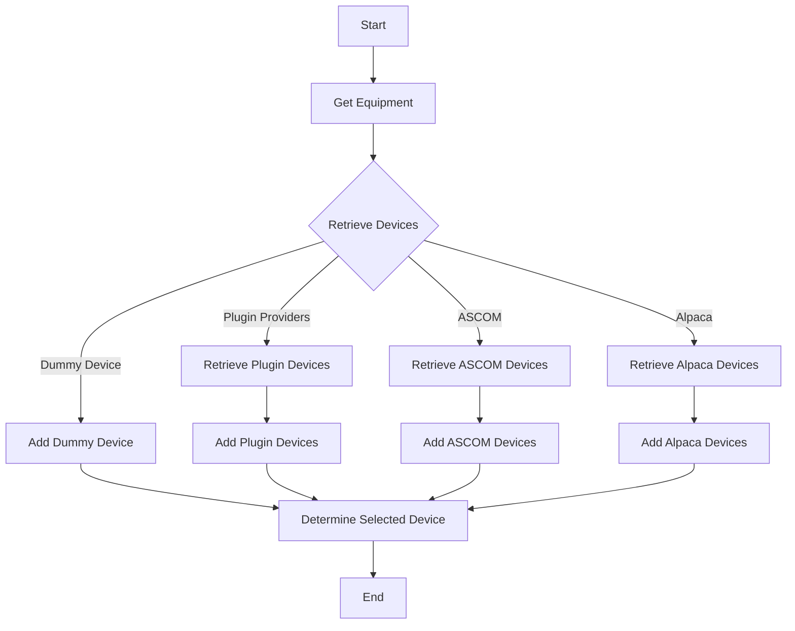
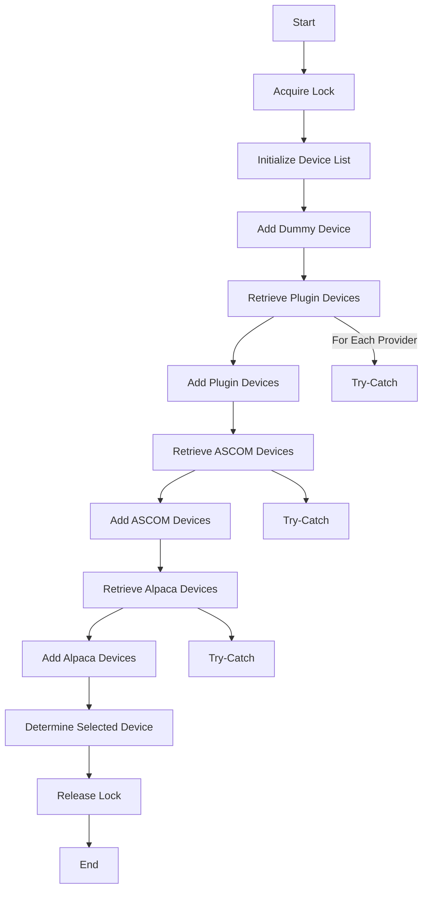

# SwitchChooserVM

## Overview

The `SwitchChooserVM` class is responsible for choosing and managing switch devices within the N.I.N.A. (Nighttime Imaging 'N' Astronomy) application. It inherits from `DeviceChooserVM<ISwitchHub>` and provides functionality to retrieve a list of switch hubs from various sources, including plugins, ASCOM, and Alpaca.

### Overall Flowchart



### Step-by-Step Flowcharts

#### 1. Get Equipment Method

The `GetEquipment` method retrieves the list of switch devices from multiple sources and determines the selected device.



#### Detailed Steps for Get Equipment

1. **Acquire Lock**

    ```mermaid
    flowchart TD
        A[Start] --> B[Lock Object]
        B --> C[Lock Acquired]
        C --> D[Proceed]
    ```

2. **Initialize Device List**

    ```mermaid
    flowchart TD
        A[Start] --> B[Create List of Devices]
        B --> C[Add Dummy Device]
        C --> D[Proceed]
    ```

3. **Retrieve Plugin Devices**

    ```mermaid
    flowchart TD
        A[Start] --> B[Get Providers]
        B --> C[Retrieve Devices]
        C --> D{Error Occurred?}
        D -->|No| E[Add Devices to List]
        D -->|Yes| F[Log Error]
        E --> G[Proceed]
        F --> G
    ```

4. **Retrieve ASCOM Devices**

    ```mermaid
    flowchart TD
        A[Start] --> B[Create ASCOM Interaction]
        B --> C[Retrieve Switches]
        C --> D{Error Occurred?}
        D -->|No| E[Add Devices to List]
        D -->|Yes| F[Log Error]
        E --> G[Proceed]
        F --> G
    ```

5. **Retrieve Alpaca Devices**

    ```mermaid
    flowchart TD
        A[Start] --> B[Create Alpaca Interaction]
        B --> C[Retrieve Switches]
        C --> D{Error Occurred?}
        D -->|No| E[Add Devices to List]
        D -->|Yes| F[Log Error]
        E --> G[Proceed]
        F --> G
    ```

6. **Determine Selected Device**

    ```mermaid
    flowchart TD
        A[Start] --> B[Determine Device]
        B --> C[Set Selected Device]
        C --> D[End]
    ```

7. **Release Lock**

    ```mermaid
    flowchart TD
        A[Start] --> B[Release Lock]
        B --> C[End]
    ```
