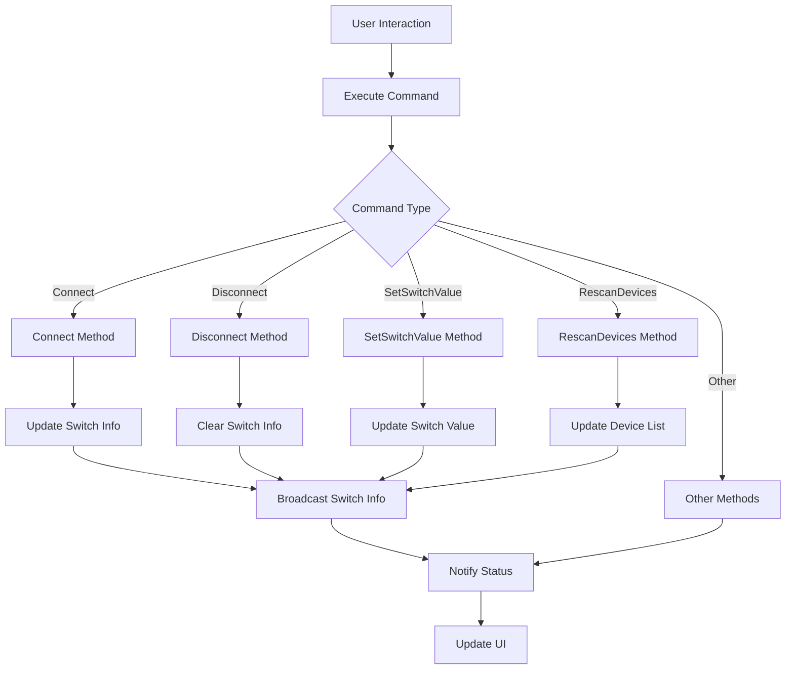
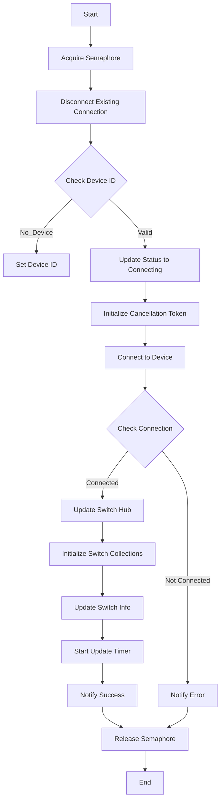
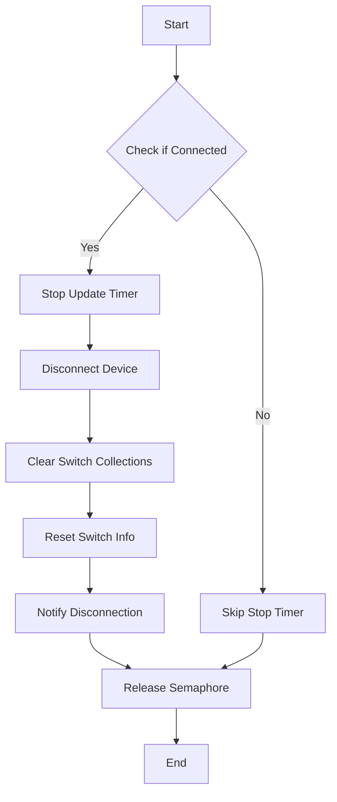
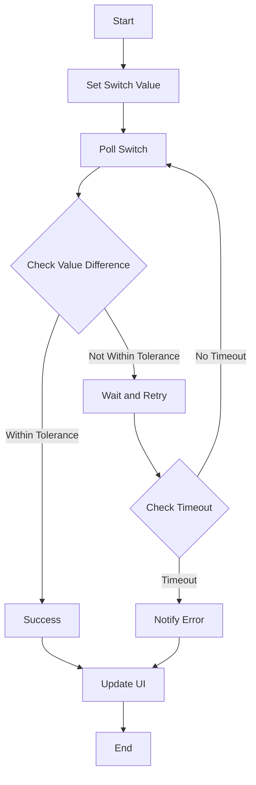
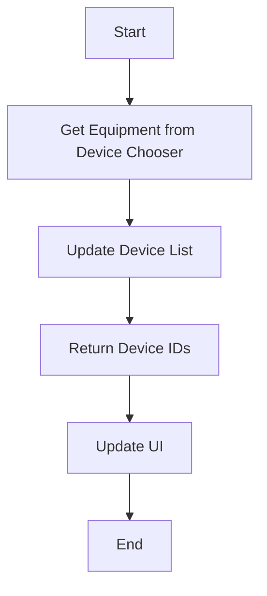

# SwitchVM

## Overview

The `SwitchVM` class is a ViewModel for handling switch equipment in the N.I.N.A. (Nighttime Imaging 'N' Astronomy) application. It manages the connection to switch devices, provides commands for interaction, and updates the state of switches.

### Overall Flowchart

### Step-by-Step Flowcharts

#### 1. Connect Method

The `Connect` method establishes a connection to the selected switch device.

#### 2. Disconnect Method

The `Disconnect` method terminates the connection and cleans up resources.

#### 3. SetSwitchValue Method

The `SetSwitchValue` method sets the value of a writable switch and verifies the update.

#### 4. RescanDevices Method

The `RescanDevices` method refreshes the list of available devices.

