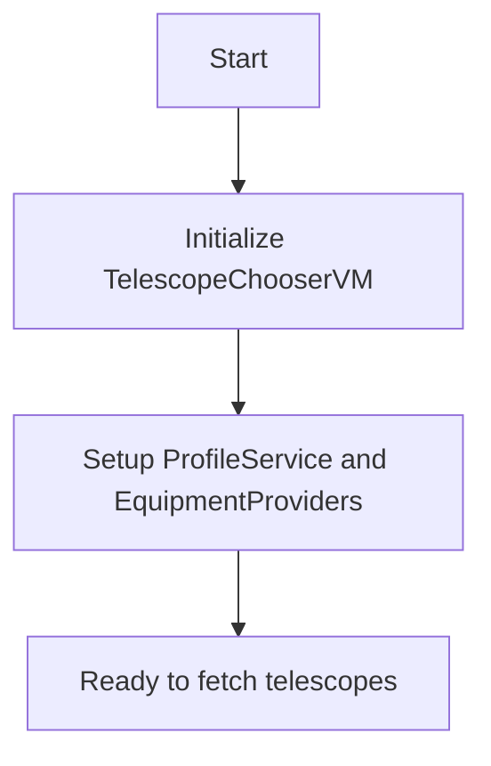
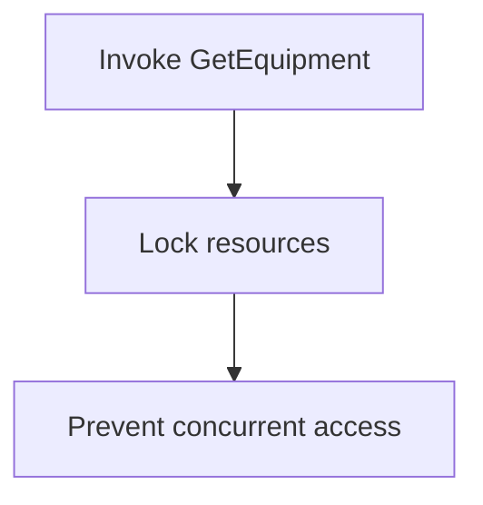
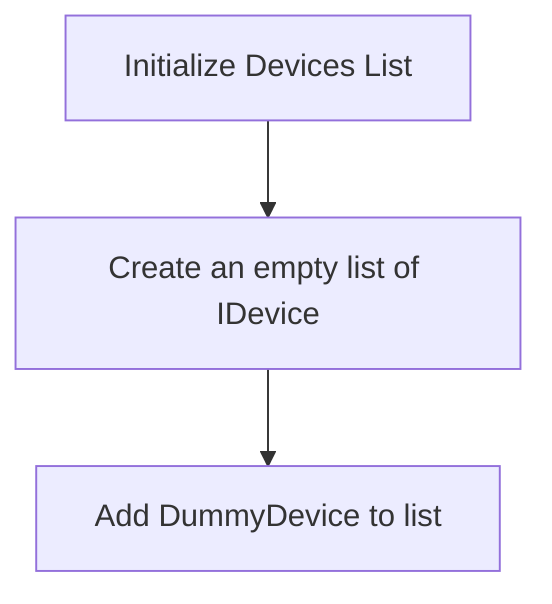
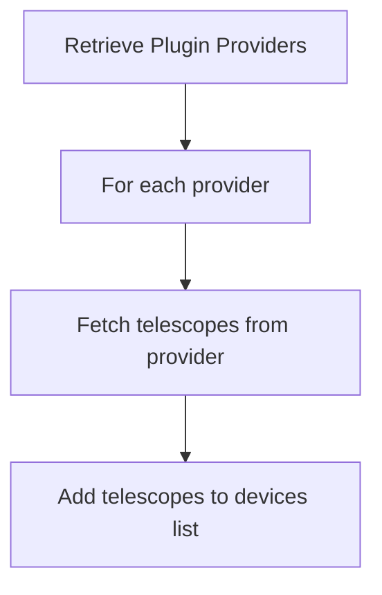
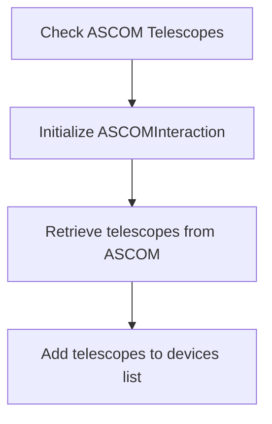
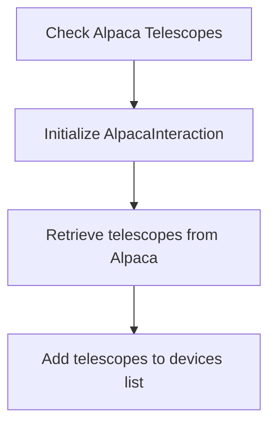
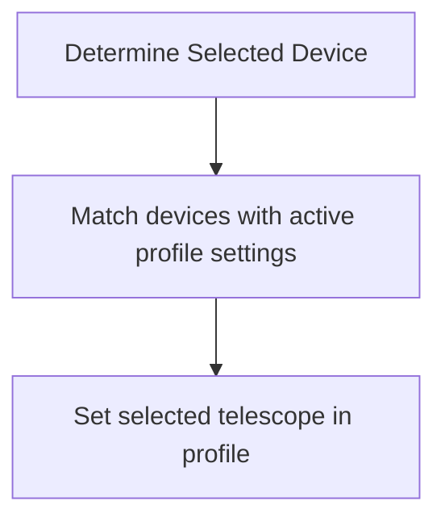
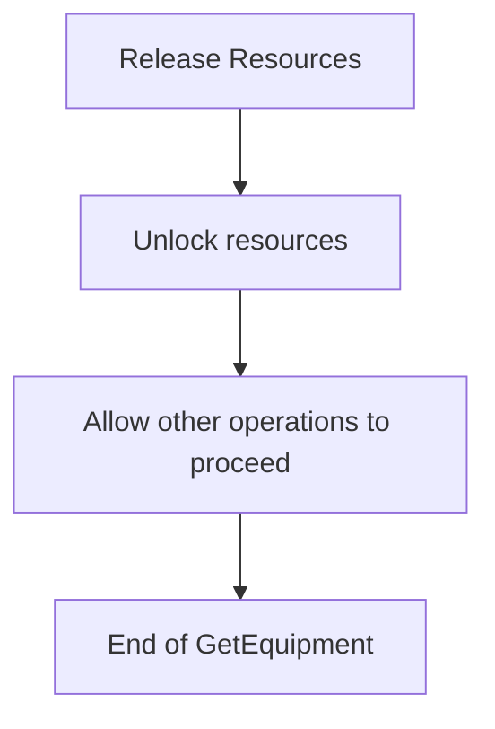

# TelescopeChooserVM Class Overview

The `TelescopeChooserVM` class is responsible for managing the selection of telescopes in the N.I.N.A. (Nighttime Imaging 'N' Astronomy) application. This class interacts with various telescope providers, gathers a list of available telescopes, and manages the user's selected telescope.

## Overall Flowchart

```mermaid
graph TD;
    A[Start] --> B[Initialize TelescopeChooserVM]
    B --> C[Invoke GetEquipment()]
    C --> D[Lock resources]
    D --> E[Initialize devices list]
    E --> F[Add Dummy Device]
    F --> G[Retrieve Plugin Providers]
    G --> H[Add Plugin Devices to List]
    H --> I[Check ASCOM Telescopes]
    I --> J[Add ASCOM Telescopes to List]
    J --> K[Check Alpaca Telescopes]
    K --> L[Add Alpaca Telescopes to List]
    L --> M[Determine Selected Device]
    M --> N[Release resources]
    N --> O[End]
```

## Step-by-Step Flowchart

## 1. **Initialize TelescopeChooserVM**



## 2. **Invoke GetEquipment()**



## 3. **Initialize Devices List**



## 4. **Retrieve Plugin Providers**



## 5. **Check ASCOM Telescopes**



## 6. **Check Alpaca Telescopes**



## 7. **Determine Selected Device**



## 8. **Release Resources**



## Detailed Explanation

1. **Initialization**: The `TelescopeChooserVM` is initialized with `profileService` and `equipmentProviders`, which are used throughout the process to interact with various telescope devices and configurations.

2. **GetEquipment Method**: This method is the core of the `TelescopeChooserVM` class. It starts by locking resources to ensure thread safety during the retrieval and management of telescope devices.

3. **Device List Management**: An empty list of devices is created, and a dummy device is added as a fallback option.

4. **Plugin Providers**: The system interacts with plugin providers to fetch available telescopes. Each provider's telescopes are added to the device list.

5. **ASCOM Interaction**: ASCOM-compatible telescopes are retrieved and added to the list.

6. **Alpaca Interaction**: Similarly, Alpaca-compatible telescopes are retrieved and added to the list.

7. **Device Selection**: The system determines which telescope device should be selected based on the active profile settings.

8. **Resource Management**: Finally, resources are released, allowing other operations to proceed, and the method concludes.
