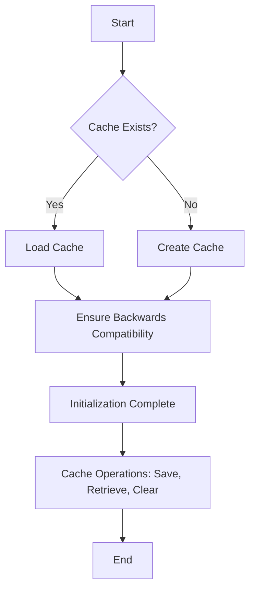
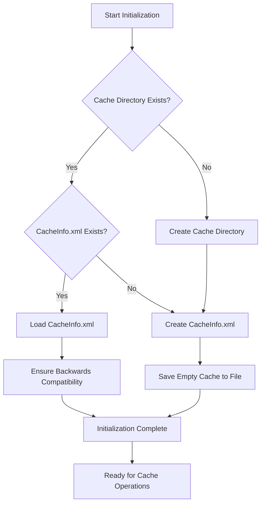
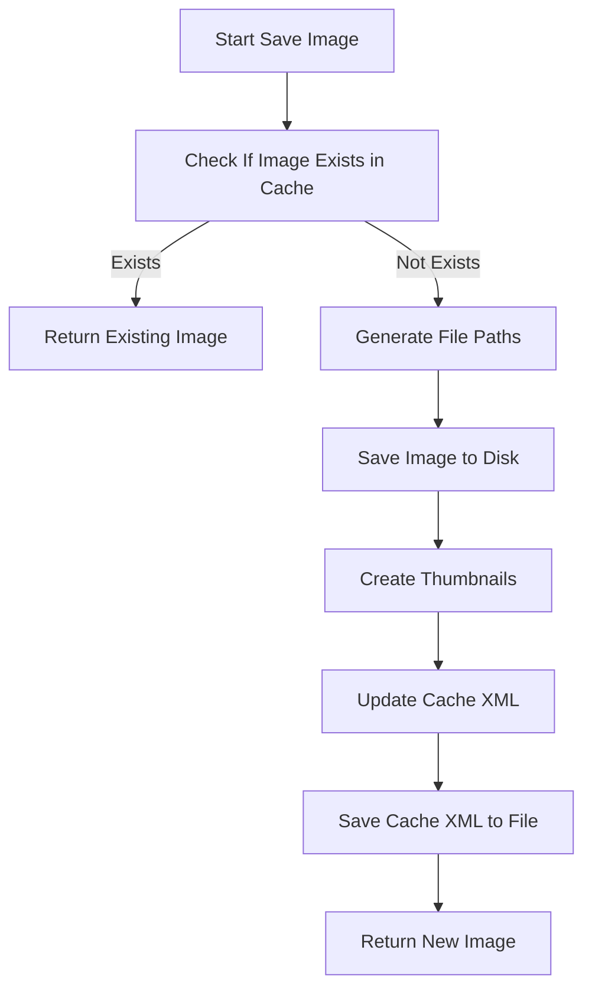
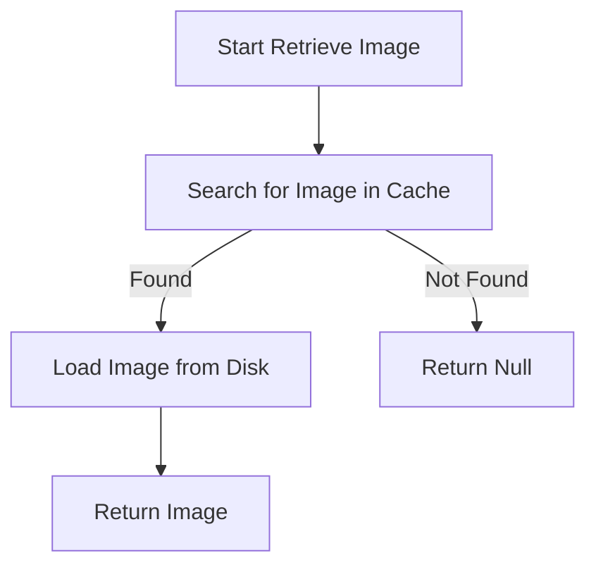
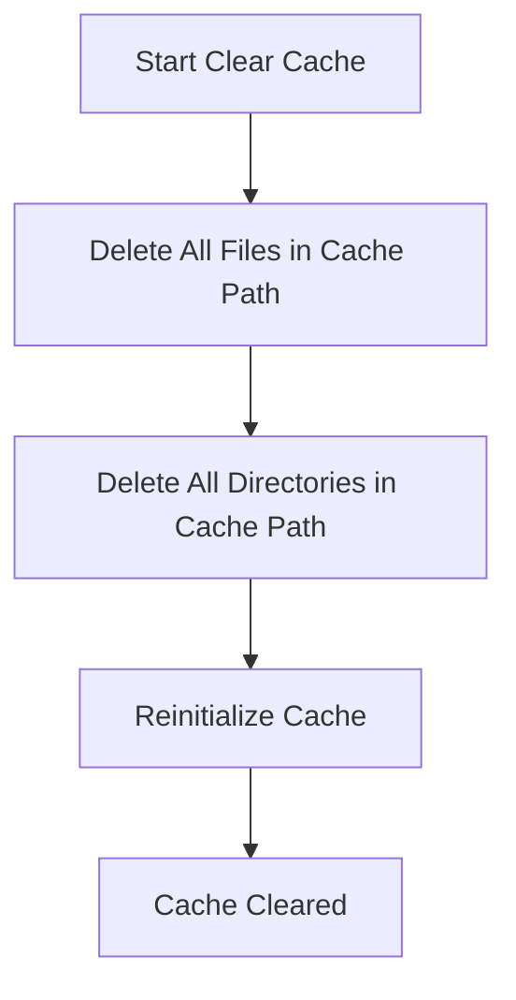
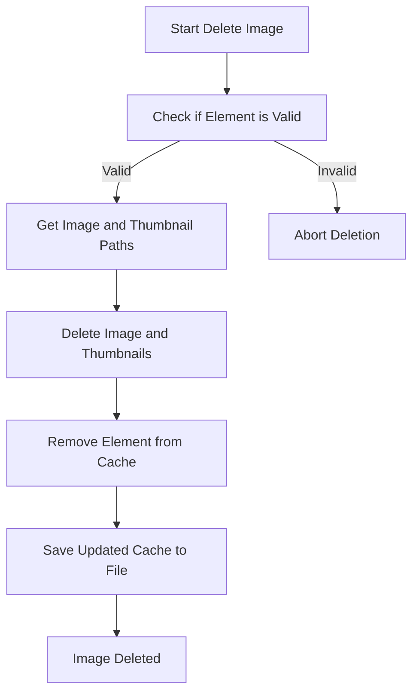

# `CacheSkySurvey`

## Overview

The `CacheSkySurvey` class is responsible for managing a cache of sky survey images. It handles operations such as initialization, saving images to the cache, retrieving images from the cache, and clearing the cache. The class is designed to work with image data and metadata to ensure efficient retrieval and storage of sky survey images.

### Overall Flowchart

---

## Step-by-Step Flowcharts

### 1. Initialization

The `Initialize` method is called when a `CacheSkySurvey` object is instantiated. It checks if the cache directory and `CacheInfo.xml` file exist. If not, it creates them. The method also ensures backward compatibility with previous versions by adding missing attributes.

#### Initialization Flowchart

### 2. Saving an Image to Cache

The `SaveImageToCache` method saves a `SkySurveyImage` to the cache. It first checks if the image already exists in the cache. If not, it generates file paths, saves the image, creates thumbnails, and updates the cache file.

#### Save Image Flowchart

### 3. Retrieving an Image from Cache

The `GetImage` method retrieves a sky survey image from the cache based on various parameters like source, RA, Dec, rotation, and FOV. It searches the cache for a matching image and loads it.

#### Retrieve Image Flowchart

### 4. Clearing the Cache

The `Clear` method deletes all files and directories in the cache path and reinitializes the cache.

#### Clear Cache Flowchart

### 5. Deleting an Image from Cache

The `DeleteFromCache` method removes a specific image from the cache by deleting the image file and its associated thumbnails.

#### Delete Image Flowchart

