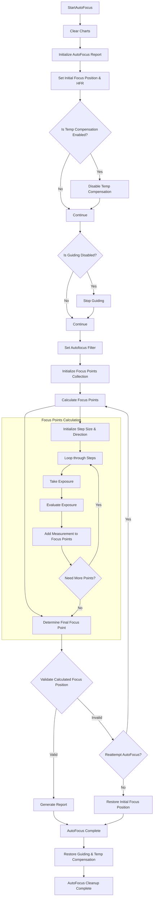

```mermaid
flowchart TD
    A[StartAutoFocus] --> B[Clear Charts]
    B --> C[Initialize AutoFocus Report]
    C --> D[Set Initial Focus Position & HFR]
    D --> E{Is Temp Compensation Enabled?}
    E -- Yes --> F[Disable Temp Compensation]
    E -- No --> G[Continue]
    F --> G
    G --> H{Is Guiding Disabled?}
    H -- Yes --> I[Stop Guiding]
    H -- No --> J[Continue]
    I --> J
    J --> K[Set Autofocus Filter]
    K --> L[Initialize Focus Points Collection]
    L --> M[Calculate Focus Points]
    M --> N[Determine Final Focus Point]
    N --> O{Validate Calculated Focus Position}
    O -- Valid --> P[Generate Report]
    O -- Invalid --> Q{Reattempt AutoFocus?}
    Q -- Yes --> M
    Q -- No --> R[Restore Initial Focus Position]
    P --> S[AutoFocus Complete]
    R --> S
    S --> T[Restore Guiding & Temp Compensation]
    T --> U[AutoFocus Cleanup Complete]

    subgraph Focus Points Calculation
        M1[Initialize Step Size & Direction] --> M2[Loop through Steps]
        M2 --> M3[Take Exposure]
        M3 --> M4[Evaluate Exposure]
        M4 --> M5[Add Measurement to Focus Points]
        M5 --> M6{Need More Points?}
        M6 -- Yes --> M2
        M6 -- No --> N
    end
    M --> M1
```
