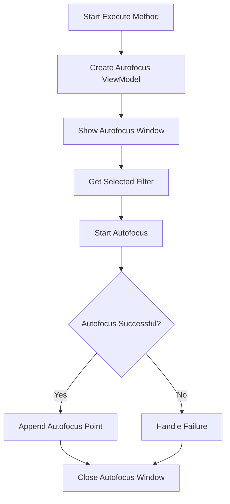

# RunAutofocus

The `RunAutofocus` class is part of the N.I.N.A. (Nighttime Imaging 'N' Astronomy) application. It manages the autofocus process for imaging sequences, ensuring the best focus is achieved for astronomical observations.

## Class Overview

### Namespace

- **Namespace:** `NINA.Sequencer.SequenceItem.Autofocus`
- **Dependencies:**
  - `NINA.Core.Model`
  - `NINA.Profile.Interfaces`
  - `NINA.Sequencer.Validations`
  - `NINA.Equipment.Interfaces.Mediator`
  - `NINA.Core.Utility.WindowService`
  - `NINA.Core.Model.Equipment`
  - `NINA.Core.Locale`
  - `NINA.WPF.Base.Interfaces.ViewModel`
  - `NINA.WPF.Base.Interfaces`

### Class Declaration

```csharp
[ExportMetadata("Name", "Lbl_SequenceItem_Autofocus_RunAutofocus_Name")]
[ExportMetadata("Description", "Lbl_SequenceItem_Autofocus_RunAutofocus_Description")]
[ExportMetadata("Icon", "AutoFocusSVG")]
[ExportMetadata("Category", "Lbl_SequenceCategory_Focuser")]
[Export(typeof(ISequenceItem))]
[JsonObject(MemberSerialization.OptIn)]
public class RunAutofocus : SequenceItem, IValidatable
```

### Class Properties

- **profileService**: Interface for accessing profile settings.
- **history**: Interface for managing image history.
- **cameraMediator**: Interface for interacting with the camera.
- **filterWheelMediator**: Interface for interacting with the filter wheel.
- **focuserMediator**: Interface for interacting with the focuser.
- **autoFocusVMFactory**: Factory for creating autofocus view models.
- **WindowServiceFactory**: Factory for creating window services.

### Constructor

The constructor initializes the `RunAutofocus` class with various services and mediators necessary for the autofocus process.

```csharp
[ImportingConstructor]
public RunAutofocus(
    IProfileService profileService, IImageHistoryVM history, ICameraMediator cameraMediator, IFilterWheelMediator filterWheelMediator, IFocuserMediator focuserMediator, IAutoFocusVMFactory autoFocusVMFactory)
```

### Key Methods

- **Clone()**: Creates a copy of the `RunAutofocus` instance.
- **Execute(IProgress<ApplicationStatus> progress, CancellationToken token)**: Starts the autofocus process and handles the UI and autofocus execution.
- **Validate()**: Checks if the camera and focuser are connected and ready for autofocus.
- **GetEstimatedDuration()**: Estimates the duration of the autofocus process based on settings and hardware.
- **ToString()**: Provides a string representation of the `RunAutofocus` instance.

### Flowchart: Execution Process

Below is a flowchart illustrating the key steps in the `Execute` method of the `RunAutofocus` class.



### Flowchart Explanation

1. **Create Autofocus ViewModel**: Creates a new autofocus view model using `autoFocusVMFactory`.
2. **Show Autofocus Window**: Displays the autofocus UI window.
3. **Get Selected Filter**: Retrieves the selected filter from the filter wheel if available.
4. **Start Autofocus**: Initiates the autofocus process and obtains a report.
5. **Autofocus Successful?**: Checks if the autofocus was successful. If not, handles the failure.
6. **Append Autofocus Point**: Adds the result of the autofocus to the image history.
7. **Close Autofocus Window**: Closes the autofocus UI window after a delay.

### Detailed Method Descriptions

#### `Clone`

Creates a new instance of `RunAutofocus` with the same configuration as the current instance.

#### `Execute`

1. **Create Autofocus ViewModel**: Initializes and displays the autofocus UI.
2. **Start Autofocus**: Executes the autofocus process and captures the result.
3. **Handle Failure**: Manages any errors during the autofocus process.
4. **Append Autofocus Point**: Updates the image history with the new autofocus point.
5. **Close Autofocus Window**: Closes the UI window after a delay.

#### `Validate`

1. **Camera Check**: Verifies that the camera is connected.
2. **Focuser Check**: Verifies that the focuser is connected.
3. **Update Issues**: Updates the list of issues based on connectivity checks.

#### `GetEstimatedDuration`

Calculates the estimated duration of the autofocus process based on settings and hardware characteristics. Considers exposure times, focuser settings, and number of attempts.

#### `ToString`

Provides a string representation of the `RunAutofocus` instance, including the category and item name.
