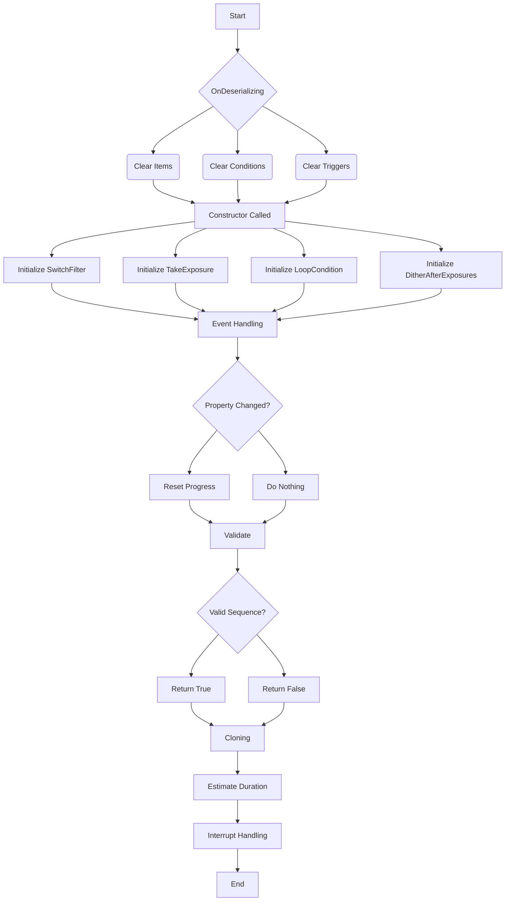

# SmartExposure Class Overview

The `SmartExposure` class is a key component within the N.I.N.A. (Nighttime Imaging 'N' Astronomy) software, designed to handle imaging sequences. Below is a detailed breakdown of its logic, event handling, validation, cloning, and more.

## Key Functionalities

- **Deserialization Initialization**

  - Clears all sequence items, conditions, and triggers during the deserialization process to ensure a clean start.

- **Constructor**

  - Accepts dependencies like `profileService`, `cameraMediator`, and `filterWheelMediator`.
  - Initializes core components including `SwitchFilter`, `TakeExposure`, `LoopCondition`, and `DitherAfterExposures`.

- **Event Handling**

  - Monitors changes to the `SwitchFilter` property. If the filter changes during sequence creation or execution, the progress is reset.

- **Error Handling**

  - Incorporates properties for managing error behavior (`ErrorBehavior`) and retry attempts (`Attempts`), ensuring robust error management during execution.

- **Validation**

  - The `Validate` method checks the configuration of all internal components and returns a boolean indicating whether the sequence is valid for execution.

- **Cloning**

  - Provides a `Clone` method to create a deep copy of the `SmartExposure` instance, including all its associated components.

- **Duration Estimation**

  - Calculates the estimated duration for the sequence based on the exposure settings.

- **Interrupt Handling**
  - If an interruption occurs, it is rerouted to the parent sequence for consistent behavior.

## Flowchart

