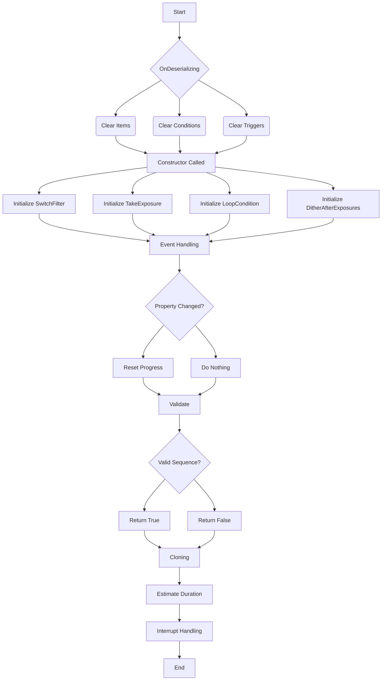

# `SmartExposure` 类概述

`SmartExposure` 类是 N.I.N.A.（Nighttime Imaging 'N' Astronomy）软件中的关键组件，专门用于处理成像序列。以下是其逻辑、事件处理、验证、克隆等方面的详细描述。

The `SmartExposure` class is a key component within the N.I.N.A. (Nighttime Imaging 'N' Astronomy) software, designed to handle imaging sequences. Below is a detailed breakdown of its logic, event handling, validation, cloning, and more.

---

## 关键功能

## Key Functionalities

### **反序列化初始化**

### **Deserialization Initialization**

- 在反序列化过程中清除所有序列项、条件和触发器，以确保一个干净的开始。
- Clears all sequence items, conditions, and triggers during the deserialization process to ensure a clean start.

---

### **构造函数**

### **Constructor**

- 接受依赖项，如 `profileService`、`cameraMediator` 和 `filterWheelMediator`。
- Initializes with dependencies like `profileService`, `cameraMediator`, and `filterWheelMediator`.

- 初始化核心组件，包括 `SwitchFilter`、`TakeExposure`、`LoopCondition` 和 `DitherAfterExposures`。
- Initializes core components including `SwitchFilter`, `TakeExposure`, `LoopCondition`, and `DitherAfterExposures`.

---

### **事件处理**

### **Event Handling**

- 监控 `SwitchFilter` 属性的变化。如果滤镜在序列创建或执行过程中发生变化，则进度会被重置。
- Monitors changes to the `SwitchFilter` property. If the filter changes during sequence creation or execution, the progress is reset.

---

### **错误处理**

### **Error Handling**

- 包含管理错误行为的属性 (`ErrorBehavior`) 和重试尝试次数 (`Attempts`)，确保在执行过程中进行稳健的错误管理。
- Incorporates properties for managing error behavior (`ErrorBehavior`) and retry attempts (`Attempts`), ensuring robust error management during execution.

---

### **验证**

### **Validation**

- `Validate` 方法检查所有内部组件的配置，并返回一个布尔值，指示该序列是否可以执行。
- The `Validate` method checks the configuration of all internal components and returns a boolean indicating whether the sequence is valid for execution.

---

### **克隆**

### **Cloning**

- 提供 `Clone` 方法来创建 `SmartExposure` 实例的深度拷贝，包括所有关联的组件。
- Provides a `Clone` method to create a deep copy of the `SmartExposure` instance, including all its associated components.

---

### **持续时间估算**

### **Duration Estimation**

- 根据曝光设置计算序列的预计持续时间。
- Calculates the estimated duration for the sequence based on the exposure settings.

---

### **中断处理**

### **Interrupt Handling**

- 如果发生中断，它会被重新引导到父序列以保持一致的行为。
- If an interruption occurs, it is rerouted to the parent sequence for consistent behavior.

---

## 流程图

## Flowchart

以下是 `SmartExposure` 类执行过程中关键步骤的流程图。  
Below is a flowchart outlining the key steps in the execution process of the `SmartExposure` class.

---

### 解释

### Explanation

1. **OnDeserializing**: 在反序列化过程中，清除所有项目、条件和触发器，确保干净的状态。
2. **Constructor Called**: 构造函数初始化各个核心组件。
3. **Event Handling**: 监听属性变化，如果 `SwitchFilter` 改变，进度将被重置。
4. **Validate**: 验证序列的有效性，确保其可以执行。
5. **Cloning**: 创建 `SmartExposure` 的深度克隆副本。
6. **Estimate Duration**: 计算执行过程的预计时间。
7. **Interrupt Handling**: 如果发生中断，将其引导至父序列。
