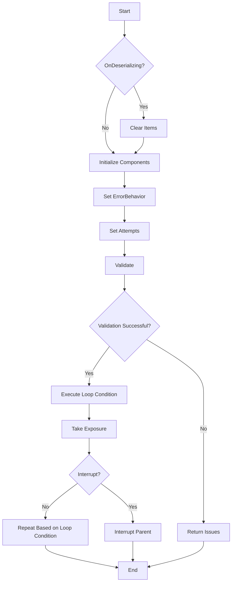

# TakeManyExposures Class Detailed Overview

The `TakeManyExposures` class is part of the Nighttime Imaging 'N' Astronomy (N.I.N.A.) software, designed to manage multiple exposures in a sequence. This class builds upon the `SequentialContainer` class and integrates components like `TakeExposure` and `LoopCondition` to facilitate repeated image capturing operations. Below is a detailed breakdown of its functionalities, logic, and methods.

## Key Functionalities

1. **Initialization and Cloning**:
   - The constructor initializes key components such as `TakeExposure` and `LoopCondition`.
   - The `Clone` method creates a deep copy of the `TakeManyExposures` instance, ensuring that all settings and configurations are preserved.

2. **Deserialization Handling (`OnDeserializing` Method)**:
   - Clears the `Items`, `Conditions`, and `Triggers` collections to ensure a clean state when the object is deserialized.

3. **Error Handling and Attempt Management**:
   - The `ErrorBehavior` property controls how errors are handled during execution. It propagates the error behavior setting to all child items.
   - The `Attempts` property determines the number of retry attempts for each operation and is also propagated to all child items.

4. **Validation (`Validate` Method)**:
   - Validates the internal `TakeExposure` component to ensure that all necessary settings are correct.
   - If validation fails, the issues are collected and made available for further inspection.

5. **Execution Flow**:
   - The main execution logic is driven by the `TakeExposure` component and the `LoopCondition`, which controls the repetition of the exposure sequence.
   - If an interruption occurs, the class routes the interrupt request to the parent sequence, ensuring consistent behavior.

6. **Duration Estimation (`GetEstimatedDuration` Method)**:
   - Calculates the estimated total duration of the exposure sequence based on the settings of the `TakeExposure` component.

## Flowchart

## Detailed Methods and Properties

1. **Constructor**:
   - Initializes the `TakeExposure` component, which handles individual exposures, and the `LoopCondition`, which manages the repetition of exposures.

2. **Clone Method**:
   - Creates a copy of the `TakeManyExposures` object, duplicating all its settings and configurations for reuse.

3. **OnDeserializing Method**:
   - Ensures that the collections `Items`, `Conditions`, and `Triggers` are cleared during deserialization to avoid conflicts and ensure a fresh start.

4. **ErrorBehavior Property**:
   - Propagates the error behavior setting to all child items, ensuring that error handling is consistent across the entire sequence.

5. **Attempts Property**:
   - Propagates the retry attempts setting to all child items, ensuring that each operation has the same number of retry attempts.

6. **Validate Method**:
   - Validates the settings of the `TakeExposure` component, checking for any issues that might prevent the sequence from executing correctly.
   - Returns `true` if validation is successful, otherwise collects and returns issues.

7. **Interrupt Method**:
   - Handles interrupt requests by forwarding them to the parent sequence, ensuring that any ongoing sequence can be halted appropriately.

8. **GetEstimatedDuration Method**:
   - Calculates the total estimated duration of the sequence based on the exposure settings and the number of repetitions defined by the `LoopCondition`.
