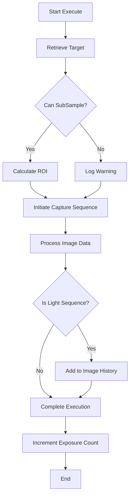
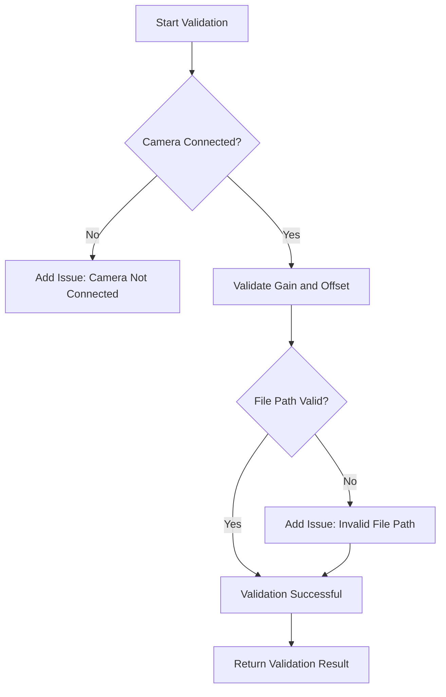
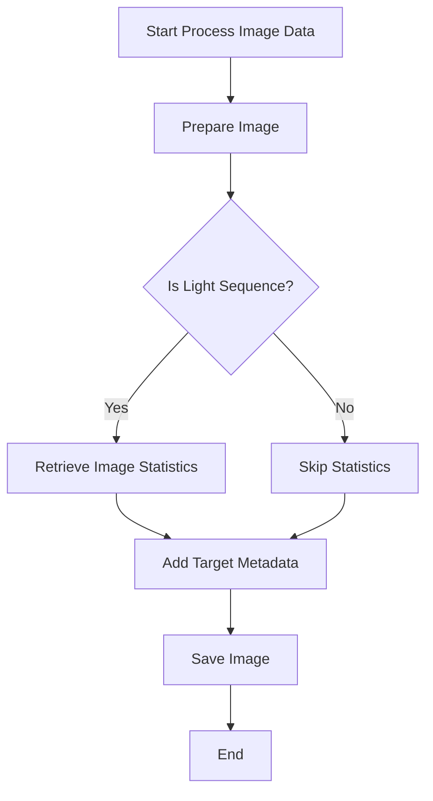

# `TakeSubframeExposure` Class Overview

The `TakeSubframeExposure` class is part of the **N.I.N.A.** project and extends the `SequenceItem` class to manage subframe exposures in astrophotography sequences.

## Key Responsibilities

- Handles the capture of subframe exposures using a connected camera.
- Manages camera settings such as exposure time, gain, offset, and region of interest (ROI).
- Validates the camera configuration and the file paths for saving captured images.
- Supports cloning of its instances to create identical exposure sequences.
- Integrates with other components such as `CameraMediator`, `ImagingMediator`, and `ImageSaveMediator` for coordinated operation.

## Constructor

### Importing Constructor

```csharp
[ImportingConstructor]
public TakeSubframeExposure(
    IProfileService profileService,
    ICameraMediator cameraMediator,
    IImagingMediator imagingMediator,
    IImageSaveMediator imageSaveMediator,
    IImageHistoryVM imageHistoryVM)
```

- **Parameters:**
  - `profileService`: Provides access to the current profile settings.
  - `cameraMediator`: Facilitates interaction with the camera.
  - `imagingMediator`: Manages imaging processes like capturing and preparing images.
  - `imageSaveMediator`: Handles the saving of images.
  - `imageHistoryVM`: Maintains the history of captured images.

### Cloning Constructor

```csharp
private TakeSubframeExposure(TakeSubframeExposure cloneMe)
```

- Creates a clone of an existing `TakeSubframeExposure` object.

## Methods

### `Execute`

```csharp
public override async Task Execute(IProgress<ApplicationStatus> progress, CancellationToken token)
```

- **Purpose:** Executes the subframe exposure sequence.
- **Flow:**
  1. Retrieves target information if available.
  2. Determines the ROI for subframe capture if the camera supports subsampling.
  3. Initiates the capture sequence and processes the image.
  4. Increments the exposure count after a successful capture.

**Flowchart:**



### `Validate`

```csharp
public bool Validate()
```

- **Purpose:** Validates the camera configuration and file paths before execution.
- **Flow:**
  1. Checks camera connection status.
  2. Validates gain and offset values.
  3. Checks if the file path for saving images is valid.
  4. Returns a boolean indicating if the configuration is valid.

**Flowchart:**



### `ProcessImageData`

```csharp
private async Task ProcessImageData(IDeepSkyObjectContainer dsoContainer, IExposureData exposureData, IProgress<ApplicationStatus> progress, CancellationToken token)
```

- **Purpose:** Processes the captured image data and saves it to the specified location.
- **Flow:**
  1. Prepares the image for saving based on the sequence type.
  2. Retrieves image statistics if it’s a light sequence.
  3. Adds target metadata if available.
  4. Saves the image through `imageSaveMediator`.

**Flowchart:**



### `Clone`

```csharp
public override object Clone()
```

- **Purpose:** Creates and returns a deep copy of the `TakeSubframeExposure` object.

### `ToString`

```csharp
public override string ToString()
```

- **Purpose:** Provides a string representation of the current state of the `TakeSubframeExposure` object.

## Properties

- **ROI (Region of Interest):** Defines the fraction of the sensor to be used for capturing.
- **ExposureTime:** The duration of each exposure.
- **Gain:** The gain setting of the camera.
- **Offset:** The offset setting of the camera.
- **Binning:** The binning mode used for capturing images.
- **ImageType:** The type of image being captured (e.g., LIGHT, DARK).
- **ExposureCount:** The number of exposures captured so far.
- **CameraInfo:** Holds information about the camera’s capabilities and settings.
