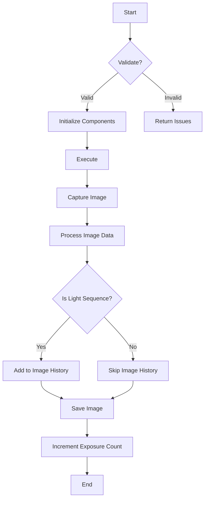

# TakeExposure Class Detailed Overview

The `TakeExposure` class is part of the Nighttime Imaging 'N' Astronomy (N.I.N.A.) software, specifically designed for managing the exposure process during an imaging sequence. Below is a detailed breakdown of its functionalities, logic, validation, and more.

## Key Functionalities

1. **Initialization and Cloning**:

   - The constructor initializes key components such as mediators (`cameraMediator`, `imagingMediator`, etc.) and sets default values for properties like `Gain`, `Offset`, and `ImageType`.
   - The `Clone` method creates a deep copy of the `TakeExposure` instance, ensuring all settings are duplicated accurately.

2. **Validation (`Validate` Method)**:

   - Ensures the camera is connected and the gain and offset values are within acceptable ranges.
   - Checks that the image file path is set and valid.

3. **Execution (`Execute` Method)**:

   - Handles the process of taking an exposure, including capturing the image, processing the data, and saving it.
   - Integrates with the `imagingMediator` to perform the actual capture and image processing tasks.
   - Updates the exposure count after each successful capture.

4. **Image Processing (`ProcessImageData` Method)**:

   - Processes the captured image data, including preparing the image and updating metadata.
   - If the sequence is for light frames, it populates statistics and associates the image with the current target.

5. **Duration Estimation (`GetEstimatedDuration` Method)**:

   - Returns the estimated duration for the exposure based on the `ExposureTime` property.

6. **Parent Validation (`AfterParentChanged` Method)**:
   - Re-validates the sequence item when its parent is changed to ensure consistency.

## Flowchart

## Detailed Methods and Properties

1. **Constructor**:

   - Initializes properties such as `Gain`, `Offset`, `ImageType`, and sets up the necessary mediators for camera and image handling.

2. **Clone Method**:

   - Creates a copy of the current `TakeExposure` object with all its properties, ensuring that the exposure settings are carried over.

3. **Execute Method**:

   - Manages the main sequence of actions for taking an exposure.
   - Integrates with the `imagingMediator` to capture the image.
   - Handles special logic for deep sky object containers, adjusting the exposure count if necessary.

4. **ProcessImageData Method**:

   - Prepares and processes the captured image data.
   - Updates metadata, such as target name and coordinates, before saving the image.
   - Handles additional tasks like calculating statistics if the sequence involves light frames.

5. **Validation Method**:

   - Checks the camera's connection status and verifies that gain and offset values are within the acceptable range.
   - Ensures the file path for saving images is valid.

6. **GetEstimatedDuration Method**:
   - Returns the estimated duration of the exposure based on the set `ExposureTime`.
