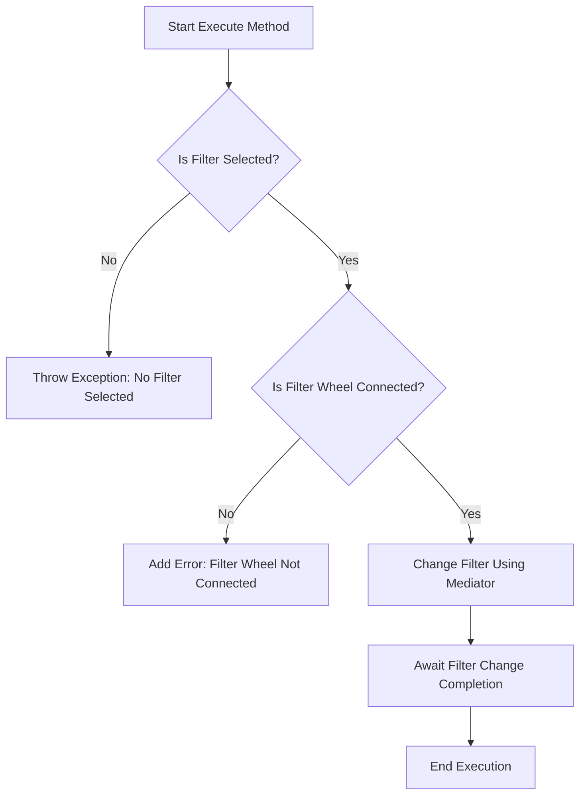

# SwitchFilter

The `SwitchFilter` class manages the process of switching filters in a filter wheel. It interfaces with both profile services and filter wheel hardware to ensure that the correct filter is selected and applied.

## Class Overview

### Namespace

- **Namespace:** `NINA.Sequencer.SequenceItem.FilterWheel`
- **Dependencies:**
  - `NINA.Core.Model`
  - `NINA.Profile.Interfaces`
  - `NINA.Sequencer.Validations`
  - `NINA.Equipment.Interfaces.Mediator`
  - `NINA.Core.Locale`
  - `NINA.Core.Utility`

### Class Declaration

```csharp
[ExportMetadata("Name", "Lbl_SequenceItem_FilterWheel_SwitchFilter_Name")]
[ExportMetadata("Description", "Lbl_SequenceItem_FilterWheel_SwitchFilter_Description")]
[ExportMetadata("Icon", "FW_NoFill_SVG")]
[ExportMetadata("Category", "Lbl_SequenceCategory_FilterWheel")]
[Export(typeof(ISequenceItem))]
[JsonObject(MemberSerialization.OptIn)]
public class SwitchFilter : SequenceItem, IValidatable
```

### Class Properties

- **profileService**: Provides access to profile services, including filter settings.
- **filterWheelMediator**: Handles communication with the filter wheel hardware.
- **issues**: A list to capture validation issues.
- **Filter**: The filter to be selected or applied.

### Constructor

The constructor initializes the `SwitchFilter` class with a `profileService` and `filterWheelMediator`. It also sets up an event handler to respond to profile changes.

```csharp
[ImportingConstructor]
public SwitchFilter(IProfileService profileservice, IFilterWheelMediator filterWheelMediator)
```

### Key Methods

- **OnDeserialized(StreamingContext context)**: Ensures the filter is correctly matched after deserialization.
- **MatchFilter()**: Attempts to match the selected filter with the current profile's filter settings.
- **ProfileService_ProfileChanged(object sender, EventArgs e)**: Updates the filter when the profile changes.
- **Execute(IProgress<ApplicationStatus> progress, CancellationToken token)**: Switches to the specified filter.
- **Validate()**: Checks if the filter wheel is connected and valid.
- **AfterParentChanged()**: Revalidates the state after the parent changes.
- **ToString()**: Returns a string representation of the class instance.

### Flowchart: Execution Process

Below is a flowchart illustrating the key steps in the `Execute` method of the `SwitchFilter` class.



### Flowchart Explanation

1. **Is Filter Selected?**: Checks if a filter has been selected. If not, an exception is thrown.
   - **No:** Throws an exception indicating that no filter was selected.
   - **Yes:** Proceeds to check if the filter wheel is connected.
2. **Is Filter Wheel Connected?**: Checks if the filter wheel is connected.
   - **No:** Adds an error indicating that the filter wheel is not connected.
   - **Yes:** Commands the filter wheel to change to the selected filter.
3. **Change Filter Using Mediator**: Uses the filter wheel mediator to change the filter.
4. **Await Filter Change Completion**: Waits for the filter change to complete.
5. **End Execution**: Marks the end of the execution process.

### Detailed Method Descriptions

#### `OnDeserialized`

This method ensures that the filter is correctly matched after deserialization by calling `MatchFilter`.

#### `MatchFilter`

Attempts to match the selected filter with the filter settings from the active profile. If the filter can't be found by name, it tries to match by position.

#### `ProfileService_ProfileChanged`

Updates the filter settings when the profile changes, ensuring that the `Filter` property is in sync with the active profile.

#### `Execute`

Switches to the specified filter. If no filter is selected or if the filter wheel is not connected, it handles these scenarios appropriately.

#### `Validate`

Checks if the filter wheel is connected and if the selected filter is valid. Updates the `Issues` property with any validation errors.

#### `AfterParentChanged`

Revalidates the state when the parent of this sequence item changes to ensure the filter settings are still valid.

#### `ToString`

Provides a string representation of the `SwitchFilter` instance, including the category, item name, and selected filter.
