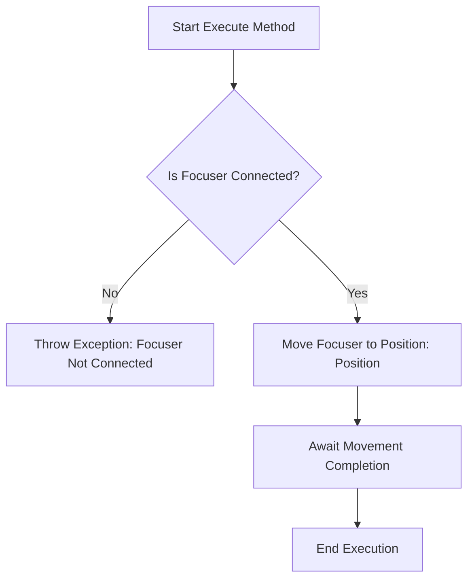

# MoveFocuserAbsolute

The `MoveFocuserAbsolute` class in the N.I.N.A. application is responsible for controlling the focuser's movement to a specified absolute position during an astronomical imaging session. The focuser plays a crucial role in ensuring the telescope's optics are precisely aligned for capturing sharp images. This class ensures that the focuser moves to the exact position specified and validates that the focuser system is connected before attempting to move it.

## Class Overview

### Namespace

- **Namespace:** `NINA.Sequencer.SequenceItem.Focuser`
- **Dependencies:**
  - `NINA.Core.Model`
  - `NINA.Sequencer.Validations`
  - `NINA.Equipment.Interfaces.Mediator`
  - `NINA.Core.Locale`

### Class Declaration

```csharp
[ExportMetadata("Name", "Lbl_SequenceItem_Focuser_MoveFocuserAbsolute_Name")]
[ExportMetadata("Description", "Lbl_SequenceItem_Focuser_MoveFocuserAbsolute_Description")]
[ExportMetadata("Icon", "MoveFocuserSVG")]
[ExportMetadata("Category", "Lbl_SequenceCategory_Focuser")]
[Export(typeof(ISequenceItem))]
[JsonObject(MemberSerialization.OptIn)]
public class MoveFocuserAbsolute : SequenceItem, IValidatable
```

### Class Properties

- **focuserMediator**: An interface that handles communication with the focuser hardware, specifically managing the movement to an absolute position.
- **Position**: The absolute position to which the focuser should move.
- **Issues**: A list of issues identified during the validation of the focuser's connection status.

### Constructor

The constructor initializes the `MoveFocuserAbsolute` class by setting up the connection with the focuser mediator, ensuring that the class can interact with the focuser system to move it to the specified position.

```csharp
[ImportingConstructor]
public MoveFocuserAbsolute(IFocuserMediator focuserMediator)
```

### Key Methods

- **Execute(IProgress<ApplicationStatus> progress, CancellationToken token)**: Moves the focuser to the specified absolute position using the `focuserMediator`.
- **Validate()**: Ensures that the focuser system is connected before attempting to move the focuser. Updates the `Issues` list if any problems are found.
- **AfterParentChanged()**: Re-validates the focuser connection whenever the parent sequence item changes.
- **Clone()**: Creates a new instance of the `MoveFocuserAbsolute` object, preserving its properties and metadata.

### Flowchart: Execution Process

Below is a flowchart that outlines the key steps in the `Execute` method of the `MoveFocuserAbsolute` class.



### Flowchart Explanation

1. **Is Focuser Connected?**: The process begins by verifying that the focuser is connected and ready.
   - **No:** If the focuser is not connected, an exception is thrown, aborting the process.
   - **Yes:** If connected, the process continues to move the focuser to the specified position.
2. **Move Focuser to Position**: The focuser is instructed to move to the absolute position specified by the `Position` property.
3. **Await Movement Completion**: The system waits for the focuser to reach the desired position.
4. **End Execution**: The method completes execution after successfully moving the focuser.

### Detailed Method Descriptions

#### `Execute` Method

The `Execute` method is the primary function of the `MoveFocuserAbsolute` class. It uses the `focuserMediator` to interact with the focuser hardware, sending the command to move the focuser to a specified absolute position. The method ensures that the focuser reaches the correct position, and if any issues arise, it handles them appropriately.

#### `Validate` Method

The `Validate` method checks that the focuser system is properly connected before allowing the movement to occur. It updates the `Issues` list with any problems that it encounters, such as the focuser being disconnected. This validation is crucial to prevent errors during execution.

#### `AfterParentChanged` Method

The `AfterParentChanged` method is called whenever the parent sequence item changes. This triggers a re-validation of the `MoveFocuserAbsolute` class to ensure that any contextual changes—such as different equipment or settings—are accounted for. This helps maintain the reliability of the sequence by confirming that moving the focuser is still appropriate in the new context.

#### `Clone` Method

The `Clone` method creates a new instance of the `MoveFocuserAbsolute` class, preserving all properties and metadata from the original instance. This is useful for repeating the focuser movement in different parts of a sequence without manually configuring each instance.
