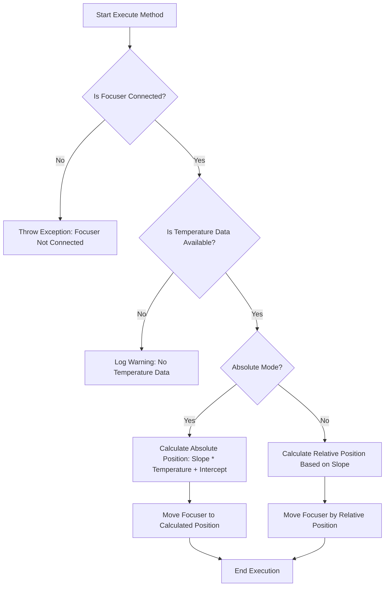

# MoveFocuserByTemperature

The `MoveFocuserByTemperature` class in the N.I.N.A. application is designed to adjust the focuser position based on temperature changes. This is particularly useful in astrophotography, where temperature fluctuations can cause the telescope's focus to drift, affecting image sharpness. This class ensures that the focuser compensates for temperature changes, either by moving to an absolute position or by adjusting the position relative to the last known temperature.

## Class Overview

### Namespace

- **Namespace:** `NINA.Sequencer.SequenceItem.Focuser`
- **Dependencies:**
  - `NINA.Core.Model`
  - `NINA.Sequencer.Validations`
  - `NINA.Equipment.Interfaces.Mediator`
  - `NINA.Core.Locale`
  - `NINA.Core.Utility`

### Class Declaration

```csharp
[ExportMetadata("Name", "Lbl_SequenceItem_Focuser_MoveFocuserByTemperature_Name")]
[ExportMetadata("Description", "Lbl_SequenceItem_Focuser_MoveFocuserByTemperature_Description")]
[ExportMetadata("Icon", "MoveFocuserByTemperatureSVG")]
[ExportMetadata("Category", "Lbl_SequenceCategory_Focuser")]
[Export(typeof(ISequenceItem))]
[JsonObject(MemberSerialization.OptIn)]
public class MoveFocuserByTemperature : SequenceItem, IValidatable, IFocuserConsumer
```

### Class Properties

- **focuserMediator**: Interface that handles communication with the focuser hardware.
- **Slope**: The slope used to calculate the focuser position based on temperature.
- **Intercept**: The intercept used in the linear equation to determine the absolute focuser position.
- **Absolute**: Boolean value indicating whether the focuser should move to an absolute position (`true`) or adjust position relative to temperature changes (`false`).
- **Issues**: List of validation issues, such as connectivity problems or missing temperature data.
- **MiniDescription**: A brief description of the focusing logic used, displayed to the user.

### Static Fields

- **lastTemperature**: Stores the last known temperature from the autofocus or manual focus operations.
- **lastRoundoff**: Stores the last roundoff value used for precise adjustments.

### Constructor

The constructor initializes the `MoveFocuserByTemperature` class by associating it with a `focuserMediator`, ensuring it can interact with the focuser system to adjust the position based on temperature.

```csharp
[ImportingConstructor]
public MoveFocuserByTemperature(IFocuserMediator focuserMediator)
```

### Key Methods

- **Execute(IProgress<ApplicationStatus> progress, CancellationToken token)**: Adjusts the focuser position based on the current temperature and the provided slope and intercept.
- **Validate()**: Ensures that the focuser system is connected and that temperature data is available.
- **AfterParentChanged()**: Re-validates the focuser connection whenever the parent sequence item changes.
- **Clone()**: Creates a new instance of the `MoveFocuserByTemperature` object, preserving its properties and metadata.
- **UpdateDeviceInfo(Equipment.Equipment.MyFocuser.FocuserInfo deviceInfo)**: Updates the device information.
- **UpdateEndAutoFocusRun(AutoFocusInfo info)**: Logs the temperature after an autofocus run.
- **UpdateUserFocused(Equipment.Equipment.MyFocuser.FocuserInfo info)**: Logs the temperature after a user focuses the telescope.

### Flowchart: Execution Process

Below is a flowchart that outlines the key steps in the `Execute` method of the `MoveFocuserByTemperature` class.



### Flowchart Explanation

1. **Is Focuser Connected?**: The process begins by checking if the focuser is connected.
   - **No:** If not connected, an exception is thrown, and the process stops.
   - **Yes:** If connected, the process continues to check temperature data.
2. **Is Temperature Data Available?**: Ensures that valid temperature data is available.
   - **No:** Logs a warning and stops further execution.
   - **Yes:** Proceeds to adjust the focuser based on temperature.
3. **Absolute Mode?**: Checks if the adjustment is in absolute mode or relative mode.
   - **Yes (Absolute Mode):** Calculates the absolute position using the formula `Slope * Temperature + Intercept`.
   - **No (Relative Mode):** Calculates the position adjustment relative to temperature changes.
4. **Move Focuser**: Executes the calculated focuser movement, either to an absolute position or a relative adjustment.
5. **End Execution**: Completes the execution process.

### Detailed Method Descriptions

#### `Execute` Method

The `Execute` method is the core function of the `MoveFocuserByTemperature` class. It adjusts the focuser's position based on the current temperature reading from the focuser hardware. Depending on whether the `Absolute` property is set to `true` or `false`, the method either calculates an absolute position using the provided slope and intercept or adjusts the position relative to the temperature change.

#### `Validate` Method

The `Validate` method checks the connectivity of the focuser system and ensures that temperature data is available. If the focuser is not connected or temperature data is missing, the method updates the `Issues` list with the relevant validation errors, preventing execution until the issues are resolved.

#### `Clone` Method

The `Clone` method creates a new instance of the `MoveFocuserByTemperature` class, preserving all the properties and metadata. This is useful for creating multiple instances of the same focuser adjustment logic within a sequence, ensuring consistency across different steps.

#### `UpdateEndAutoFocusRun` and `UpdateUserFocused` Methods

These methods log the temperature after an autofocus run or user focus operation. This data is stored in `lastTemperature` and can be used for further adjustments or logging purposes, ensuring that the focuser remains in optimal alignment throughout the imaging session.
