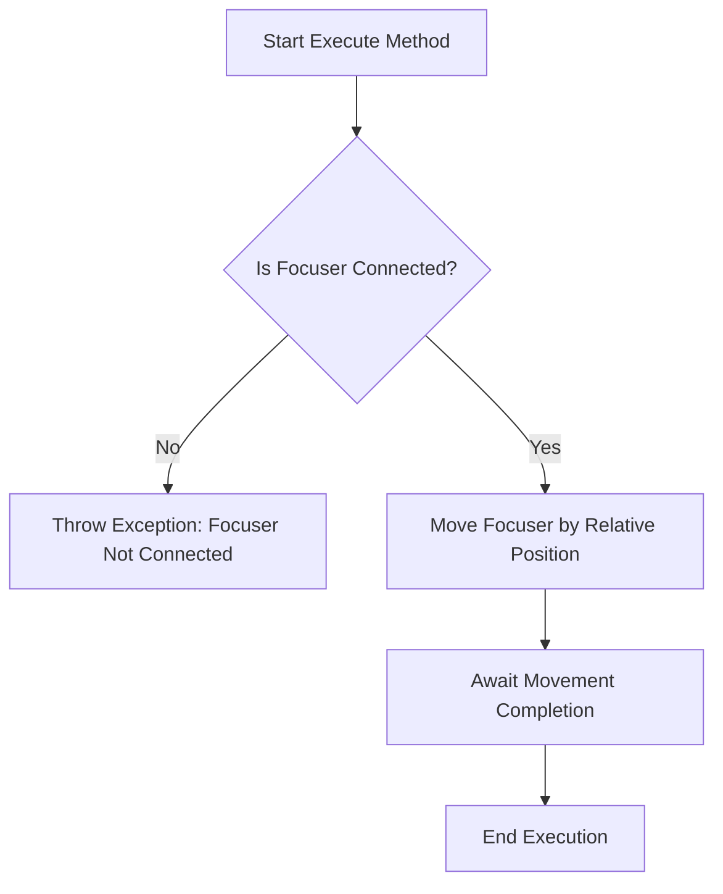

# MoveFocuserRelative

The `MoveFocuserRelative` class is part of the N.I.N.A. application, and it manages the movement of the focuser relative to its current position. This functionality is useful for fine-tuning the focus without needing to specify an absolute position.

## Class Overview

### Namespace

- **Namespace:** `NINA.Sequencer.SequenceItem.Focuser`
- **Dependencies:**
  - `NINA.Core.Model`
  - `NINA.Sequencer.Validations`
  - `NINA.Equipment.Interfaces.Mediator`
  - `NINA.Core.Locale`

### Class Declaration

```csharp
[ExportMetadata("Name", "Lbl_SequenceItem_Focuser_MoveFocuserRelative_Name")]
[ExportMetadata("Description", "Lbl_SequenceItem_Focuser_MoveFocuserRelative_Description")]
[ExportMetadata("Icon", "MoveFocuserRelativeSVG")]
[ExportMetadata("Category", "Lbl_SequenceCategory_Focuser")]
[Export(typeof(ISequenceItem))]
[JsonObject(MemberSerialization.OptIn)]
public class MoveFocuserRelative : SequenceItem, IValidatable
```

### Class Properties

- **focuserMediator**: Manages communication with the focuser hardware.
- **RelativePosition**: The amount by which to move the focuser relative to its current position.
- **issues**: A list to capture validation issues.

### Constructor

The constructor initializes the `MoveFocuserRelative` class with a `focuserMediator`, allowing interaction with the focuser system.

```csharp
[ImportingConstructor]
public MoveFocuserRelative(IFocuserMediator focuserMediator)
```

### Key Methods

- **Execute(IProgress<ApplicationStatus> progress, CancellationToken token)**: Moves the focuser by a relative amount specified by the `RelativePosition` property.
- **Validate()**: Ensures that the focuser system is connected.
- **AfterParentChanged()**: Validates the state after the parent changes.
- **ToString()**: Returns a string representation of the class instance.

### Flowchart: Execution Process

Below is a flowchart illustrating the key steps in the `Execute` method of the `MoveFocuserRelative` class.



### Flowchart Explanation

1. **Is Focuser Connected?**: Checks if the focuser is connected. If not, an exception is thrown.
   - **No:** Throws an exception indicating that the focuser is not connected.
   - **Yes:** Proceeds to move the focuser.
2. **Move Focuser by Relative Position**: Commands the focuser to move by the amount specified in `RelativePosition`.
3. **Await Movement Completion**: Waits for the focuser to complete its movement.
4. **End Execution**: Marks the end of the execution process.

### Detailed Method Descriptions

#### `Execute` Method

The `Execute` method instructs the focuser to move by the amount specified in `RelativePosition`. This relative movement adjusts the focus based on the current position rather than an absolute position.

#### `Validate` Method

The `Validate` method checks if the focuser is connected. If not, it adds an appropriate validation error to the `Issues` list.

#### `AfterParentChanged` Method

The `AfterParentChanged` method is used to revalidate the state when the parent of this sequence item changes.

#### `ToString` Method

The `ToString` method provides a string representation of the `MoveFocuserRelative` instance, including the category, item name, and the relative position.
