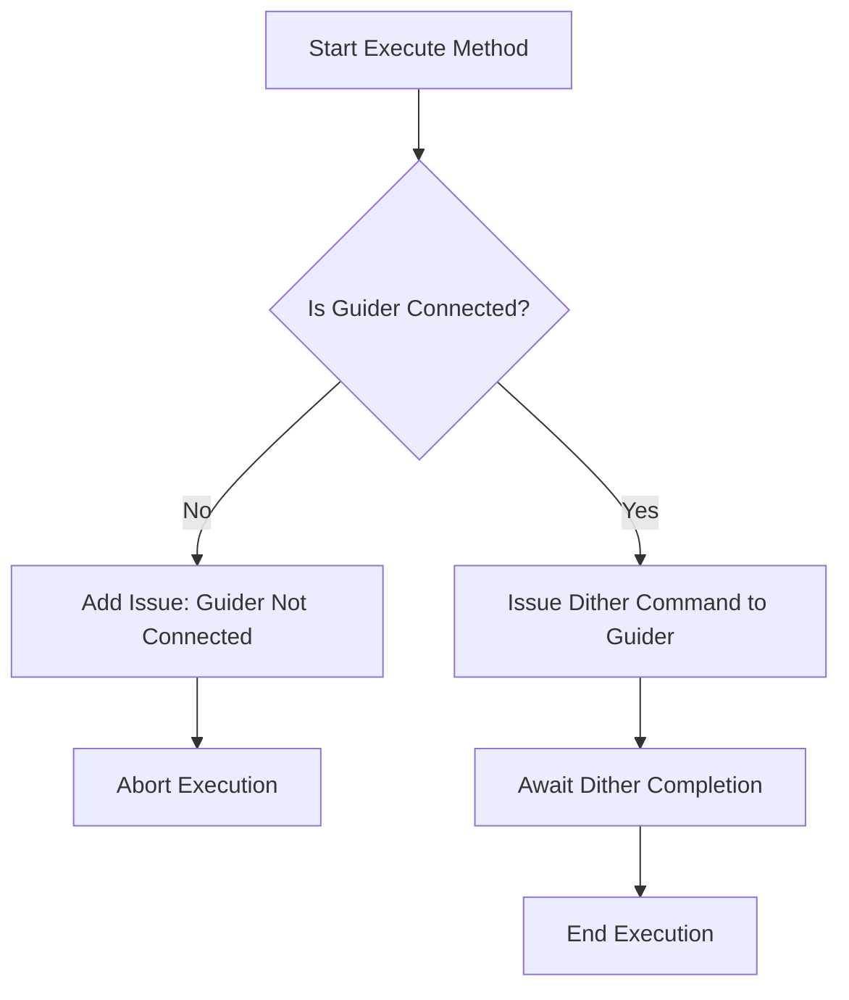

# `Dither` 类

`Dither` 类在 N.I.N.A.（Nighttime Imaging 'N' Astronomy）应用程序中用于在天文摄影会话期间执行抖动过程。抖动是一种技术，通过在曝光之间轻微移动望远镜来减少固定模式噪声对最终堆叠图像的影响。该类确保抖动过程的执行，从而提高图像质量，防止噪声模式在多个曝光中对齐。

The `Dither` class in the N.I.N.A. (Nighttime Imaging 'N' Astronomy) application is designed to execute the dithering process during an astronomical imaging session. Dithering is a technique used to slightly move the telescope between exposures to reduce the impact of fixed pattern noise in the final stacked image. This class is essential for achieving higher-quality images by ensuring that noise patterns do not align across exposures.

---

## 类概述

## Class Overview

### 命名空间

### Namespace

- **命名空间:** `NINA.Sequencer.SequenceItem.Guider`
- **Namespace:** `NINA.Sequencer.SequenceItem.Guider`

- **依赖项:**

  - `NINA.Core.Model`
  - `NINA.Sequencer.Validations`
  - `NINA.Equipment.Interfaces.Mediator`
  - `NINA.Core.Locale`
  - `NINA.Profile.Interfaces`

- **Dependencies:**
  - `NINA.Core.Model`
  - `NINA.Sequencer.Validations`
  - `NINA.Equipment.Interfaces.Mediator`
  - `NINA.Core.Locale`
  - `NINA.Profile.Interfaces`

---

### 类声明

### Class Declaration

```csharp
[ExportMetadata("Name", "Lbl_SequenceItem_Guider_Dither_Name")]
[ExportMetadata("Description", "Lbl_SequenceItem_Guider_Dither_Description")]
[ExportMetadata("Icon", "DitherSVG")]
[ExportMetadata("Category", "Lbl_SequenceCategory_Guider")]
[Export(typeof(ISequenceItem))]
[JsonObject(MemberSerialization.OptIn)]
public class Dither : SequenceItem, IValidatable
```

---

### 类属性

### Class Properties

- **guiderMediator**: 负责与引导硬件的通信，以执行抖动命令。
- **guiderMediator**: Handles communication with the guider hardware to execute the dithering commands.

- **profileService**: 提供对活动配置文件设置的访问，包括引导器配置。
- **profileService**: Provides access to the active profile settings, including guider configuration.

- **Issues**: 在类验证过程中发现的问题列表，尤其是与引导器连接状态相关的问题。
- **Issues**: A list of issues found during the validation of the class, particularly related to the connection status of the guider.

---

### 构造函数

### Constructor

构造函数初始化 `Dither` 类，并依赖于引导器中介器和配置文件服务，确保在执行抖动过程中所需的组件可用。

The constructor initializes the `Dither` class with dependencies on the guider mediator and profile service, ensuring the necessary components are available for executing the dithering process.

```csharp
[ImportingConstructor]
public Dither(IGuiderMediator guiderMediator, IProfileService profileService)
```

---

### 关键方法

### Key Methods

- **Execute(IProgress<ApplicationStatus> progress, CancellationToken token)**: 该方法通过向引导器发出抖动命令来执行抖动过程。
- **Execute(IProgress<ApplicationStatus> progress, CancellationToken token)**: This method executes the dithering process by issuing the dither command to the guider.

- **Validate()**: 在尝试抖动之前，检查引导器是否连接并正常工作。
- **Validate()**: Checks if the guider is connected and operational before attempting to dither.

- **AfterParentChanged()**: 当父级序列项发生更改时，验证引导器的连接状态。
- **AfterParentChanged()**: Validates the connection status of the guider when the parent sequence item changes.

- **GetEstimatedDuration()**: 返回抖动过程的预计持续时间，基于配置文件中的引导器设置。
- **GetEstimatedDuration()**: Returns an estimated duration for the dithering process, based on the profile's guider settings.

- **Clone()**: 创建 `Dither` 对象的深拷贝。
- **Clone()**: Creates a deep copy of the `Dither` object.

---

### 流程图：执行过程

### Flowchart: Execution Process

以下是 `Dither` 类中 `Execute` 方法的关键步骤流程图。
Below is a flowchart outlining the key steps in the `Execute` method of the `Dither` class.



---

### 流程图解释

### Flowchart Explanation

1. **引导器是否连接？**：首先检查引导器是否已连接且准备执行命令。

   - **否:** 如果引导器未连接，会记录一个连接问题，并中止执行。
   - **是:** 如果引导器已连接，继续执行下一步。

1. **Is Guider Connected?:** The process begins by checking whether the guider is connected and ready to execute commands.

   - **No:** If the guider is not connected, an issue is logged indicating the connection problem, and the execution is aborted.
   - **Yes:** If the guider is connected, the process continues.

1. **向引导器发出抖动命令**：`Dither` 类向引导器发送命令，执行抖动操作。
1. **等待抖动完成**：系统等待引导器完成抖动过程。
1. **结束执行**：抖动过程结束后，控制返回给序列执行器。

1. **Issue Dither Command to Guider:** The `Dither` class sends a command to the guider to perform the dithering operation.
1. **Await Dither Completion:** The system waits for the guider to complete the dithering process.
1. **End Execution:** The dithering process concludes, and control is returned to the sequence executor.

---

### 方法详细描述

### Detailed Method Descriptions

#### `Execute` 方法

#### `Execute` Method

`Execute` 方法负责向引导器发出抖动命令。它依赖于 `guiderMediator` 来与引导硬件通信。该方法确保在尝试抖动之前引导器已连接并准备就绪，从而防止运行时错误。

The `Execute` method is responsible for issuing the dither command to the guider. It relies on the `guiderMediator` to communicate with the guider hardware. The method ensures that the guider is connected and ready before attempting to dither, thus preventing runtime errors.

---

#### `Validate` 方法

#### `Validate` Method

`Validate` 方法检查引导器的连接状态。如果引导器未连接，方法会在 `Issues` 列表中添加问题，用户可以查看并解决问题。此验证步骤对于确保抖动过程能够无误执行至关重要。

The `Validate` method checks the connection status of the guider. If the guider is not connected, the method adds an issue to the `Issues` list, which can be reviewed by the user to troubleshoot the problem. This validation step is critical for ensuring that the dithering process can be executed without errors.

---

#### `AfterParentChanged` 方法

#### `AfterParentChanged` Method

每当父级序列项发生更改时，都会调用 `AfterParentChanged` 方法。此方法会重新验证 `Dither` 项，以确保考虑到序列上下文中的任何变化，尤其是设备连接性方面的变化。

The `AfterParentChanged` method is called whenever the parent sequence item is changed. It triggers a re-validation of the `Dither` item to ensure that any changes in the sequence context are taken into account, particularly in terms of equipment connectivity.

---

#### `GetEstimatedDuration` 方法

#### `GetEstimatedDuration` Method

`GetEstimatedDuration` 方法返回完成抖动过程的预计时间。该估算基于活动配置文件中引导器设置的 `SettleTimeout` 值，提供抖动所需时间的大致时间线。

The `GetEstimatedDuration` method returns the estimated time required to complete the dithering process. This estimate is based on the `SettleTimeout` value specified in the active profile's guider settings, providing a rough timeline for how long the dithering will take.
