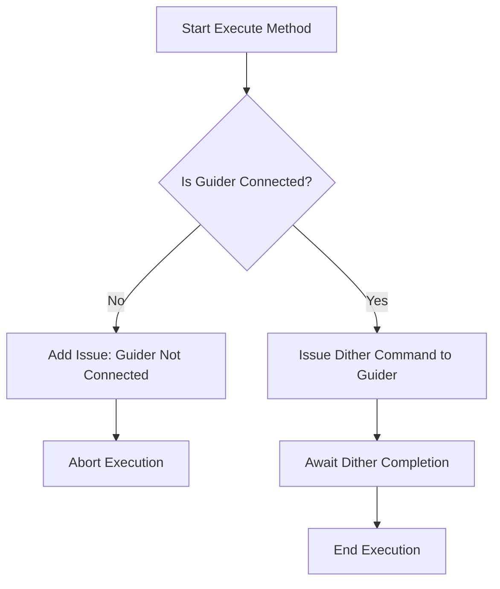

# Dither

The `Dither` class in the N.I.N.A. application is designed to execute the dithering process during an astronomical imaging session. Dithering is a technique used to slightly move the telescope between exposures to reduce the impact of fixed pattern noise in the final stacked image. This class is essential for achieving higher-quality images by ensuring that noise patterns do not align across exposures.

## Class Overview

### Namespace

- **Namespace:** `NINA.Sequencer.SequenceItem.Guider`
- **Dependencies:**
  - `NINA.Core.Model`
  - `NINA.Sequencer.Validations`
  - `NINA.Equipment.Interfaces.Mediator`
  - `NINA.Core.Locale`
  - `NINA.Profile.Interfaces`

### Class Declaration

```csharp
[ExportMetadata("Name", "Lbl_SequenceItem_Guider_Dither_Name")]
[ExportMetadata("Description", "Lbl_SequenceItem_Guider_Dither_Description")]
[ExportMetadata("Icon", "DitherSVG")]
[ExportMetadata("Category", "Lbl_SequenceCategory_Guider")]
[Export(typeof(ISequenceItem))]
[JsonObject(MemberSerialization.OptIn)]
public class Dither : SequenceItem, IValidatable
```

### Class Properties

- **guiderMediator**: Handles communication with the guider hardware to execute the dithering commands.
- **profileService**: Provides access to the active profile settings, including guider configuration.
- **Issues**: A list of issues found during the validation of the class, particularly related to the connection status of the guider.

### Constructor

The constructor initializes the `Dither` class with dependencies on the guider mediator and profile service, ensuring the necessary components are available for executing the dithering process.

```csharp
[ImportingConstructor]
public Dither(IGuiderMediator guiderMediator, IProfileService profileService)
```

### Key Methods

- **Execute(IProgress<ApplicationStatus> progress, CancellationToken token)**: This method executes the dithering process by issuing the dither command to the guider.
- **Validate()**: Checks if the guider is connected and operational before attempting to dither.
- **AfterParentChanged()**: Validates the connection status of the guider when the parent sequence item changes.
- **GetEstimatedDuration()**: Returns an estimated duration for the dithering process, based on the profile's guider settings.
- **Clone()**: Creates a deep copy of the `Dither` object.

### Flowchart: Execution Process

Below is a flowchart that outlines the key steps in the `Execute` method of the `Dither` class.



### Flowchart Explanation

1. **Is Guider Connected?:** The process begins by checking whether the guider is connected and ready to execute commands.
   - **No:** If the guider is not connected, an issue is logged indicating the connection problem, and the execution is aborted.
   - **Yes:** If the guider is connected, the process continues.
2. **Issue Dither Command to Guider:** The `Dither` class sends a command to the guider to perform the dithering operation.
3. **Await Dither Completion:** The system waits for the guider to complete the dithering process.
4. **End Execution:** The dithering process concludes, and control is returned to the sequence executor.

### Detailed Method Descriptions

#### `Execute` Method

The `Execute` method is responsible for issuing the dither command to the guider. It relies on the `guiderMediator` to communicate with the guider hardware. The method ensures that the guider is connected and ready before attempting to dither, thus preventing runtime errors.

#### `Validate` Method

The `Validate` method checks the connection status of the guider. If the guider is not connected, the method adds an issue to the `Issues` list, which can be reviewed by the user to troubleshoot the problem. This validation step is critical for ensuring that the dithering process can be executed without errors.

#### `AfterParentChanged` Method

The `AfterParentChanged` method is called whenever the parent sequence item is changed. It triggers a re-validation of the `Dither` item to ensure that any changes in the sequence context are taken into account, particularly in terms of equipment connectivity.

#### `GetEstimatedDuration` Method

The `GetEstimatedDuration` method returns the estimated time required to complete the dithering process. This estimate is based on the `SettleTimeout` value specified in the active profile's guider settings, providing a rough timeline for how long the dithering will take.
