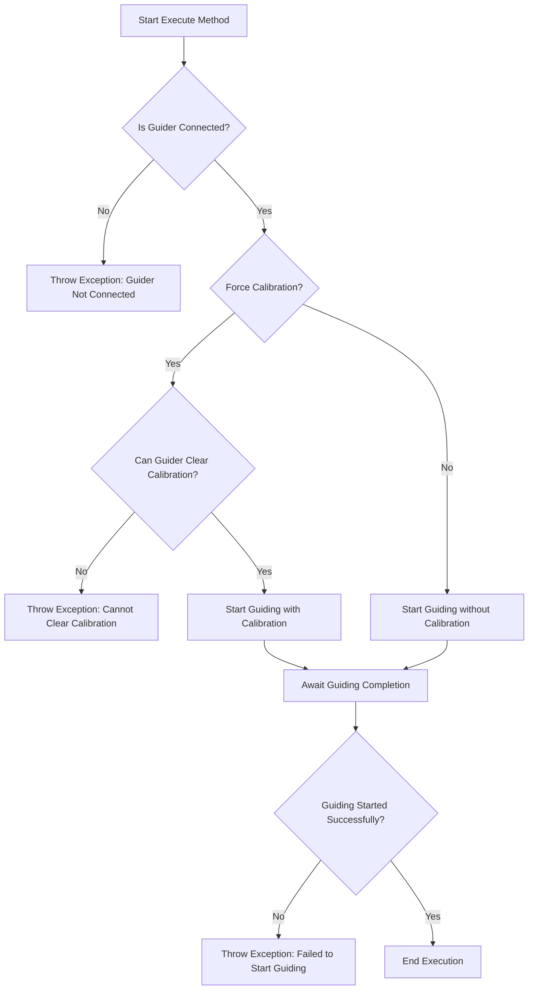

# `StartGuiding` 类

`StartGuiding` 类在 N.I.N.A.（Nighttime Imaging 'N' Astronomy）应用程序中用于启动引导过程，这是天文摄影会话中的关键步骤。在天文摄影中，使用一个独立的引导相机或系统来保持望远镜与目标物体的精确对齐。该类确保引导过程正确启动，并且可以选择强制进行新的校准。

The `StartGuiding` class in the N.I.N.A. (Nighttime Imaging 'N' Astronomy) application is used to initiate the guiding process, which is a critical step in an astronomical imaging session. In astrophotography, a separate guiding camera or system is used to keep the telescope precisely aligned with the target object. This class ensures that the guiding process starts correctly and optionally forces a new calibration.

---

## 类概述

## Class Overview

### 命名空间

### Namespace

- **命名空间:** `NINA.Sequencer.SequenceItem.Guider`
- **Namespace:** `NINA.Sequencer.SequenceItem.Guider`

- **依赖项:**

  - `NINA.Core.Model`
  - `NINA.Sequencer.Validations`
  - `NINA.Equipment.Interfaces.Mediator`
  - `NINA.Core.Locale`

- **Dependencies:**
  - `NINA.Core.Model`
  - `NINA.Sequencer.Validations`
  - `NINA.Equipment.Interfaces.Mediator`
  - `NINA.Core.Locale`

---

### 类声明

### Class Declaration

```csharp
[ExportMetadata("Name", "Lbl_SequenceItem_Guider_StartGuiding_Name")]
[ExportMetadata("Description", "Lbl_SequenceItem_Guider_StartGuiding_Description")]
[ExportMetadata("Icon", "GuiderSVG")]
[ExportMetadata("Category", "Lbl_SequenceCategory_Guider")]
[Export(typeof(ISequenceItem))]
[JsonObject(MemberSerialization.OptIn)]
public class StartGuiding : SequenceItem, IValidatable
```

---

### 类属性

### Class Properties

- **guiderMediator**: 管理与引导硬件的通信，处理引导过程的启动。
- **guiderMediator**: Manages communication with the guiding hardware, handling the start of the guiding process.

- **ForceCalibration**: 一个布尔值标志，指示是否应在启动引导之前强制进行新的校准。
- **ForceCalibration**: A boolean flag indicating whether a new calibration should be forced before starting the guiding process.

- **Issues**: 在验证过程中发现的问题列表，尤其与引导器的连接状态和校准能力相关。
- **Issues**: A list of issues identified during validation, particularly related to the guider's connection status and calibration capability.

---

### 构造函数

### Constructor

构造函数初始化 `StartGuiding` 类，并通过 `guiderMediator` 与引导设备建立连接。这确保了该类能够在执行引导过程中与引导系统交互。

The constructor initializes the `StartGuiding` class and establishes a connection with the guider hardware via the `guiderMediator`. This ensures that the class can interact with the guider system during the guiding process.

```csharp
[ImportingConstructor]
public StartGuiding(IGuiderMediator guiderMediator)
```

---

### 关键方法

### Key Methods

- **Execute(IProgress<ApplicationStatus> progress, CancellationToken token)**: 启动引导过程，可选择强制执行新的校准。如果过程失败，将抛出异常。
- **Execute(IProgress<ApplicationStatus> progress, CancellationToken token)**: Starts the guiding process, optionally forcing a new calibration. If the process fails, an exception is thrown.

- **Validate()**: 验证引导器的连接，并检查是否可以强制校准，若发现问题则更新 `Issues` 列表。
- **Validate()**: Validates the guider connection and checks whether forced calibration is possible. It updates the `Issues` list if any problems are detected.

- **AfterParentChanged()**: 每当父级序列项发生变化时，重新验证引导器的连接和能力。
- **AfterParentChanged()**: Re-validates the guider connection and capabilities whenever the parent sequence item changes.

- **Clone()**: 创建 `StartGuiding` 对象的副本，保留其属性和元数据。
- **Clone()**: Creates a copy of the `StartGuiding` object, preserving its properties and metadata.

---

### 流程图：执行过程

### Flowchart: Execution Process

以下是 `StartGuiding` 类中 `Execute` 方法的关键步骤流程图。
Below is a flowchart outlining the key steps in the `Execute` method of the `StartGuiding` class.



---

### 流程图解释

### Flowchart Explanation

1. **引导器是否连接？**：首先检查引导器是否已连接且准备就绪。

   - **否:** 如果引导器未连接，抛出异常并终止过程。
   - **是:** 如果已连接，继续执行下一步。

1. **Is Guider Connected?**: The process begins by verifying whether the guider is connected and ready.

   - **No:** If the guider is not connected, an exception is thrown, aborting the process.
   - **Yes:** If connected, the process continues to the next step.

1. **是否强制校准？**：检查引导过程中是否需要强制执行新校准。

   - **是:** 如果需要校准，系统将检查引导器是否可以清除当前校准数据。
   - **否:** 如果不强制校准，则直接开始引导。

1. **Force Calibration?**: Checks whether a new calibration should be forced during the guiding process.

   - **Yes:** If calibration is required, the system checks if the guider can clear its current calibration data.
   - **No:** If no calibration is forced, guiding begins without recalibration.

1. **引导器能否清除校准？**：如果需要校准，此步骤检查引导器是否能清除现有校准数据。

   - **否:** 如果不能清除校准，抛出异常。
   - **是:** 如果可以，系统开始带有校准的引导。

1. **Can Guider Clear Calibration?**: If calibration is required, this step checks whether the guider can clear existing calibration data.

   - **No:** If the guider cannot clear calibration, an exception is thrown.
   - **Yes:** If possible, the system proceeds to start guiding with calibration.

1. **开始引导**：根据前面的步骤，启动引导过程，无论是否带有校准。
1. **等待引导完成**：系统等待引导过程的成功或失败。
1. **引导是否成功启动？**：最后检查引导是否成功启动。

   - **否:** 如果引导失败，抛出异常。
   - **是:** 如果成功，则执行完成。

1. **Start Guiding**: The guiding process is initiated, either with or without calibration based on previous steps.
1. **Await Guiding Completion**: The system waits for the guiding process to either succeed or fail.
1. **Guiding Started Successfully?**: A final check is made to confirm whether guiding has started successfully.
   - **No:** If guiding fails, an exception is thrown.
   - **Yes:** If successful, the process completes.

---

### 方法详细描述

### Detailed Method Descriptions

#### `Execute` 方法

#### `Execute` Method

`Execute` 方法是 `StartGuiding` 类的核心，它负责启动引导过程，包括选择性地强制执行新校准。该方法通过 `guiderMediator` 与引导硬件交互，确保过程正确执行。如果在引导启动或清除校准时出现问题，会抛出异常以中断序列。

The `Execute` method is the core of the `StartGuiding` class. It is responsible for starting the guiding process, including optionally forcing a new calibration. The method interacts with the guider hardware through `guiderMediator` to ensure the process is executed correctly. If any issues arise—such as failing to start guiding or being unable to clear calibration—an exception is thrown to halt the sequence.

---

#### `Validate` 方法

#### `Validate` Method

`Validate` 方法检查引导系统的就绪状态。它确保引导器已连接，并在必要时验证引导器能否清除校准数据。验证结果存储在 `Issues` 列表中，以便在执行引导过程之前识别和解决潜在问题。

The `Validate` method checks the readiness of the guiding system. It ensures that the guider is connected and, if necessary, verifies that it
