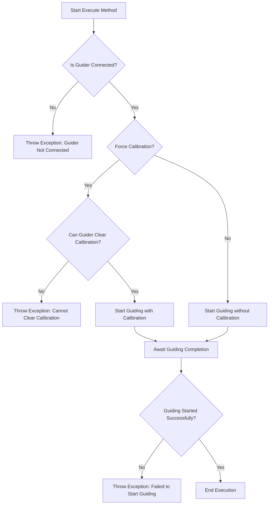

# StartGuiding

The `StartGuiding` class in the N.I.N.A. application is designed to initiate the guiding process during an astronomical imaging session. Guiding is a critical process in astrophotography, where a separate guider camera or system is used to keep the telescope precisely aligned with the target object. This class ensures that the guiding process starts correctly and optionally forces a new calibration.

## Class Overview

### Namespace

- **Namespace:** `NINA.Sequencer.SequenceItem.Guider`
- **Dependencies:**
  - `NINA.Core.Model`
  - `NINA.Sequencer.Validations`
  - `NINA.Equipment.Interfaces.Mediator`
  - `NINA.Core.Locale`

### Class Declaration

```csharp
[ExportMetadata("Name", "Lbl_SequenceItem_Guider_StartGuiding_Name")]
[ExportMetadata("Description", "Lbl_SequenceItem_Guider_StartGuiding_Description")]
[ExportMetadata("Icon", "GuiderSVG")]
[ExportMetadata("Category", "Lbl_SequenceCategory_Guider")]
[Export(typeof(ISequenceItem))]
[JsonObject(MemberSerialization.OptIn)]
public class StartGuiding : SequenceItem, IValidatable
```

### Class Properties

- **guiderMediator**: Manages communication with the guider hardware, handling the start of the guiding process.
- **ForceCalibration**: A boolean flag indicating whether the guiding process should force a new calibration before starting.
- **Issues**: A list of issues identified during validation, particularly related to the guider’s connection status and calibration capability.

### Constructor

The constructor initializes the `StartGuiding` class by setting up the connection with the guider mediator. This ensures that the class can interact with the guider system when executing the guiding process.

```csharp
[ImportingConstructor]
public StartGuiding(IGuiderMediator guiderMediator)
```

### Key Methods

- **Execute(IProgress<ApplicationStatus> progress, CancellationToken token)**: Starts the guiding process, optionally forcing a new calibration. If the process fails, an exception is thrown.
- **Validate()**: Validates the connection to the guider and checks if forced calibration is possible, updating the `Issues` list if any problems are detected.
- **AfterParentChanged()**: Re-validates the guider connection and capabilities whenever the parent sequence item changes.
- **Clone()**: Creates a copy of the `StartGuiding` object, preserving its properties and metadata.

### Flowchart: Execution Process

Below is a flowchart that outlines the key steps in the `Execute` method of the `StartGuiding` class.



### Flowchart Explanation

1. **Is Guider Connected?**: The process begins by verifying that the guider is connected and ready.
   - **No:** If the guider is not connected, an exception is thrown, aborting the process.
   - **Yes:** If connected, the process continues to the next step.
2. **Force Calibration?**: Checks if the guiding process should force a new calibration.
   - **Yes:** If calibration is required, the system checks if the guider can clear its current calibration.
   - **No:** If no calibration is forced, guiding begins without recalibration.
3. **Can Guider Clear Calibration?**: If calibration is forced, this step checks whether the guider can clear its existing calibration.
   - **No:** If the guider cannot clear calibration, an exception is thrown.
   - **Yes:** If it can, the system proceeds to start guiding with calibration.
4. **Start Guiding**: The guiding process is initiated, either with or without calibration based on the previous steps.
5. **Await Guiding Completion**: The system waits for the guiding process to either succeed or fail.
6. **Guiding Started Successfully?**: A final check to confirm that guiding has started successfully.
   - **No:** If guiding fails, an exception is thrown.
   - **Yes:** If successful, the process completes.

### Detailed Method Descriptions

#### `Execute` Method

The `Execute` method is the core of the `StartGuiding` class. It handles starting the guiding process, including the optional step of forcing a new calibration. The method uses the `guiderMediator` to interact with the guider hardware, ensuring the process is executed correctly. If any issues arise—such as a failure to start guiding or the inability to clear calibration—an exception is thrown to halt the sequence.

#### `Validate` Method

The `Validate` method checks the readiness of the guiding system. It ensures that the guider is connected and, if necessary, verifies that it can clear calibration data before starting a new calibration. The results of this validation are stored in the `Issues` list, which provides a way to identify and troubleshoot potential problems before executing the guiding process.

#### `AfterParentChanged` Method

The `AfterParentChanged` method is invoked whenever the parent sequence item changes. This triggers a re-validation of the `StartGuiding` class to ensure that any contextual changes—such as different equipment or settings—are taken into account. It helps maintain the integrity of the sequence by ensuring that guiding can be started successfully in the new context.

#### `Clone` Method

The `Clone` method creates a new instance of the `StartGuiding` class with the same properties and metadata as the original. This allows the guiding process to be reused or repeated in different parts of a sequence without needing to manually reconfigure each instance.
