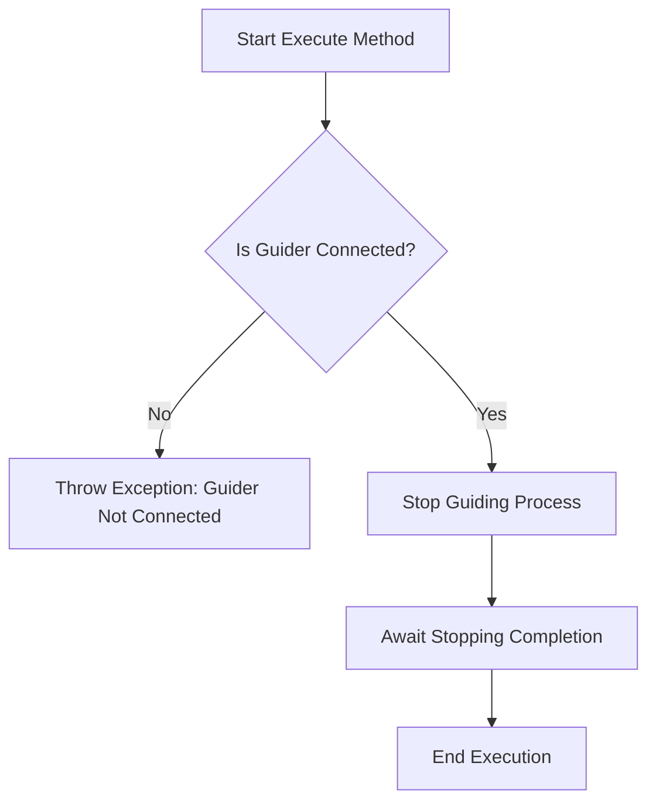

# StopGuiding

The `StopGuiding` class in the N.I.N.A. application is responsible for halting the guiding process during an astronomical imaging session. Guiding is a critical aspect of astrophotography, where a guiding camera or system keeps the telescope aligned with the target object. This class ensures that the guiding process stops correctly and validates that the guiding system is properly connected before attempting to stop guiding.

## Class Overview

### Namespace

- **Namespace:** `NINA.Sequencer.SequenceItem.Guider`
- **Dependencies:**
  - `NINA.Core.Model`
  - `NINA.Sequencer.Validations`
  - `NINA.Equipment.Interfaces.Mediator`
  - `NINA.Core.Locale`

### Class Declaration

```csharp
[ExportMetadata("Name", "Lbl_SequenceItem_Guider_StopGuiding_Name")]
[ExportMetadata("Description", "Lbl_SequenceItem_Guider_StopGuiding_Description")]
[ExportMetadata("Icon", "StopGuiderSVG")]
[ExportMetadata("Category", "Lbl_SequenceCategory_Guider")]
[Export(typeof(ISequenceItem))]
[JsonObject(MemberSerialization.OptIn)]
public class StopGuiding : SequenceItem, IValidatable
```

### Class Properties

- **guiderMediator**: An interface that handles communication with the guider hardware, specifically managing the stop guiding process.
- **Issues**: A list of issues that are identified during the validation of the guider's connection status.

### Constructor

The constructor initializes the `StopGuiding` class by setting up the connection with the guider mediator, ensuring that the class can interact with the guider system to stop the guiding process.

```csharp
[ImportingConstructor]
public StopGuiding(IGuiderMediator guiderMediator)
```

### Key Methods

- **Execute(IProgress<ApplicationStatus> progress, CancellationToken token)**: Stops the guiding process using the `guiderMediator`. If any issues occur, an exception may be thrown.
- **Validate()**: Ensures that the guiding system is connected before attempting to stop guiding. Updates the `Issues` list if any problems are found.
- **AfterParentChanged()**: Re-validates the guider connection whenever the parent sequence item changes.
- **Clone()**: Creates a new instance of the `StopGuiding` object, preserving its properties and metadata.

### Flowchart: Execution Process

Below is a flowchart that outlines the key steps in the `Execute` method of the `StopGuiding` class.



### Flowchart Explanation

1. **Is Guider Connected?**: The process begins by verifying that the guider is connected and ready.
   - **No:** If the guider is not connected, an exception is thrown, aborting the process.
   - **Yes:** If connected, the process continues to stop the guiding process.
2. **Stop Guiding Process**: The guider is instructed to stop the guiding process.
3. **Await Stopping Completion**: The system waits for the guiding process to stop completely.
4. **End Execution**: The method completes execution after successfully stopping the guider.

### Detailed Method Descriptions

#### `Execute` Method

The `Execute` method is the primary function of the `StopGuiding` class. It uses the `guiderMediator` to interact with the guider hardware, sending the command to stop guiding. The method ensures that the guiding process halts successfully, and if any issues arise, it handles them appropriately, potentially throwing an exception.

#### `Validate` Method

The `Validate` method checks that the guiding system is properly connected before allowing the guiding process to be stopped. It updates the `Issues` list with any problems that it encounters, such as the guider being disconnected. This validation is crucial to prevent errors during execution.

#### `AfterParentChanged` Method

The `AfterParentChanged` method is called whenever the parent sequence item changes. This triggers a re-validation of the `StopGuiding` class to ensure that any contextual changes—such as different equipment or settings—are accounted for. This helps maintain the reliability of the sequence by confirming that stopping guiding is still appropriate in the new context.

#### `Clone` Method

The `Clone` method creates a new instance of the `StopGuiding` class, preserving all properties and metadata from the original instance. This is useful for repeating the stop guiding process in different parts of a sequence without manually configuring each instance.
