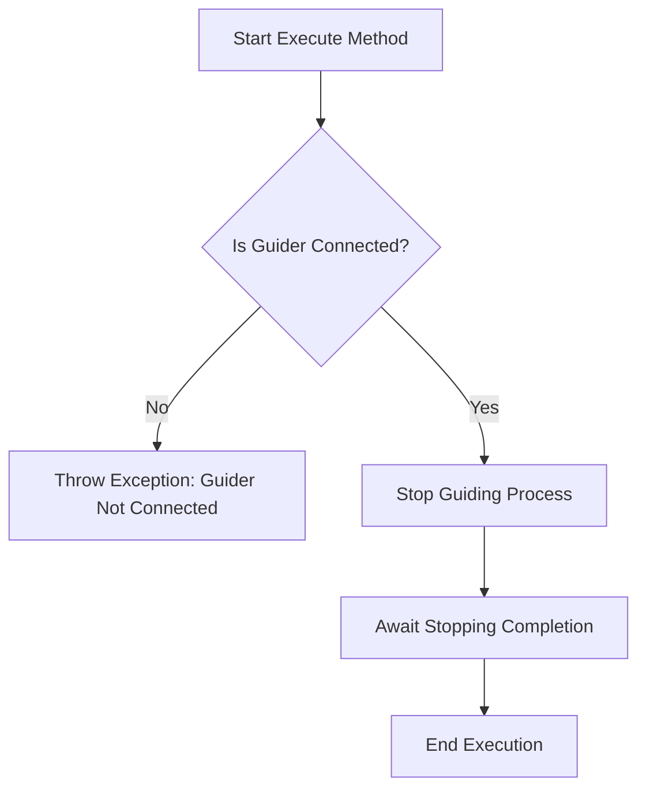

# `StopGuiding` 类

`StopGuiding` 类在 N.I.N.A.（Nighttime Imaging 'N' Astronomy）应用程序中负责在天文摄影会话期间停止引导过程。引导是天文摄影的关键步骤，其中引导相机或系统用于保持望远镜与目标物体的对齐。该类确保引导过程正确停止，并在尝试停止引导之前验证引导系统是否正确连接。

The `StopGuiding` class in the N.I.N.A. (Nighttime Imaging 'N' Astronomy) application is responsible for halting the guiding process during an astronomical imaging session. Guiding is a critical aspect of astrophotography, where a guiding camera or system keeps the telescope aligned with the target object. This class ensures that the guiding process stops correctly and validates that the guiding system is properly connected before attempting to stop guiding.

---

## 类概述

## Class Overview

### 命名空间

### Namespace

- **命名空间:** `NINA.Sequencer.SequenceItem.Guider`
- **Namespace:** `NINA.Sequencer.SequenceItem.Guider`

- **依赖项:**

  - `NINA.Core.Model`
  - `NINA.Sequencer.Validations`
  - `NINA.Equipment.Interfaces.Mediator`
  - `NINA.Core.Locale`

- **Dependencies:**
  - `NINA.Core.Model`
  - `NINA.Sequencer.Validations`
  - `NINA.Equipment.Interfaces.Mediator`
  - `NINA.Core.Locale`

---

### 类声明

### Class Declaration

```csharp
[ExportMetadata("Name", "Lbl_SequenceItem_Guider_StopGuiding_Name")]
[ExportMetadata("Description", "Lbl_SequenceItem_Guider_StopGuiding_Description")]
[ExportMetadata("Icon", "StopGuiderSVG")]
[ExportMetadata("Category", "Lbl_SequenceCategory_Guider")]
[Export(typeof(ISequenceItem))]
[JsonObject(MemberSerialization.OptIn)]
public class StopGuiding : SequenceItem, IValidatable
```

---

### 类属性

### Class Properties

- **guiderMediator**: 管理与引导硬件的通信，专门处理停止引导过程。
- **guiderMediator**: An interface that handles communication with the guider hardware, specifically managing the stop guiding process.

- **Issues**: 在验证引导器连接状态时识别的问题列表。
- **Issues**: A list of issues that are identified during the validation of the guider's connection status.

---

### 构造函数

### Constructor

构造函数初始化 `StopGuiding` 类，并通过 `guiderMediator` 与引导设备建立连接，确保类能够与引导系统交互以停止引导过程。

The constructor initializes the `StopGuiding` class by setting up the connection with the guider mediator, ensuring that the class can interact with the guider system to stop the guiding process.

```csharp
[ImportingConstructor]
public StopGuiding(IGuiderMediator guiderMediator)
```

---

### 关键方法

### Key Methods

- **Execute(IProgress<ApplicationStatus> progress, CancellationToken token)**: 使用 `guiderMediator` 停止引导过程。如果出现任何问题，可能会抛出异常。
- **Execute(IProgress<ApplicationStatus> progress, CancellationToken token)**: Stops the guiding process using the `guiderMediator`. If any issues occur, an exception may be thrown.

- **Validate()**: 在尝试停止引导之前，确保引导系统已连接。如果发现问题，更新 `Issues` 列表。
- **Validate()**: Ensures that the guiding system is connected before attempting to stop guiding. Updates the `Issues` list if any problems are found.

- **AfterParentChanged()**: 每当父级序列项发生变化时，重新验证引导器的连接状态。
- **AfterParentChanged()**: Re-validates the guider connection whenever the parent sequence item changes.

- **Clone()**: 创建 `StopGuiding` 对象的新实例，保留其属性和元数据。
- **Clone()**: Creates a new instance of the `StopGuiding` object, preserving its properties and metadata.

---

### 流程图：执行过程

### Flowchart: Execution Process

以下是 `StopGuiding` 类中 `Execute` 方法的关键步骤流程图。  
Below is a flowchart outlining the key steps in the `Execute` method of the `StopGuiding` class.



---

### 流程图解释

### Flowchart Explanation

1. **引导器是否连接？**：首先检查引导器是否已连接且准备就绪。

   - **否:** 如果引导器未连接，抛出异常并终止过程。
   - **是:** 如果已连接，继续执行停止引导过程。

1. **Is Guider Connected?**: The process begins by verifying that the guider is connected and ready.

   - **No:** If the guider is not connected, an exception is thrown, aborting the process.
   - **Yes:** If connected, the process continues to stop the guiding process.

1. **停止引导过程**：引导器被指示停止引导过程。
1. **等待停止完成**：系统等待引导过程完全停止。
1. **执行结束**：引导成功停止后，方法执行完成。

1. **Stop Guiding Process**: The guider is instructed to stop the guiding process.
1. **Await Stopping Completion**: The system waits for the guiding process to stop completely.
1. **End Execution**: The method completes execution after successfully stopping the guider.

---

### 方法详细描述

### Detailed Method Descriptions

#### `Execute` 方法

#### `Execute` Method

`Execute` 方法是 `StopGuiding` 类的主要功能。它使用 `guiderMediator` 与引导硬件交互，发送停止引导的命令。该方法确保引导过程成功停止，如果出现任何问题，会适当地处理，可能会抛出异常。

The `Execute` method is the primary function of the `StopGuiding` class. It uses the `guiderMediator` to interact with the guider hardware, sending the command to stop guiding. The method ensures that the guiding process halts successfully, and if any issues arise, it handles them appropriately, potentially throwing an exception.

---

#### `Validate` 方法

#### `Validate` Method

`Validate` 方法检查引导系统是否正确连接，以便允许停止引导过程。它会更新 `Issues` 列表，记录遇到的任何问题，例如引导器断开连接。此验证对于在执行过程中防止错误至关重要。

The `Validate` method checks that the guiding system is properly connected before allowing the guiding process to be stopped. It updates the `Issues` list with any problems that it encounters, such as the guider being disconnected. This validation is crucial to prevent errors during execution.

---

#### `AfterParentChanged` 方法

#### `AfterParentChanged` Method

每当父级序列项发生变化时，都会调用 `AfterParentChanged` 方法。这会触发对 `StopGuiding` 类的重新验证，以确保任何上下文变化（如不同的设备或设置）都被考虑到。这有助于确保序列的可靠性，确认在新上下文中停止引导仍然合适。

The `AfterParentChanged` method is called whenever the parent sequence item changes. This triggers a re-validation of the `StopGuiding` class to ensure that any contextual changes—such as different equipment or settings—are accounted for. This helps maintain the reliability of the sequence by confirming that stopping guiding is still appropriate in the new context.

---

#### `Clone` 方法

#### `Clone` Method

`Clone` 方法创建 `StopGuiding` 类的新实例，保留所有属性和元数据。这在序列的不同部分重复停止引导过程时非常有用，而无需手动配置每个实例。

The `Clone` method creates a new instance of the `StopGuiding` class, preserving all properties and metadata from the original instance. This is useful for repeating the stop guiding process in different parts of a sequence without manually configuring each instance.
