# TaskInterpreter Class Overview

The TaskInterpreter class is part of the lithium namespace and is designed to load, manage, and execute scripts in JSON format. It provides a variety of methods to control script execution, manage variables, and handle exceptions. Below is an overview of the class and its key components.

## Overall Flowchart

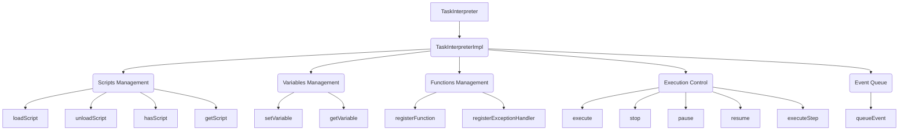

### Explanation

TaskInterpreterImpl: This is a private implementation class that contains the actual data structures and methods used by TaskInterpreter. It includes:
Scripts Management: Manages loading, unloading, and checking of scripts.
Variables Management: Manages setting and getting of variables.
Functions Management: Handles function registration and invocation.
Execution Control: Handles the execution flow of the scripts, including pause, stop, and resume functionalities.
Event Queue: Manages the event queue for the interpreter.

## Key Functions

### `loadScript` Function

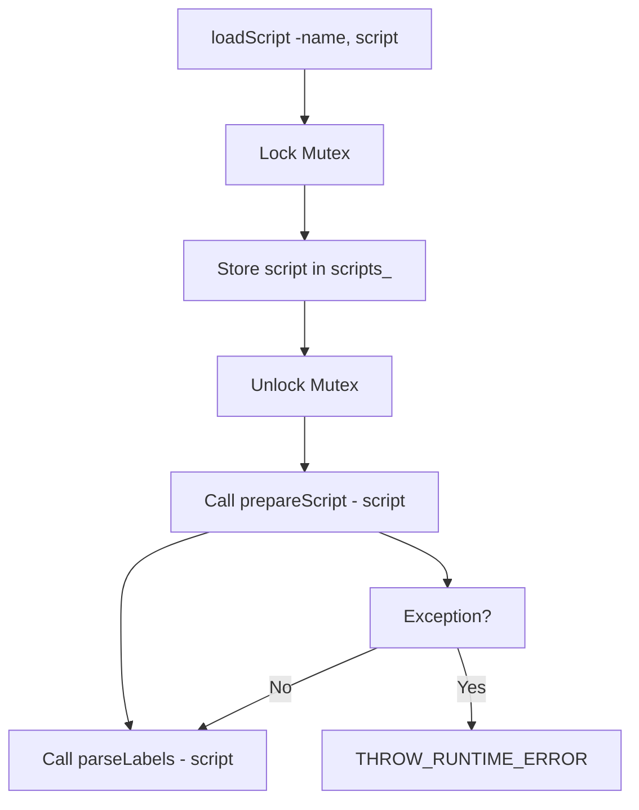

The loadScript function loads a script into the interpreter. It locks the mutex, stores the script in the scripts\_ map, prepares the script by processing it, and then parses any labels. If any errors occur during preparation, an exception is thrown.

### `execute` Function

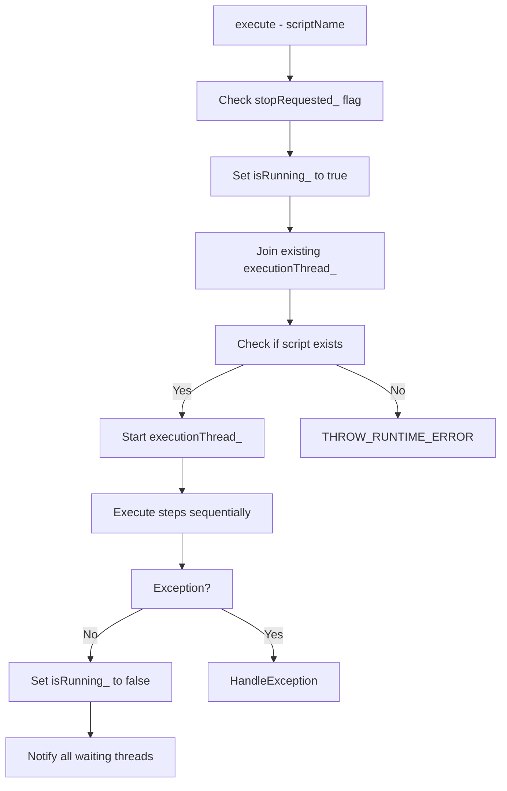

The execute function starts the execution of a specified script. It checks if the script exists, sets the isRunning\_ flag, and runs the script in a separate thread. If any exception occurs during execution, it is caught and handled appropriately. After the execution is complete, it notifies any waiting threads.

### `executeStep` Function

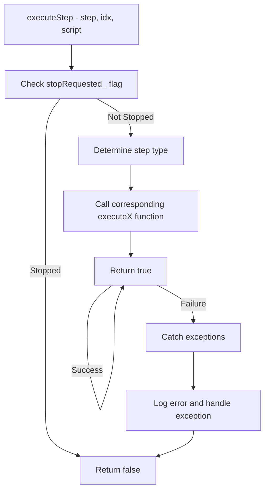

The executeStep function handles the execution of individual steps within a script. It checks if execution should stop, determines the step type, and calls the appropriate function to handle the step. If an exception occurs, it logs the error, handles the exception, and returns false to indicate failure.

### `setVariable` Function

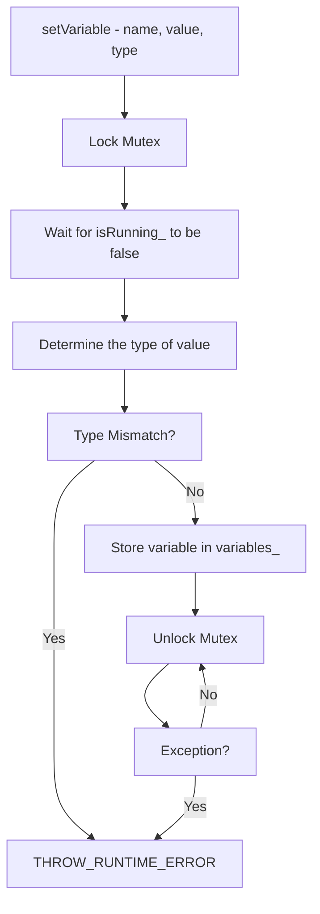

The setVariable function sets a variable's value and type in the interpreter. It first locks the mutex and waits until isRunning* is false. It then checks if the provided type matches the value's determined type. If the types match, it stores the variable in variables*. If any exception occurs during the process, it is thrown as a runtime error.

### `executeCall` Function

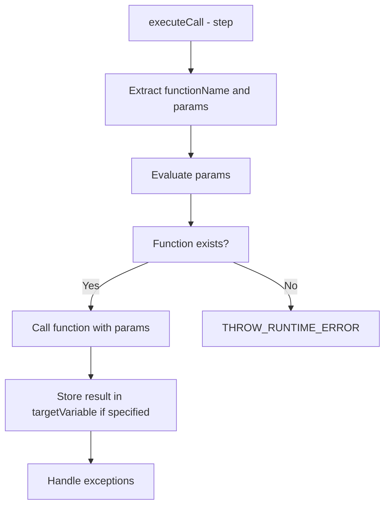

The executeCall function is used to execute a registered function. It extracts the function name and parameters from the step, looks up the corresponding function in the functions\_ map, and calls it. If a target variable is specified, the return value is stored in that variable.

### `executeCondition` Function

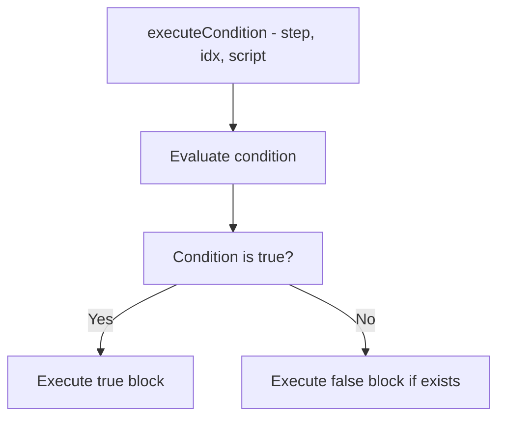

The executeCondition function evaluates a condition and executes the appropriate block of code. If the condition is true, the true block is executed; otherwise, the false block is executed (if it exists).

### `executeGoto` Function

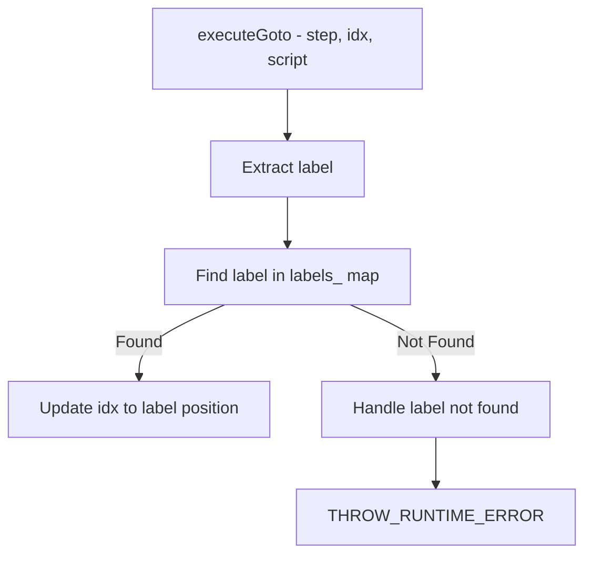

The executeGoto function allows jumping to a specific point in the script based on a label. It finds the label in the script and updates the execution index to that position.

### `executeParallel` Function

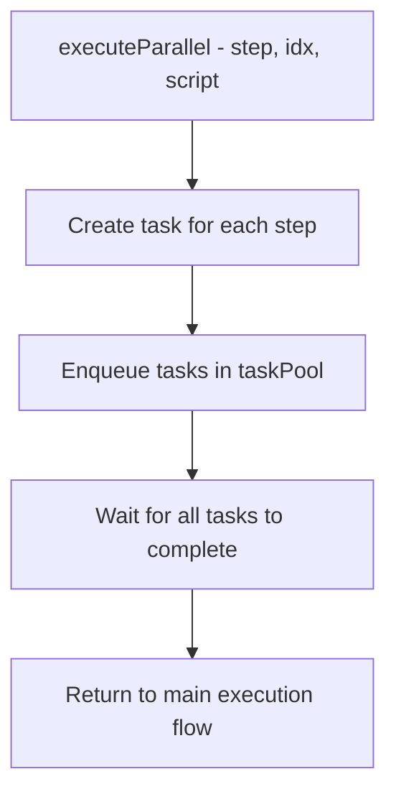

The executeParallel function executes multiple steps in parallel. It creates a task for each step, enqueues these tasks to the task pool, and waits for all tasks to complete before proceeding.

### `executeTryCatch` Function

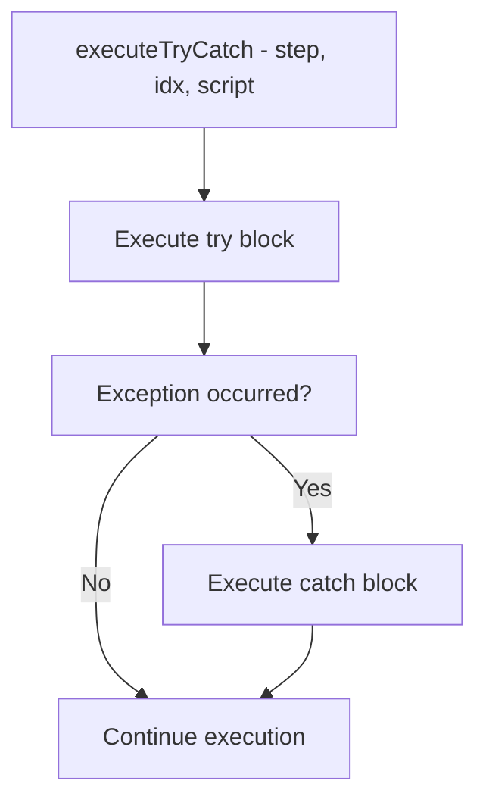

The executeTryCatch function implements error handling. It executes the steps in the try block, and if an exception occurs, it handles the error by executing the steps in the catch block.

### `executeAssign` Function

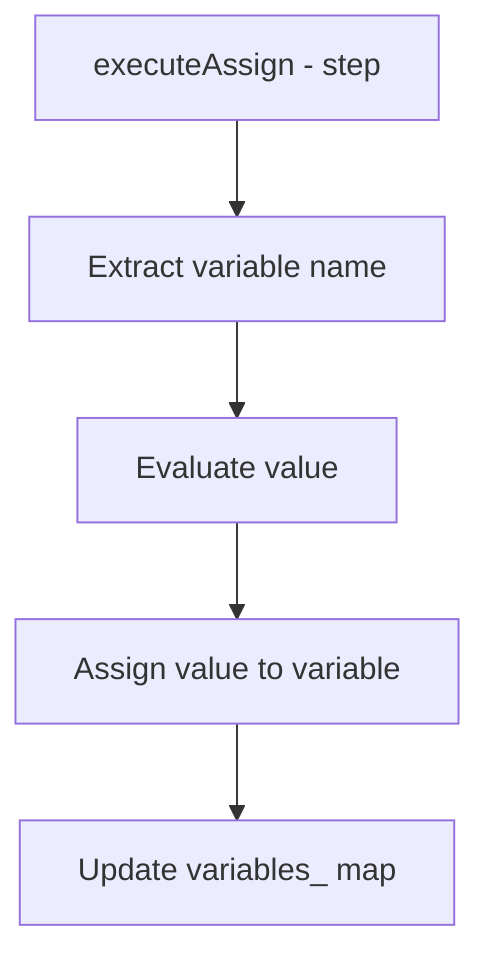

The executeAssign function assigns a value to a variable. It evaluates the value specified in the step and stores it in the designated variable.

### `executeLoop` Function

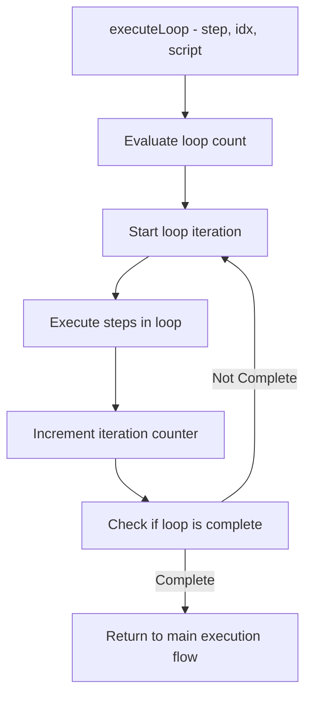

The executeLoop function handles looping in scripts. It repeats the execution of a block of steps for a specified number of iterations.

### `executeSwitch` Function

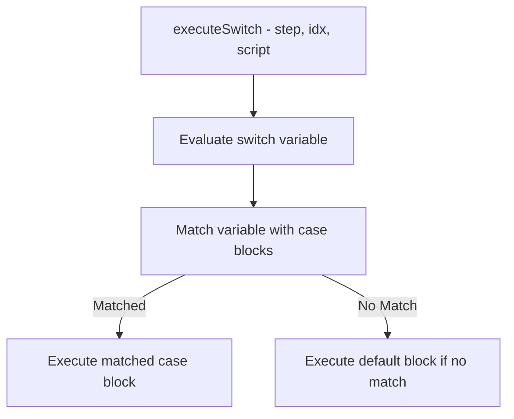

The executeSwitch function implements multi-branch conditional logic. It evaluates a variable and executes the corresponding case block or a default block if no cases match.

### `handleException` Function

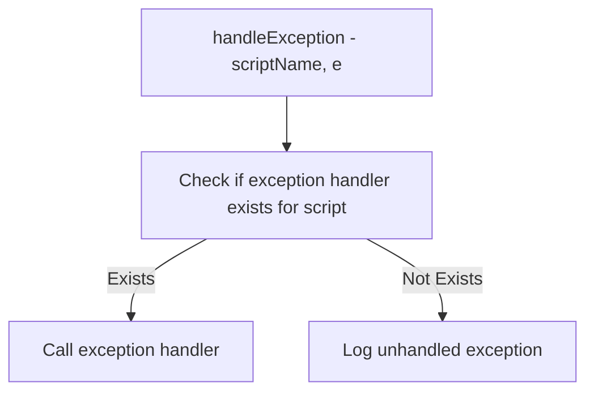

The handleException function is called when an unhandled exception occurs during script execution. It checks for a registered exception handler and invokes it if available; otherwise, it logs the error.
