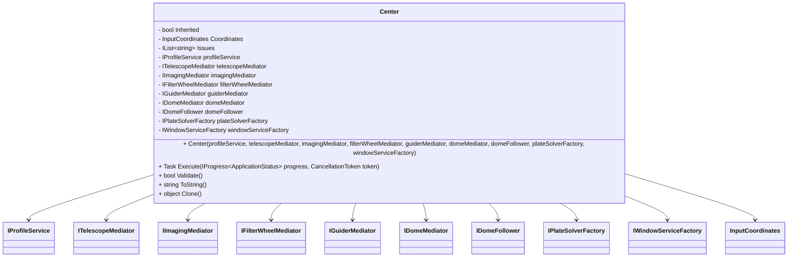
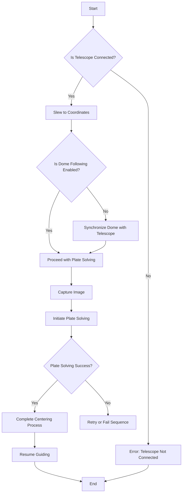

# Center

## Overview

The `Center` sequence item in N.I.N.A. is designed to accurately center a telescope on a specific set of celestial coordinates. This process uses plate solving, a method of determining the exact position of a telescope by analyzing an image of the night sky. The `Center` class is part of the N.I.N.A. sequencer, which allows users to automate various astrophotography tasks.

## Class Diagram

## Key Components

1. **Dependencies and Mediators**

   - `IProfileService`: Provides access to the user's profile settings, which are critical for the centering process.
   - `ITelescopeMediator`: Manages telescope operations, including slewing to the target coordinates.
   - `IImagingMediator`: Handles the camera operations needed to capture images for plate solving.
   - `IFilterWheelMediator`, `IGuiderMediator`, `IDomeMediator`, `IDomeFollower`: Additional equipment mediators that may be involved depending on the setup.
   - `IPlateSolverFactory`: Generates the plate solver used to determine the exact position of the telescope.
   - `IWindowServiceFactory`: Manages UI windows, such as the one displaying the status of the plate-solving process.

2. **Attributes**

   - `Coordinates`: Stores the target celestial coordinates for centering.
   - `Issues`: A list of any issues or validation errors encountered during the centering process.
   - `Inherited`: Indicates whether the coordinates were inherited from a parent sequence item.

3. **Methods**
   - `Execute`: The main method that performs the centering operation. It involves:
     1. Stopping guiding if it’s active.
     2. Slewing the telescope to the target coordinates.
     3. Initiating the plate-solving process.
     4. Synchronizing the dome position if necessary.
     5. Resuming guiding if it was stopped.
   - `Validate`: Checks for any issues that might prevent the centering operation, such as a disconnected telescope.
   - `Clone`: Creates a deep copy of the `Center` object.
   - `ToString`: Provides a string representation of the sequence item, including its category and coordinates.

## Process Flowchart

## Execution Flow

1. **Initialization**: The `Center` class is initialized with dependencies that manage various equipment and services required for the centering process.
2. **Validation**: Before executing the centering operation, the `Validate` method checks if the telescope is connected. If not, the process halts with an error.
3. **Slewing**: The telescope is slewed to the target coordinates provided by the user or inherited from a parent sequence item.
4. **Dome Synchronization**: If the observatory dome is not following the telescope, it is synchronized manually.
5. **Plate Solving**: The process captures an image of the sky and uses plate solving to determine the exact position of the telescope.
6. **Guiding**: If guiding was stopped earlier, it is resumed after successful centering.
7. **Completion**: The process concludes, and any issues are logged or displayed to the user.
