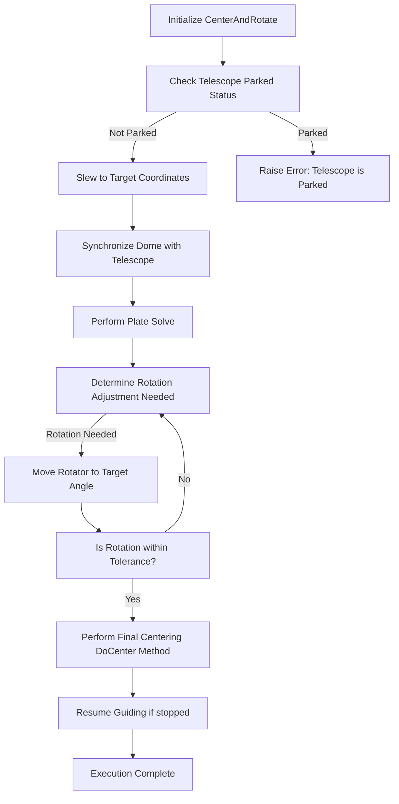

# Center and Rotate

This document provides an overview of the `CenterAndRotate` class from the N.I.N.A. software, which is responsible for controlling the telescope and camera to ensure accurate centering and rotation of the telescope's field of view. This functionality is crucial for astrophotography, where precise alignment and positioning are necessary.

## Class Overview

The `CenterAndRotate` class extends the `Center` class, adding functionality to rotate the telescope's field of view to match a desired position angle. This is particularly useful when capturing astronomical objects that require specific framing.

### Key Components

- **IProfileService**: Manages profile settings, such as plate solving settings and equipment configurations.
- **ITelescopeMediator**: Handles communication with the telescope, including slewing and retrieving its current position.
- **IImagingMediator**: Manages the imaging process, including camera control.
- **IRotatorMediator**: Manages the rotator, which adjusts the camera's rotation angle.
- **IFilterWheelMediator**: Controls the filter wheel for selecting the appropriate filter during imaging.
- **IGuiderMediator**: Handles the guiding process, which keeps the telescope locked on the target.
- **IDomeMediator & IDomeFollower**: Synchronizes the dome with the telescope’s movements.
- **IPlateSolverFactory**: Creates instances of plate solvers, which are used to determine the telescope's position based on star field images.
- **IWindowServiceFactory**: Provides a service to display windows for user interaction, such as progress tracking.

### Properties

- **PositionAngle**: The desired rotation angle of the telescope's field of view.
- **Coordinates**: The target celestial coordinates to which the telescope should point.

### Methods

- **Execute**: The main method that centers the telescope on the target and adjusts the field of view rotation.
- **Solve**: Performs a plate solve to determine the telescope's current position and orientation.
- **Validate**: Checks if all necessary equipment (e.g., telescope, rotator) is connected and ready.
- **AfterParentChanged**: Updates the target coordinates and position angle based on the parent sequence item.

## Detailed Workflow with Flowchart

Below is a detailed explanation of how the `CenterAndRotate` class operates, accompanied by a flowchart for visual reference.

1. **Initialization**

   - The `CenterAndRotate` class is instantiated with various mediators and services that manage telescope, rotator, and other equipment.

2. **Execution (`Execute` Method)**

   - The method begins by checking if the telescope is parked. If parked, an error is raised.
   - The telescope slews to the specified coordinates.
   - The dome is synchronized with the telescope if necessary.
   - The `Solve` method is called to perform a plate solve and determine the telescope’s current orientation.
   - The rotator is adjusted to match the desired position angle. If the difference between the current and desired angles is greater than a specified tolerance, the rotator moves accordingly.
   - Once the rotation is within tolerance, the `DoCenter` method (inherited from `Center`) is called to fine-tune the telescope’s positioning.

3. **Plate Solving (`Solve` Method)**

   - The method creates a plate solver instance using `IPlateSolverFactory`.
   - A series of images are captured, and the solver compares them with star catalogs to determine the telescope’s exact position and orientation.
   - The solver adjusts the telescope’s position until the target coordinates and rotation angle are achieved.

4. **Validation (`Validate` Method)**

   - Checks if the telescope and rotator are connected.
   - If any issues are detected, they are reported, and execution is halted.

5. **Parent Change Handling (`AfterParentChanged` Method)**
   - When the parent sequence item changes, the method updates the target coordinates and position angle based on the new parent’s context.

