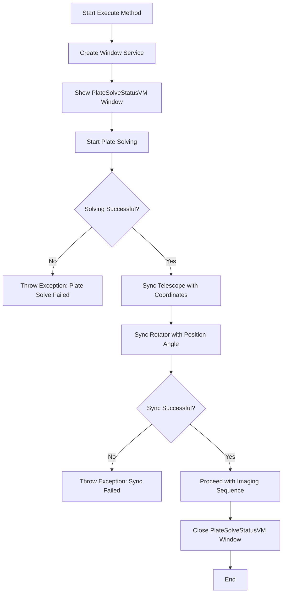

# SolveAndSync

The `SolveAndSync` class in the N.I.N.A. application is designed to accurately synchronize the telescope's position with the actual celestial coordinates by performing a plate solving process. This class is essential for ensuring the telescope is correctly aligned with the intended target during an imaging session.

## Class Overview

### Namespace

- **Namespace:** `NINA.Sequencer.SequenceItem.Platesolving`
- **Dependencies:**
  - `NINA.Core.Model`
  - `NINA.PlateSolving`
  - `NINA.Profile.Interfaces`
  - `NINA.Sequencer.Validations`
  - `NINA.Equipment.Interfaces.Mediator`
  - `NINA.Core.Utility.WindowService`
  - `NINA.ViewModel`
  - `NINA.Core.Locale`
  - `NINA.Equipment.Model`
  - `NINA.WPF.Base.ViewModel`
  - `NINA.PlateSolving.Interfaces`

### Class Declaration

```csharp
[ExportMetadata("Name", "Lbl_SequenceItem_Platesolving_SolveAndSync_Name")]
[ExportMetadata("Description", "Lbl_SequenceItem_Platesolving_SolveAndSync_Description")]
[ExportMetadata("Icon", "CrosshairSVG")]
[ExportMetadata("Category", "Lbl_SequenceCategory_Telescope")]
[Export(typeof(ISequenceItem))]
[JsonObject(MemberSerialization.OptIn)]
public class SolveAndSync : SequenceItem, IValidatable
```

### Class Properties

- **PlateSolveStatusVM**: Manages the status of the plate-solving process, displaying progress and results.
- **Issues**: A list of issues found during the validation of the class, particularly related to equipment connectivity.

### Constructor

The constructor initializes the `SolveAndSync` class with dependencies on various services and mediators, including those for the telescope, rotator, imaging, filter wheel, plate solver, and window service.

```csharp
[ImportingConstructor]
public SolveAndSync(IProfileService profileService, ...)
```

### Key Methods

- **Execute(IProgress<ApplicationStatus> progress, CancellationToken token)**: This method executes the main logic of the `SolveAndSync` class. It performs plate solving and synchronizes the telescope’s position with the solved coordinates.
- **DoSolve(IProgress<ApplicationStatus> progress, CancellationToken token)**: This method performs the actual plate solving using the configured settings.
- **Validate()**: Checks if the telescope is connected and operational before attempting to solve and sync.
- **Clone()**: Creates a deep copy of the `SolveAndSync` object.

### Flowchart: Execution Process

Below is a flowchart that outlines the key steps in the `Execute` method of the `SolveAndSync` class.



### Flowchart Explanation

1. **Create Window Service:** Initializes a window service to display the status of the plate-solving process.
2. **Show PlateSolveStatusVM Window:** Displays the `PlateSolveStatusVM` window to provide real-time feedback on the plate-solving progress.
3. **Start Plate Solving:** Begins the process of solving the telescope’s current position using the plate solver.
4. **Solving Successful?:** Checks if the plate-solving process was successful.
   - **No:** Throws an exception indicating that the plate solve failed.
   - **Yes:** Proceeds to sync the telescope’s coordinates.
5. **Sync Telescope with Coordinates:** Synchronizes the telescope's internal coordinates with the solved celestial coordinates.
6. **Sync Rotator with Position Angle:** Syncs the rotator's position angle with the orientation derived from the plate-solving result.
7. **Sync Successful?:** Checks if the telescope sync was successful.
   - **No:** Throws an exception indicating that the sync operation failed.
   - **Yes:** Proceeds with the imaging sequence.
8. **Close PlateSolveStatusVM Window:** Closes the status window after a short delay.
9. **End:** The method concludes.

### Detailed Method Descriptions

#### `Execute` Method

The `Execute` method is the core of the `SolveAndSync` class, responsible for initiating and managing the entire plate-solving and synchronization process. It uses the `PlateSolveStatusVM` to provide real-time updates on the solving process and handles the synchronization of the telescope and rotator.

#### `DoSolve` Method

The `DoSolve` method encapsulates the logic for performing the actual plate-solving operation. It retrieves the appropriate plate solver and blind solver, configures the necessary parameters, and executes the solving sequence to determine the telescope's precise position and orientation.

#### `Validate` Method

The `Validate` method checks if the telescope is connected and functional before proceeding with the solve-and-sync operation. It ensures that the necessary equipment is ready, preventing runtime errors and providing feedback through the `Issues` list.
