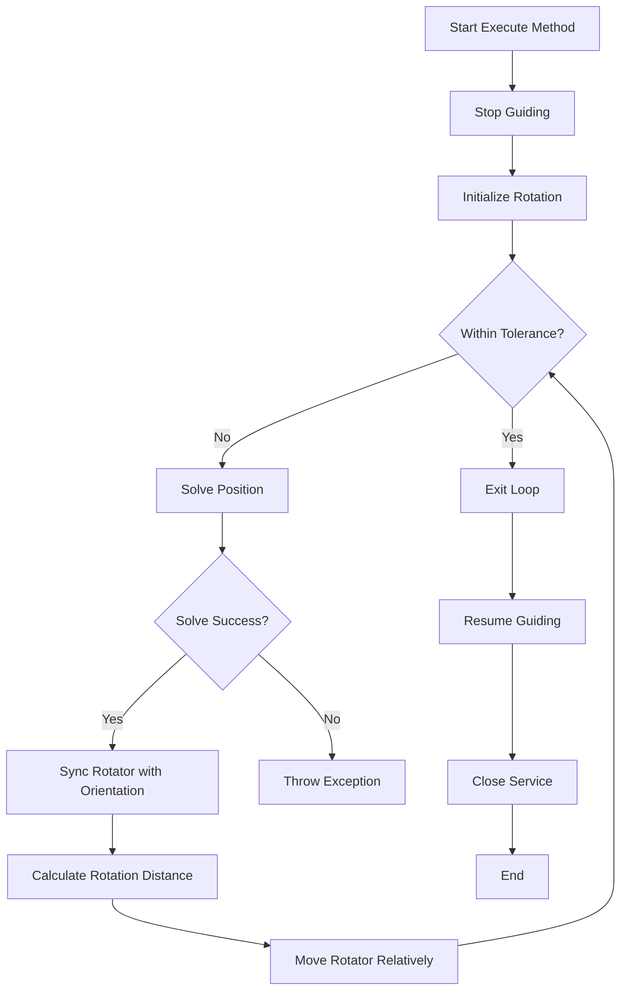

# SolveAndRotate

The `SolveAndRotate` class is part of the N.I.N.A. application, which is used for astrophotography and astronomical imaging. This class is responsible for solving the position of a telescope and rotating it to achieve a desired position angle. The class integrates various services and mediators to interact with the telescope, rotator, and other imaging equipment.

## Class Overview

### Namespace

- **Namespace:** `NINA.Sequencer.SequenceItem.Platesolving`
- **Dependencies:**
  - `NINA.Astrometry`
  - `NINA.Core.Locale`
  - `NINA.Core.Model`
  - `NINA.Core.Utility`
  - `NINA.Equipment.Interfaces.Mediator`
  - `NINA.PlateSolving`
  - `NINA.Profile.Interfaces`
  - `NINA.Sequencer.Utility`
  - `NINA.Sequencer.Validations`
  - `NINA.WPF.Base.ViewModel`

### Class Declaration

```csharp
[ExportMetadata("Name", "Lbl_SequenceItem_Platesolving_SolveAndRotate_Name")]
[ExportMetadata("Description", "Lbl_SequenceItem_Platesolving_SolveAndRotate_Description")]
[ExportMetadata("Icon", "PlatesolveAndRotateSVG")]
[ExportMetadata("Category", "Lbl_SequenceCategory_Rotator")]
[Export(typeof(ISequenceItem))]
[JsonObject(MemberSerialization.OptIn)]
public class SolveAndRotate : SequenceItem, IValidatable
```

### Class Properties

- **PositionAngle**: This property holds the desired position angle for the telescope. It ensures the value is within a valid range (0-360 degrees).
- **Inherited**: Indicates whether the position angle is inherited from a parent sequence item.
- **Issues**: A list of validation issues that might arise during execution.
- **PlateSolveStatusVM**: Manages the status of the plate solving process.

### Constructor

The constructor initializes the `SolveAndRotate` class with dependencies on services and mediators for the telescope, imaging, rotator, filter wheel, guider, plate solver, and window service.

```csharp
[ImportingConstructor]
public SolveAndRotate(IProfileService profileService, ...)
```

### Key Methods

- **Execute(IProgress<ApplicationStatus> progress, CancellationToken token)**: This method executes the main logic of the `SolveAndRotate` class. It orchestrates the process of plate solving, rotating, and validating the rotation against the desired position angle.
- **Solve(IProgress<ApplicationStatus> progress, CancellationToken token)**: This method performs the plate solving using the configured settings.
- **AfterParentChanged()**: Updates the position angle and inheritance status based on the parent sequence item.
- **Validate()**: Checks if the necessary components (e.g., rotator) are connected and operational.

### Flowchart: Execution Process

Below is a flowchart that outlines the key steps in the `Execute` method of the `SolveAndRotate` class.



### Flowchart Explanation

1. **Stop Guiding:** The guider is stopped to prepare for the rotation process.
2. **Initialize Rotation:** The initial rotation distance is set to a maximum value.
3. **Within Tolerance?:** Checks if the current rotation is within the acceptable tolerance.
   - **Yes:** Exit the loop and proceed to resume guiding.
   - **No:** Continue with the solving and rotation process.
4. **Solve Position:** The telescope’s current position is solved to determine the orientation.
5. **Solve Success?:** Checks if the solving process was successful.
   - **Yes:** Sync the rotator with the current orientation.
   - **No:** Throw an exception indicating the failure of the solving process.
6. **Calculate Rotation Distance:** The distance to the target rotation angle is calculated.
7. **Move Rotator Relatively:** The rotator is moved by the calculated rotation distance.
8. **Repeat:** The process loops until the rotation is within the desired tolerance.
9. **Resume Guiding:** Guiding is resumed after the rotation is completed.
10. **Close Service:** The window service is closed with a delay.
11. **End:** The method concludes.
