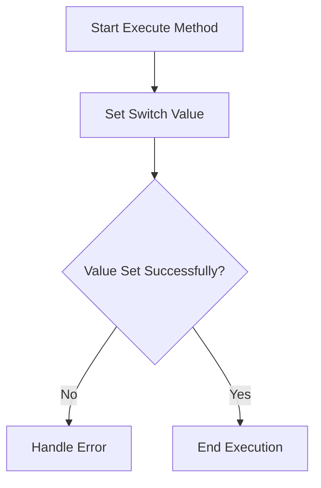

# SetSwitchValue

The `SetSwitchValue` class is designed to interact with switches within the N.I.N.A. (Nighttime Imaging 'N' Astronomy) application. It allows for setting values on writable switches and is used within sequence operations.

## Class Overview

### Namespace

- **Namespace:** `NINA.Sequencer.SequenceItem.Switch`
- **Dependencies:**
  - `NINA.Core.Model`
  - `NINA.Sequencer.Validations`
  - `NINA.Core.Utility`
  - `NINA.Equipment.Interfaces.Mediator`
  - `NINA.Core.Locale`
  - `NINA.Equipment.Interfaces`
  - `NINA.Equipment.Equipment.MySwitch`

### Class Declaration

```csharp
[ExportMetadata("Name", "Lbl_SequenceItem_Switch_SetSwitchValue_Name")]
[ExportMetadata("Description", "Lbl_SequenceItem_Switch_SetSwitchValue_Description")]
[ExportMetadata("Icon", "ButtonSVG")]
[ExportMetadata("Category", "Lbl_SequenceCategory_Switch")]
[Export(typeof(ISequenceItem))]
[JsonObject(MemberSerialization.OptIn)]
public class SetSwitchValue : SequenceItem, IValidatable
```

### Class Properties

- **switchMediator**: Interface for communicating with the switch hardware.
- **issues**: List of validation issues encountered.
- **Value**: The value to set on the switch.
- **SwitchIndex**: Index of the switch to be controlled.
- **SelectedSwitch**: The currently selected writable switch.
- **WritableSwitches**: List of writable switches available.

### Constructor

The constructor initializes the `SetSwitchValue` class with the provided `switchMediator` and sets up a dummy list of switches.

```csharp
[ImportingConstructor]
public SetSwitchValue(ISwitchMediator switchMediator)
```

### Key Methods

- **Clone()**: Creates a copy of the `SetSwitchValue` instance.
- **Execute(IProgress<ApplicationStatus> progress, CancellationToken token)**: Sets the switch value using `switchMediator`.
- **CreateDummyList()**: Creates a dummy list of switches for testing purposes.
- **Validate()**: Checks if the switch is connected and validates the switch value.
- **ToString()**: Provides a string representation of the `SetSwitchValue` instance.

### Flowchart: Execution Process

Below is a flowchart illustrating the key steps in the `Execute` method of the `SetSwitchValue` class.



### Flowchart Explanation

1. **Set Switch Value**: Calls `switchMediator.SetSwitchValue()` to set the value on the switch.
2. **Value Set Successfully?**: Checks if the value was set successfully. If not, handles the error accordingly.
3. **End Execution**: If successful, the method completes without errors.

### Detailed Method Descriptions

#### `Clone`

Creates a new instance of the `SetSwitchValue` class with the same configuration as the current instance, including the switch index and value.

#### `Execute`

Uses `switchMediator.SetSwitchValue()` to set the value on the switch at the specified index.

#### `CreateDummyList`

Generates a dummy list of switches, which is useful for scenarios where the actual switch hardware is not connected.

#### `Validate`

1. **Check Connection**: Verifies if the switch is connected. If not, replaces the real list with a dummy list.
2. **Update List**: If the switch is connected, updates the list of writable switches.
3. **Validation**: Ensures that the selected switch and value are valid. Adds errors to the issues list if validation fails.

#### `ToString`

Provides a string representation of the `SetSwitchValue` instance, including the category, item name, switch index, and value.
