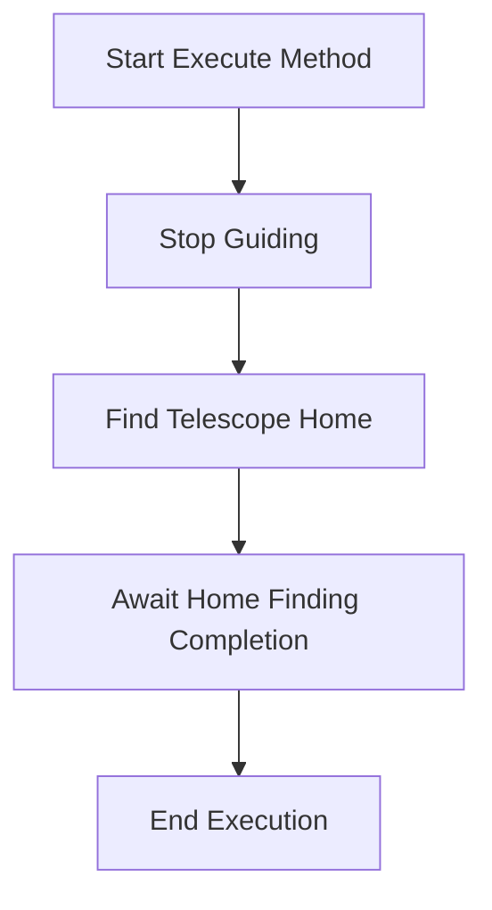

# FindHome

The `FindHome` class is used for directing a telescope to find its home position. It interacts with both the telescope and guider mediators to ensure the telescope returns to its home position while stopping any ongoing guiding operations.

## Class Overview

### Namespace

- **Namespace:** `NINA.Sequencer.SequenceItem.Telescope`
- **Dependencies:**
  - `NINA.Core.Model`
  - `NINA.Sequencer.Validations`
  - `NINA.Equipment.Interfaces.Mediator`
  - `NINA.Core.Locale`

### Class Declaration

```csharp
[ExportMetadata("Name", "Lbl_SequenceItem_Telescope_FindHome_Name")]
[ExportMetadata("Description", "Lbl_SequenceItem_Telescope_FindHome_Description")]
[ExportMetadata("Icon", "HomeSVG")]
[ExportMetadata("Category", "Lbl_SequenceCategory_Telescope")]
[Export(typeof(ISequenceItem))]
[JsonObject(MemberSerialization.OptIn)]
public class FindHome : SequenceItem, IValidatable
```

### Class Properties

- **telescopeMediator**: Manages communication with the telescope hardware.
- **guiderMediator**: Manages communication with the guider hardware.
- **issues**: A list to capture any validation issues.

### Constructor

The constructor initializes the `FindHome` class with `telescopeMediator` and `guiderMediator`.

```csharp
[ImportingConstructor]
public FindHome(ITelescopeMediator telescopeMediator, IGuiderMediator guiderMediator)
```

### Key Methods

- **Clone()**: Creates a copy of the `FindHome` instance.
- **Execute(IProgress<ApplicationStatus> progress, CancellationToken token)**: Commands the telescope to find its home position while stopping guiding.
- **Validate()**: Checks if the telescope is connected and if it supports finding the home position.
- **AfterParentChanged()**: Revalidates the state when the parent changes.
- **ToString()**: Returns a string representation of the class instance.

### Flowchart: Execution Process

Below is a flowchart illustrating the key steps in the `Execute` method of the `FindHome` class.



### Flowchart Explanation

1. **Stop Guiding**: Stops any ongoing guiding operations using `guiderMediator`.
2. **Find Telescope Home**: Commands the telescope to find its home position using `telescopeMediator`.
3. **Await Home Finding Completion**: Waits for the telescope to complete the home finding process.
4. **End Execution**: Marks the end of the execution process.

### Detailed Method Descriptions

#### `Clone`

Creates a new instance of the `FindHome` class with the same configuration as the current instance.

#### `Execute`

1. **Stop Guiding**: Stops any guiding operation to avoid conflicts.
2. **Find Telescope Home**: Directs the telescope to locate its home position. This operation might involve moving the telescope to a known reference point where it can determine its home position.
3. **Await Completion**: Waits until the telescope completes the home finding process.

#### `Validate`

Checks the current state of the telescope:

- If the telescope is not connected, adds an error to the issues list.
- If the telescope cannot find its home position, adds an error to the issues list.
- Updates the `Issues` property with any validation errors.

#### `AfterParentChanged`

Revalidates the state of the `FindHome` instance whenever its parent changes to ensure it remains valid.

#### `ToString`

Provides a string representation of the `FindHome` instance, including the category and item name.
