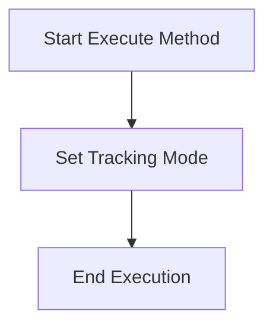

# SetTracking

The `SetTracking` class is responsible for setting the tracking mode of a telescope. It provides functionality to select and apply various tracking modes, ensuring that the telescope operates correctly according to the selected mode.

## Class Overview

### Namespace

- **Namespace:** `NINA.Sequencer.SequenceItem.Telescope`
- **Dependencies:**
  - `NINA.Equipment.Interfaces.Mediator`
  - `NINA.Core.Model`
  - `NINA.Sequencer.Validations`
  - `NINA.Core.Locale`
  - `NINA.Equipment.Interfaces`

### Class Declaration

```csharp
[ExportMetadata("Name", "Lbl_SequenceItem_Telescope_SetTracking_Name")]
[ExportMetadata("Description", "Lbl_SequenceItem_Telescope_SetTracking_Description")]
[ExportMetadata("Icon", "SpeedometerSVG")]
[ExportMetadata("Category", "Lbl_SequenceCategory_Telescope")]
[Export(typeof(ISequenceItem))]
[JsonObject(MemberSerialization.OptIn)]
public class SetTracking : SequenceItem, IValidatable
```

### Class Properties

- **telescopeMediator**: Interface for interacting with the telescope hardware.
- **issues**: List of validation issues.
- **trackingMode**: The current tracking mode selected for the telescope.

### Static Properties

- **trackingModeChoices**: A static list of available tracking modes.

### Constructor

The constructor initializes the `SetTracking` class with `telescopeMediator`.

```csharp
[ImportingConstructor]
public SetTracking(ITelescopeMediator telescopeMediator)
```

### Key Methods

- **Clone()**: Creates a copy of the `SetTracking` instance.
- **Execute(IProgress<ApplicationStatus> progress, CancellationToken token)**: Sets the tracking mode on the telescope.
- **Validate()**: Checks if the telescope is connected and if the selected tracking mode is supported.
- **AfterParentChanged()**: Revalidates the state when the parent changes.
- **ToString()**: Provides a string representation of the class instance.

### Flowchart: Execution Process

Below is a flowchart illustrating the key steps in the `Execute` method of the `SetTracking` class.



### Flowchart Explanation

1. **Set Tracking Mode**: Uses `telescopeMediator.SetTrackingMode()` to apply the selected tracking mode.
2. **End Execution**: Marks the end of the execution process.

### Detailed Method Descriptions

#### `Clone`

Creates a new instance of the `SetTracking` class with the same configuration as the current instance.

#### `Execute`

Sets the tracking mode on the telescope using `telescopeMediator.SetTrackingMode()`. This method completes immediately as it does not need to await any asynchronous operations.

#### `Validate`

Checks if the telescope is connected and if it supports the selected tracking mode:

- Adds an error to the issues list if the telescope is not connected.
- Adds an error if the selected tracking mode is not supported by the telescope.

#### `AfterParentChanged`

Revalidates the state of the `SetTracking` instance whenever its parent changes to ensure it remains valid.

#### `ToString`

Provides a string representation of the `SetTracking` instance, including the category, item name, and the selected tracking mode.

### Tracking Modes

The `trackingModeChoices` static property provides a list of available tracking modes:

- **Sidereal**: Follows the sidereal rate of the stars.
- **King**: A mode for specific astronomical calculations.
- **Solar**: Tracks the sun.
- **Lunar**: Tracks the moon.
- **Stopped**: Disables tracking.
